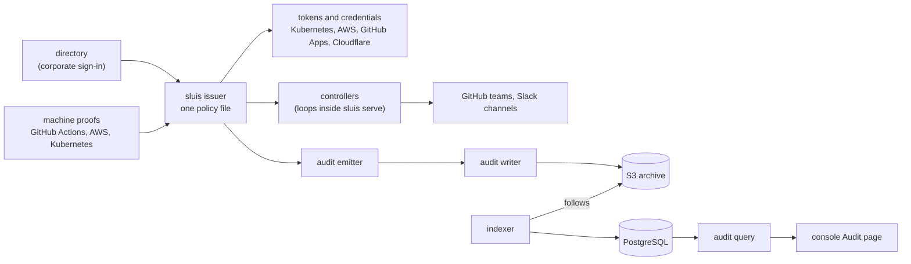

# sluis

OpenID issuer and audit trail in one repository: sluis turns the proofs you already have into short-lived tokens and
credentials under one policy file, and audit keeps a tamper-evident record of what happened. One tag, one version.

| Deliverable | Published at |
|---|---|
| sluis and audit images | `ghcr.io/truvity/sluis/*`, `ghcr.io/truvity/audit/*` |
| Helm charts `sluis`, `audit` | `oci://ghcr.io/truvity/charts/sluis`, `oci://ghcr.io/truvity/charts/audit` |
| `sluisctl`, `audit` CLI, Lambda zips | the [GitHub release](https://github.com/truvity/sluis/releases) |
| Go modules (root, `storage`, `audit`, Pulumi libraries) | `github.com/truvity/sluis[/<dir>]`, tagged with the release |
| `@truvity/sluis`, `@truvity/audit`, `@truvity/audit-react` | GitHub Packages |
| GitHub Action | `truvity/sluis@<commit>` |

Every artifact and its location: [artifacts](docs/reference/artifacts.md). Docs site: <https://truvity.github.io/sluis/>.

[](https://github.com/truvity/sluis/actions/workflows/ci.yaml)
[](https://github.com/truvity/sluis/releases)
[](LICENSE)

Two products and a shared module:

- **sluis**: an OpenID issuer and directory hub. Corporate sign-in, GitHub Actions OIDC and AWS or Kubernetes workload
  identity become tokens and credentials; controllers reconcile GitHub teams and Slack channels from the same file.
- **audit**: an audit trail an application owns: one record format, an immutable archive, projections for search and
  verification. sluis records its own actions through audit.
- **storage**: the Go module for state and keys that both use.

SDKs: Go and TypeScript are built; Kotlin and Python are planned.



Five minutes, no credential and no network:

```sh
cat > /tmp/demo.yaml <<'YAML'
demo: true
store: memory
allowInsecure: true
issuerURL: http://localhost:8099
publicURL: http://localhost:8099/console
listen: {address: ":8099"}
probes: {address: ":7099"}
YAML
go run ./cmd/sluis serve --config /tmp/demo.yaml
```

Open `http://localhost:8099/console/` and take *Continue with the demonstration directory*.

## Who it is for

Platform teams that run a corporate directory and want one reviewed policy file to drive tokens, GitHub teams and
Slack channels, and applications that need an audit trail an auditor can verify. sluis runs on AWS Lambda or on
Kubernetes with AWS storage; audit runs with its services in the cluster or as AWS serverless, and needs a KMS key (or
OpenBao transit) and an S3 store (AWS S3 or Cloudflare R2) either way. Neither installs an identity store, passwords or MFA.

## The model

A directory says who people are, a policy file in git maps directory groups and machine identities to internal groups,
and one process mints tokens and reconciles GitHub and Slack from that file; audit records what it did.
See [concepts](docs/explanation/concepts.md).

## Install and a worked example

```sh
sluisctl render --installation installation.yaml --out rendered/
helm install sluis oci://ghcr.io/truvity/charts/sluis --version X.Y.Z --namespace sluis --create-namespace \
  --values values.yaml --set-file documents.service=rendered/sluis.yaml --set-file documents.policy=rendered/policy.yaml
```

Tutorials: [Kubernetes on AWS](docs/getting-started/kubernetes-aws.md), [AWS Lambda](docs/getting-started/aws-lambda.md),
audit [on Kubernetes](docs/audit/getting-started/kubernetes.md) and [on AWS Lambda](docs/audit/getting-started/aws-lambda.md).

## Consumers

Estates install the charts from their GitOps repositories or the Pulumi libraries; services import the Go module or
`@truvity/sluis`; CI jobs use the GitHub Action and `sluisctl`; people use `sluisctl` on laptops.

## Neighbours

- **OpenBao** trusts sluis tokens and issues certificates; it can also be audit's key provider.
- **Cloudflare** fronts the Lambda shape and can hold audit's archive (R2).

## Documentation

[docs/README.md](docs/README.md) is the entry point; every artifact is in [artifacts](docs/reference/artifacts.md).
Upgrading: the [CHANGELOG](CHANGELOG.md) links an upgrade page from each breaking entry.

## The rule that makes this repository public

Mechanism only: nothing here names an account, zone, hostname, cluster or secret path of any installation. Examples use
neutral values, and [`hack/leak-canary.sh`](hack/leak-canary.sh) enforces it in `just check` and CI
([CONTRIBUTING](CONTRIBUTING.md#this-repository-is-public)).

## Status

Used in production by its maintainers; see the [releases](https://github.com/truvity/sluis/releases). audit is
stabilizing: a minor may break with a **Breaking:** entry, a patch never does. Security reports: [SECURITY.md](SECURITY.md).

## Development

`devbox shell` (or direnv), then `just check`, which runs what CI runs; `just generate` rebuilds generated code and
`just docs-generate` the generated docs. See [CONTRIBUTING](CONTRIBUTING.md).

## Releasing

Releases are cut by hand: a patch, a minor or a major is a pushed tag `vX.Y.Z`, and nothing auto-releases.
See [CONTRIBUTING](CONTRIBUTING.md#releasing).

## Licence

MIT, see [LICENSE](LICENSE).
