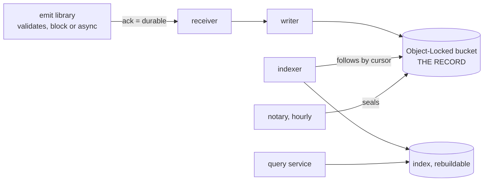

# audit

An audit trail an application owns: one record format, one write path, an immutable archive, and
projections for security, billing and history. An application emits records through a library; the
writer puts them in an Object-Locked bucket, an indexer follows the bucket into Postgres for search,
a notary seals each hour, and `audit verify` lets an auditor check the archive with read access to
the bucket and nothing else.

**Status: stabilizing.** A minor release may carry a breaking change with a **Breaking:** entry in the
[CHANGELOG](CHANGELOG.md) and a migration page under [`docs/audit/how-to/upgrade/`](../docs/audit/how-to/upgrade/v0.13.md);
a patch never does ([policy decision 0012](https://github.com/truvity/policy/blob/master/docs/decisions/0054-stabilization-amendments.md)).

## Who it is for

An application team that already has, or can provision, a Postgres database, an S3-compatible bucket
(with Object Lock for a profile that demands it) and a reference clock. It deliberately does not install
a central, multi-tenant audit service, its own message bus, or the Audit page, which lives in the
application's own console.

## The model

An **installation** is one deployment in one application's namespace. It writes **records**, validated
against the application's **catalogue**, through a **receiver** into the **archive** (an Object-Locked
bucket) and an **index** (Postgres, rebuildable, not itself evidence) that an **indexer** writes by
following the bucket. A **query service** reads them back behind declared grants.

## Install and a worked example

An installation belongs to **one application** and runs in that application's namespace
([0053](../docs/decisions/0053-one-installation-per-service-or-product.md)). It comes in three shapes,
each with a tutorial from nothing to working:

| shape | for | start |
|---|---|---|
| Kubernetes, with the chart | an internal service (direct) or a product (stream) | [Getting started on Kubernetes](../docs/audit/getting-started/kubernetes.md) |
| AWS Lambda, with the Pulumi library | writer and notary as functions behind an SQS queue | [Getting started on AWS Lambda](../docs/audit/getting-started/aws-lambda.md) |
| connected to sluis | audit's half of an access-management install | [Getting started with a sluis-connected install](../docs/audit/getting-started/sluis.md) |

They write the same archive, under the same catalogue rules and bucket layout, and are verified by the
same command. The two combine: writer on Lambda, observe and query in Kubernetes.

The worked example is `charts/audit/examples/direct.yaml`, rendered as a golden fixture, walked through
in [Getting started on Kubernetes](../docs/audit/getting-started/kubernetes.md).

## Artifacts

| artifact | where |
|---|---|
| chart `audit` | `oci://ghcr.io/truvity/charts/audit` ([chart README](../charts/audit/README.md)) |
| images `audit-writer`, `audit-query`, `audit-observe`, `audit-notary`, `audit` | `ghcr.io/truvity/audit/<name>` |
| Lambda zips `audit-writer-lambda_<version>_linux_arm64.zip`, `audit-notary-lambda_<version>_linux_arm64.zip` | the GitHub release, with `checksums.txt` |
| Pulumi library | `github.com/truvity/sluis/audit/deploy/pulumi` ([reference](../docs/audit/reference/aws-pulumi-library.md)) |
| Go SDK: record, catalogue, emitter, sink | `github.com/truvity/sluis/audit/sdk` |
| `audit` CLI (verify, hold, reindex, migrate, ...) | the GitHub release archives |
| `@truvity/audit`: query client, sentences, React view | GitHub Packages, at each release tag |
| JSON Schemas of the record, the catalogue and every configuration file | `https://truvity.github.io/sluis/schemas/audit/` ([`schemas/`](schemas/README.md)) |

## Consumers

| repo | surface |
|---|---|
| estates that deploy it | chart `audit`, or the Pulumi library for AWS Lambda |
| sluis | emits records; see [the sluis page](../docs/audit/getting-started/sluis.md) |

## Neighbours

sluis (access management), OpenBAO (a relying party and, optionally, the key provider) and this
component's own records are one trail: audit is the record each of them writes.

## Documentation

[`docs/`](../docs/audit/README.md) is organised by what you are doing: tutorials in
[`getting-started/`](../docs/audit/getting-started/kubernetes.md), tasks and runbooks in
[`how-to/`](../docs/audit/how-to/), lookups in [`reference/`](../docs/audit/reference/configuration.md), the why in
[`explanation/`](../docs/audit/explanation/architecture.md) and the [decisions](../docs/decisions/README.md). The
changelog says what changed; the steps to take are in [`how-to/upgrade/`](../docs/audit/how-to/upgrade/v0.13.md).

## The rule that makes this repository public

Mechanism only: nothing in this repository may name a real organisation, cluster, account, team, person,
incident or internal ticket ([CONTRIBUTING](CONTRIBUTING.md)). Every chart value that names one is an
input with a neutral default; the consuming estate supplies the particulars from its own private
repository. `hack/leak-canary.sh` enforces it, and `just check` runs it. This repository follows the shared
[component contract](https://github.com/truvity/policy/blob/master/docs/contracts/component.md).

## Status

**Stabilizing** (see above). What is built, designed and run live, platform by platform:
[capabilities](../docs/audit/reference/capabilities.md).

## What it is not

- **Not an application log pipeline.** Logs keep flowing through the observability stack. This records
  what happened, who did it, to what, with what outcome, and keeps it as long as a framework requires.
- **Not a SIEM.** It exports to one.
- **Not a central, multi-tenant audit service.** An installation belongs to one application.

## Development

Tools come from the repository's root `devbox.json` through direnv. `just audit-check` is the gate and needs
nothing but this checkout. [CONTRIBUTING](CONTRIBUTING.md) has the rest, and
[the repository layout](../docs/audit/reference/repository-layout.md) says where things are.

## Releasing

A pushed `v*` tag runs [`release.yaml`](../.github/workflows/release.yaml), the shared `release-public`
workflow: it builds the toolchain archives, the Lambda zips and, through `ko`, the images, and pushes the
`audit` chart to `oci://ghcr.io/truvity/charts/audit` at the tag's version.
[`charts/audit/Chart.yaml`](../charts/audit/Chart.yaml)'s `version: 0.0.0` / `appVersion: "0.0.0"` are
placeholders the release stamps over; never bump them by hand. A breaking change links its migration page
from the CHANGELOG ([upgrade pages](../docs/audit/how-to/upgrade/v0.13.md)).

## Licence

MIT. See [LICENSE](LICENSE).
