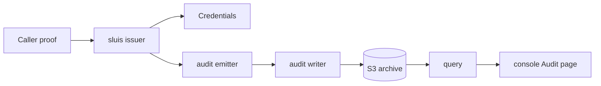

# Documentation

Three products share one repository and one version. The tabs above (Get started, Guides, Reference, Concepts) hold a section for each.

| | What it is | Start at |
|---|---|---|
| **sluis** | the identity and access service: who a caller is, what that gets them, and the way out | [sluis](concepts/sluis/README.md) |
| **audit** | the audit trail: records written once, sealed, searchable, verifiable by an auditor | [audit](concepts/audit/README.md) |
| **storage** | the state and key backends both share, chosen by the `state` and `keys` blocks | [storage](concepts/storage/README.md) |

sluis mints short-lived credentials and emits audit records. audit archives the records in S3, seals them and serves them to the console's Audit page.

## Next

- Choose where sluis runs: [sluis deployment shapes](get-started/sluis/README.md).
- Choose where audit runs: [audit deployment shapes](get-started/audit/README.md).
- Use a library: [SDKs](sdk/README.md).
- Read why: [decisions](decisions/README.md). Read what changed: the [CHANGELOG](../CHANGELOG.md).
