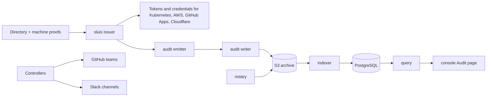

# Documentation

Two products in one repository, one version: **sluis** and **audit**, plus the shared **storage** module. Each has a
documentation tree with the same sections, organised by what the reader is doing ([Diataxis](https://diataxis.fr/)).

## How the parts fit

In one line: sluis turns a caller's proof into short-lived credentials and records what it did; audit archives those
records in S3, seals them, and serves them to the console's Audit page.

## The three products

| | What it is | Start at |
|---|---|---|
| **sluis** | the identity and access service: who a caller is, what that gets them, and the way out | [docs/sluis](sluis/README.md) |
| **audit** | the audit trail: records written once, sealed, searchable, verifiable by an auditor | [docs/audit](audit/README.md) |
| **storage** | the state and key backends both share, chosen by the `state` and `keys` blocks | [docs/storage](storage/README.md) |

## Deployment shapes

A shape is where a product runs. Each product's page is the owner of its list; this is the map.

| Product | Shape | State | Page |
|---|---|---|---|
| sluis | AWS Lambda | available | [AWS Lambda](sluis/deployment/aws-lambda.md) |
| sluis | AWS Lambda behind Cloudflare | available | [AWS behind Cloudflare](sluis/deployment/aws-behind-cloudflare.md) |
| sluis | Kubernetes with AWS storage | available | [Kubernetes with AWS storage](getting-started/kubernetes-aws.md) |
| sluis | Kubernetes with OpenBao | planned | [Kubernetes with OpenBao](sluis/deployment/kubernetes-openbao.md) |
| audit | services in the cluster (stream broker, OpenBao, PostgreSQL) | available | [in the cluster](audit/getting-started/in-cluster.md) |
| audit | AWS serverless (Lambda, SQS, DynamoDB, SSM) | available | [AWS Lambda](audit/getting-started/aws-lambda.md) |
| audit | writer on Lambda, readers in the cluster | available | [run readers in Kubernetes](audit/how-to/aws-run-readers-in-kubernetes.md) |

The two audit shapes are peers; both need a KMS key (or OpenBao transit) and an S3 store (AWS S3 or Cloudflare R2), and
[the audit deployment page](audit/deployment/README.md) says what differs. Installing audit *beside sluis* is a
connection, not a shape: [a sluis-connected install](audit/getting-started/sluis.md).

| SDK | Go | TypeScript | Kotlin | Python |
|---|---|---|---|---|
| sluis client, audit emitter and query | built | built | planned | planned |

Kotlin and Python are planned and have no code ([0042](decisions/0042-one-repository-one-release-train.md)).

## What changed

The [CHANGELOG](../CHANGELOG.md) lists every release; the upgrade pages are under each product's how-to
(for audit, [upgrade](audit/how-to/upgrade/v0.13.md)).

## Sections

| You are | sluis | audit | storage |
|---|---|---|---|
| learning | [getting started](getting-started/README.md) | [getting started](audit/README.md#getting-started) | [use the OpenBao backends](storage/how-to/use-the-openbao-backends.md) |
| understanding | [architecture](explanation/architecture.md), [people and agents](sluis/explanation/people-and-agents.md) | [architecture](audit/explanation/architecture.md) | [architecture](storage/architecture.md) |
| deploying | [deployment shapes](sluis/deployment/README.md) | [deployment shapes](audit/deployment/README.md) | [where the backends run](storage/deployment.md) |
| running it | [operations](sluis/operations/README.md) | [how-to: operate](audit/README.md#how-to) | [deployment](storage/deployment.md) |
| doing a task | [how-to](how-to/day-two.md) | [how-to](audit/README.md#how-to) | [how-to](storage/how-to/use-the-openbao-backends.md) |
| looking something up | [reference](reference/configuration.md) | [reference](audit/reference/configuration.md) | [the adapter block](storage/reference/adapter-block.md) |

## Why it is so

[Decisions](decisions/README.md) is one series for all three: sluis 0001 to 0042, audit's records renumbered after them
(a table maps the old numbers), storage's next. A record is never edited to reverse a decision; a new one supersedes it.

## Where a shared topic lives

A topic that crosses products lives with the owner of the contract, and the others link to it.

| Topic | Owner |
|---|---|
| the roster catalogue (what sluis records, its actions and schemas) | sluis: [audit actions](reference/audit-actions.md), [change the audit catalogue](how-to/change-the-audit-catalogue.md) |
| the record format, extension slots and the SDKs (emitter and query) | audit: [the record](audit/reference/record.md), [extension points](audit/reference/extension-points.md), [emitter library](sdk/go/audit-emitter.md) |
| the adapter block (`keys`, `state`) | storage: [the adapter block](storage/explanation/adapter-block.md) |
| people and agents: client classes and sign-out scopes | sluis: [people and agents](sluis/explanation/people-and-agents.md) |

The documentation sections of sluis predate this layout and still sit at the top of `docs/` (`getting-started`,
`how-to`, `reference`, `explanation`); [docs/sluis](sluis/README.md) is their index and the home of the new pages.
Moving them under `docs/sluis/` is a mechanical change that waits for the open pull requests that edit them.
