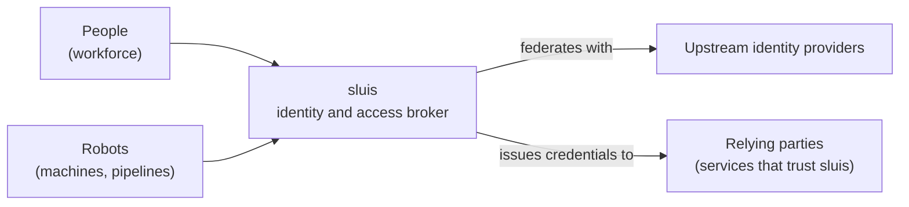

:::note[Placeholder]
This diagram only proves that Mermaid renders. The real context view is drawn when the design model is accepted.
:::

```mermaid
flowchart LR
  people["People<br/>(workforce)"]
  robots["Robots<br/>(machines, pipelines)"]
  sluis["sluis<br/>identity and access broker"]
  upstream["Upstream identity providers"]
  relying["Relying parties<br/>(services that trust sluis)"]

  people --> sluis
  robots --> sluis
  sluis -->|"federates with"| upstream
  sluis -->|"issues credentials to"| relying
```
