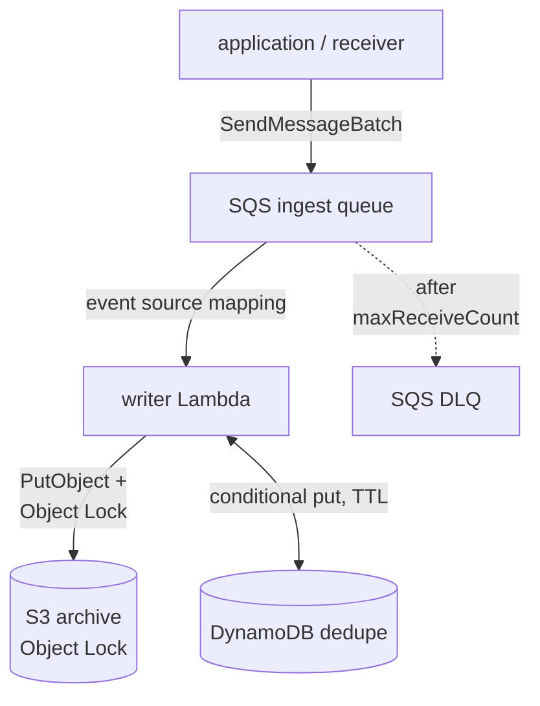
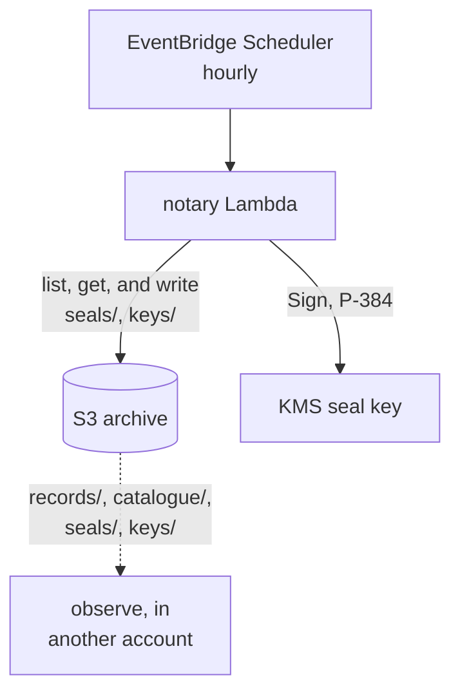
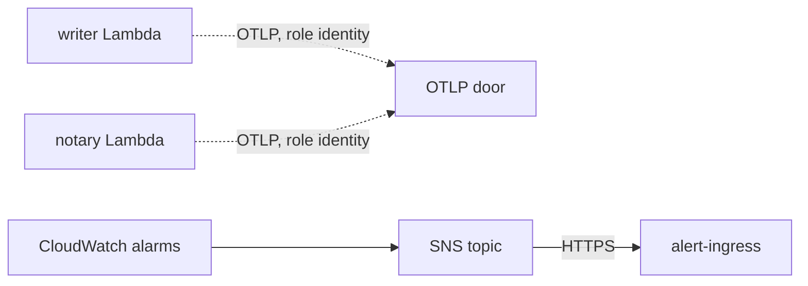

# AWS Lambda: how the writer and the notary run

The audit trail on AWS without Kubernetes: the writer and the notary as Lambda
functions, an SQS queue in front of the writer, an S3 bucket (with Object Lock, once it is turned on),
two KMS keys, and the alarms that say when any of it stops. All of it is built
by a Pulumi Go library, `github.com/truvity/sluis/audit/deploy/pulumi`, which is a
module of its own so that Pulumi is not in the root module's dependency graph.

**Nothing here is deployed by this repository.** The library is tested against
Pulumi's mocks (`just pulumi-test`): it declares the right resources with the
right arguments and creates none. The Lambda binaries are tested against fakes,
and the DynamoDB store against LocalStack. What has not happened is a run in an
account, which is why the [capabilities](../reference/capabilities.md) page marks every AWS
row here 🧪 and not ✅.

## The shape

**Ingest.** The receiver sends batches to SQS; the writer Lambda locks objects in S3 and dedupes in DynamoDB; failures go to a DLQ.

**Seals.** An hourly schedule runs the notary, which signs seals with a KMS key and writes them beside the records; observe reads from another account.

**Telemetry and alerts.** Both Lambdas send OTLP under their role identity; CloudWatch alarms reach the alert ingress through SNS.

The two functions are the [two parts](../../decisions/0058-three-parts-installed-independently.md)
that hold an identity each: the writer writes records and cannot sign, the notary
signs and cannot write a record. Observe is the third part and is not deployed
here; the library only creates the role it reads the bucket through.

### The writer

`cmd/audit-writer-lambda` is the writer of `audit-writer`, the package `writer`,
opened over the same archive with the same profiles and wrapped in the same
`require: archived` guard ([0059](../../decisions/0059-sink-durability-and-transports.md)).
What changes is the shell:

- **Input.** An SQS event source mapping with partial batch responses
  (`ReportBatchItemFailures`). The handler decodes each message as a record,
  writes the batch as one call to the writer, and answers with the messages that
  were not archived, so that only they return to the queue.
  - the write succeeds: no failures, and the platform deletes the batch;
  - the write fails: every message that decoded is returned, and the writer's
    deduplication absorbs any of them that did land;
  - the sink refuses a record by id: that message is returned;
  - a message that is not a record: returned at once. It is a poison message and
    it reaches the DLQ after `MaxReceiveCount` deliveries, where an alarm is on
    it. Deleting it silently would be a record lost without anyone being told.
- **Deduplication.** Not Postgres: a function has no database. The `Dedupe` port
  of the writer has a second adapter, `dedupe/dynamodbdedupe`, with the semantics
  of a JetStream duplicate window and no more machinery than that. One item per
  written record id, `pk = DEDUPE#<id>`, with `expires_at` in epoch seconds.
  - Asking (`Seen`) is a consistent `BatchGetItem` and marks nothing. An expired
    item counts as absent even if DynamoDB has not deleted it yet, which it does
    lazily, up to two days late.
  - Marking is a conditional put per id, `attribute_not_exists(pk) OR
    expires_at < :now`, made only once the copies are durable. Two writers marking
    one id at once is not an error, and a repeat does not extend the window.
  - The order is the one the [Dedupe port](../../decisions/0054-two-deliveries-and-a-durable-ack.md)
    has always had: a crash between the put and the mark costs a second copy of
    the record and never a hole.
  - The table's TTL attribute is `expires_at`, so it cleans itself.
  - The window is the widest any profile's framework profiles ask for unless the
    configuration says (`dedupe.dynamodb.window`). It wants to be at least the
    queue's retention, which is 14 days at most.
- **Configuration.** One file, `/opt/audit/audit.yaml`, in an immutable layer
  version of its own, validated against
  `schemas/config/audit-writer-lambda.schema.json`
  ([0063](../../decisions/0063-one-validated-configuration-file.md)). The function
  finds it through `AUDIT_CONFIG=/opt/audit/audit.yaml`, which the library sets
  and which is also the binary's default. Beside it the layer holds the profile
  document (`deployment.yaml`) and the catalogues (`catalogues/`), so the three
  things that decide what the writer keeps and how it reads a record travel
  together. See [configuration as a layer](#configuration-as-a-layer).
- **Legal holds.** The writer reads the holds every minute in a goroutine. A
  frozen environment does not run it, so the first write after a thaw could act
  on a list older than it looks. The handler re-reads the holds at the start of
  every invocation, and a refresh that fails keeps the last answer, as the
  background one does.
- **Telemetry.** `OTEL_*` only, to the extension's loopback proxy, flushed at the
  end of every invocation (the environment is frozen after it) and on SIGTERM.
- **Queue metrics.** The age of each message at receive, from `SentTimestamp`,
  as the histogram `audit.queue.message.age` (`audit_queue_message_age_seconds`)
  with the label `transport=sqs`. The depth, the oldest message and the DLQ are
  CloudWatch's and are [alarmed](../reference/aws-pulumi-library.md#alarms).

Records on the queue were stamped by a receiver of the installation, which is the
only principal the queue's policy lets send, so the writer keeps the stamp they
carry (`FromStream`), as `audit-writer` does behind a stream.

### The notary

`cmd/audit-notary-lambda` runs `internal/cli.Notary`, the logic of `audit-notary`,
once per invocation. EventBridge Scheduler invokes it hourly (`cron(15 * * * ? *)`,
UTC, a quarter past, after the settle window of the hour that has just ended) and
does not retry: a run is idempotent, so the next run seals whatever is missing,
and a failed run is the Errors alarm's. It reads `audit-notary`'s own file
(`schemas/config/audit-notary.schema.json`) from the same place, with
`signer.kms` naming the seal key by alias. A run that could not seal a tenant
**fails the invocation**. The report is a log line, not standard output.

The notary records `audit.seal.written` only if the file's `sink` names a writer
the function can reach. A function outside a VPC cannot reach an in-cluster
writer, so on AWS the seals themselves, which are in the bucket and verifiable,
are the record, and `audit.seal.age` over OTLP says how far behind they are.

### Why a zip, and why no VPC

A **zip** on `provided.al2023`, `arm64`, and not a container image: the binaries
are static and a few MB and nothing here needs a registry. The release carries
each function as a zip with `bootstrap` at its root
(`audit-writer-lambda_<version>_linux_arm64.zip`,
`audit-notary-lambda_<version>_linux_arm64.zip`), and the library deploys **that
file, byte for byte**: it adds nothing to it and builds no package of its own. You
give it the zip and the SHA-256 the release's `checksums.txt` lists for it
(`Writer.Package`, `Writer.PackageSHA256`; pin the digest in the stack's source, where it is reviewed, and do not fetch `checksums.txt` at deploy time, which would check the file against itself), and it is read, hashed and refused when
it is not that file. The configuration is a layer beside it.

The functions run **outside a VPC** (a decision of the AWS design). They reach S3, DynamoDB,
SQS, KMS and STS over the regional public endpoints with the role's credentials,
and the OTLP door over the internet. That is also why there is no NAT, no
interface endpoint, and no in-cluster writer for the notary to record through.

## Configuration as a layer

The rendered `audit.yaml`, the profile document and the catalogues are published as
an `aws.lambda.LayerVersion` named `<name>-writer-config` (and `<name>-notary-config`,
which holds `audit.yaml` alone), whose zip holds them under `audit/` so that Lambda
extracts them to `/opt/audit/`. The function's `Layers` are the extension, with `Telemetry`, and then the
configuration layer, last so that nothing after it can shadow `/opt/audit/`: two
of the five a function may have. A layer is never destroyed, so the library refuses a
value in `Writer.Keys` whose key says it is a secret (name a secret, `...Secret`, or a file; an `...Env` name is refused too, see [Why no secret is in the environment](#why-no-secret-is-in-the-environment)). Its environment is
`AUDIT_CONFIG=/opt/audit/audit.yaml`, `AUDIT_CONFIG_LAYER=<the layer version's ARN>`
and the telemetry's `OTEL_*`.

The alternative was a pointer: the function's environment names an SSM parameter or
an S3 object that holds the configuration, read at cold start. A layer wins on the
properties that matter to an audit trail. **It is immutable**: a layer version
cannot be edited, so what ran is what was published, and a change is a new version
that the function is pointed at in the same `pulumi up` that is reviewed. **It is
versioned and kept**: the library does not delete an old version when a new one
replaces it (`SkipDestroy`), so a rollback, and an older function version, find the
configuration they ran with. **It has no moving part at start**: nothing is fetched,
there is no IAM for SSM or for a second bucket, and a cold start cannot fail because
a parameter store is unreachable. And **the function and its configuration are two
things with two versions**: a new release of the binary with the same configuration
is a code update, and an edited catalogue with the same binary is a layer update.
The pointer's one advantage, changing the configuration without a deploy, is the
one an audit trail should not have.

The writer says which configuration it ran under in its start-up record
(`audit.writer.started`): the digest of the file, of the profile document and of the
catalogues, and the layer version's ARN
([configuration](../reference/configuration.md#evidence-the-writers-start-up-record)).
The platform does not tell a function which layers it has, so the ARN is what the
library puts in `AUDIT_CONFIG_LAYER`.

## Why no secret is in the environment

A function's environment is not a place for a secret: the console and the API show it to
whoever may describe the function, and every version of the function keeps it. The library
sets no secret in it (the environment is `AUDIT_CONFIG`, `AUDIT_CONFIG_LAYER` and the
telemetry's `OTEL_*`, which the tests hold it to), and the binary refuses
`secrets.source: env` when `AWS_LAMBDA_FUNCTION_NAME` is set. A secret reaches the function
through SSM Parameter Store instead, read at cold start with the function's own role
([store the writer's secrets in SSM](../how-to/aws-store-secrets-in-ssm.md)).

## The lock modes

Storage is configured per install preset ([0068](../../decisions/0068-storage-is-configured-per-preset.md)): the deployment lists the presets it uses, each with its own bucket, prefix, region, optional endpoint and key alias, and the lock is a property of the preset's bucket. Object Lock COMPLIANCE exists only on an attested preset's S3 bucket; the other presets write no lock, and a store at an endpoint (R2) never has one. The modes below are the Pulumi library's `Archive.ObjectLockMode` for that bucket; where the text says `archive.lockMode`, read it as the lock of the preset's bucket.

The mode is a parameter, and it is required. **The order is NONE, then
GOVERNANCE, and COMPLIANCE only after sign-off**
([0065](../../decisions/0065-archive-retention-and-lifecycle.md)).

- **NONE** creates no Object Lock configuration. `archive.lockMode` is `none` in
  both functions' configuration, so the writer and the notary send no retention
  and no legal-hold header, and their roles are not granted
  `PutObjectRetention` or `PutObjectLegalHold`. The bucket is versioned all the
  same, which is what lets the lock be turned on later. Every profile in the
  deployment must then be satisfied by no lock (the attested tier,
  [0056](../../decisions/0056-lock-modes-and-store-tiers.md)): the writer refuses
  to start when a profile's frameworks demand a stricter mode, and the first
  rollout is where that shows. A NONE bucket is for a period while formats,
  seals and layout settle; whatever is written during it is not locked, and
  stays unlocked after the lock is turned on.
- **GOVERNANCE** adds the Object Lock configuration. A principal holding
  `s3:BypassGovernanceRetention` can shorten or remove a retention. No role in
  this stack holds it. It is a rehearsal for the retention values, the key
  layout and the lifecycle, not a destination.
- **COMPLIANCE** is the one where **nobody can shorten or remove a retention,
  including the account's root**, until each object's retention date. A retention
  wrong in the long direction is paid for until it expires, and one set on the
  wrong bucket cannot be undone. It needs `AcknowledgeCompliance: true`; without
  it the library refuses to build anything, and says why.

The bucket, its versioning and both KMS keys are protected (Pulumi's `protect`)
in every mode, `NONE` included. A trial bucket can still be destroyed, but only
by lifting the protection by hand first, which is cheap insurance against an
accidental `pulumi destroy` and costs a trial one extra step.

The bucket, its versioning and both KMS keys are protected (Pulumi's `protect`) in every
mode, `NONE` included: a trial bucket can still be destroyed, but only by lifting the
protection by hand first. To change the mode see
[turn the Object Lock on](../how-to/aws-turn-on-object-lock.md).
