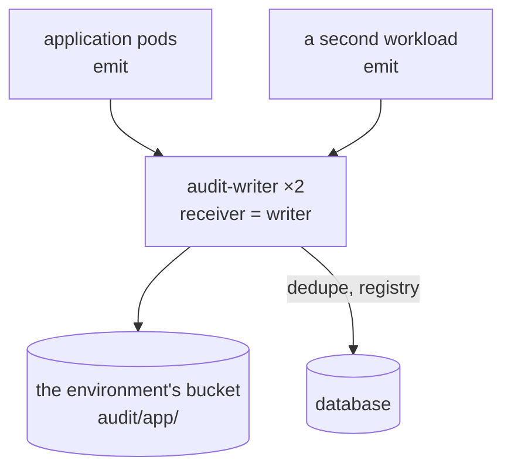
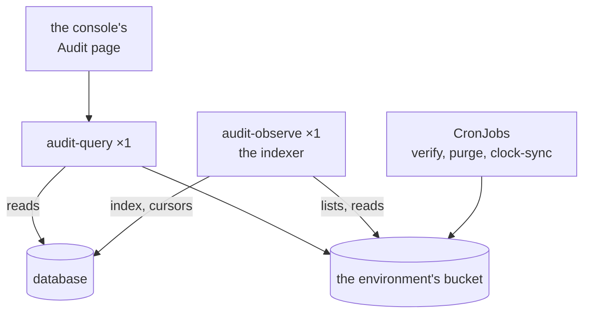
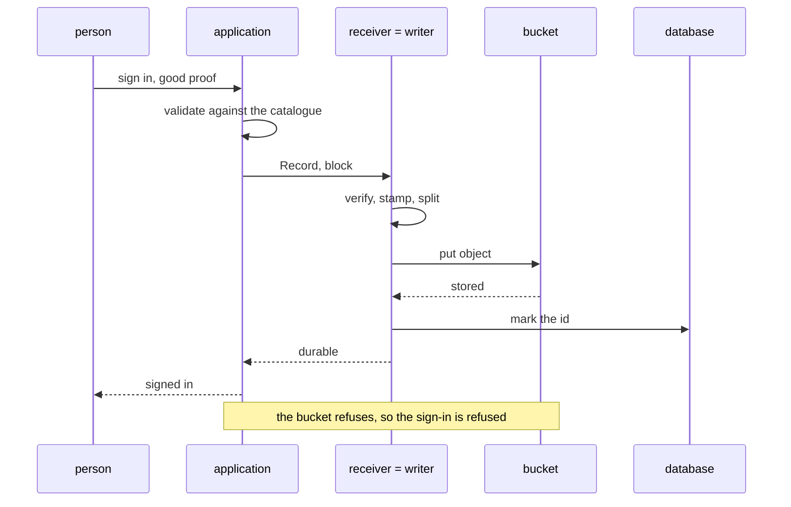

# Direct mode

The receiver is the writer. A record arrives over Connect, is validated,
split per profile, rolled into an object and put into the bucket, and only
then acknowledged. There is no stream and nothing to consume.

This is the shape for an internal service — an identity service, an
operations console, anything whose record rate is tens or hundreds a minute
rather than thousands a second — and for any cluster that has no message
stream to use.

## What it looks like

**Write path.** Every workload of the application emits to the same writer, which puts the object in the bucket and marks the id in the database.

**Read path and jobs.** The indexer fills the index; the query service answers the console's Audit page; the CronJobs verify and purge the bucket.

Two receiver replicas are safe: the deduplication table is in Postgres, so
two pods cannot write the same record twice, and the application's client
follows the Service to whichever is ready.

## One record

A privileged sign-in, declared `block` in the catalogue:

An `async` record takes the same path, except that the application does not
wait: it is queued, batched with whatever else is queued, and the batch is put
and acknowledged as one. The application's queue holds a record from the
moment it is recorded until that acknowledgement — one flush interval plus a
round trip, and that is the loss window if the pod dies. The emitter's `Flush`
and `Batch` are the knobs.

## Running it

The values, the index's database and the checks are in the
[Kubernetes tutorial](../getting-started/kubernetes.md) (the whole of
[`charts/audit/examples/direct.yaml`](../../../charts/audit/examples/direct.yaml) is rendered by the
chart's own tests) and [prepare the database](../how-to/prepare-the-database.md). The index
is behind the archive by the indexer's settle window (two minutes by default,
[0062](../../decisions/0062-observe-follows-the-bucket.md)); anything that must see a record
sooner reads the sink's acknowledgement, not the index. What to do when something fails is
in [recover from an outage](../how-to/recover-from-an-outage.md).
