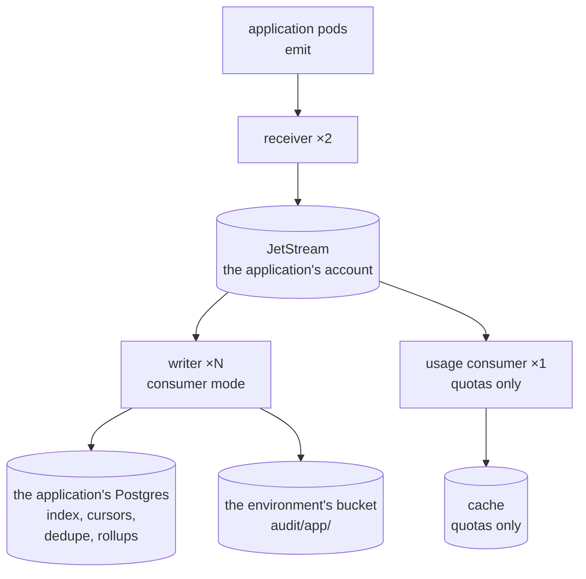
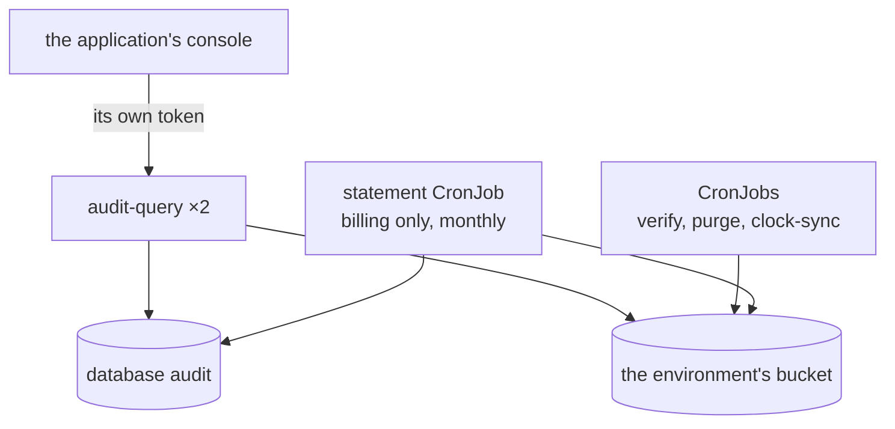
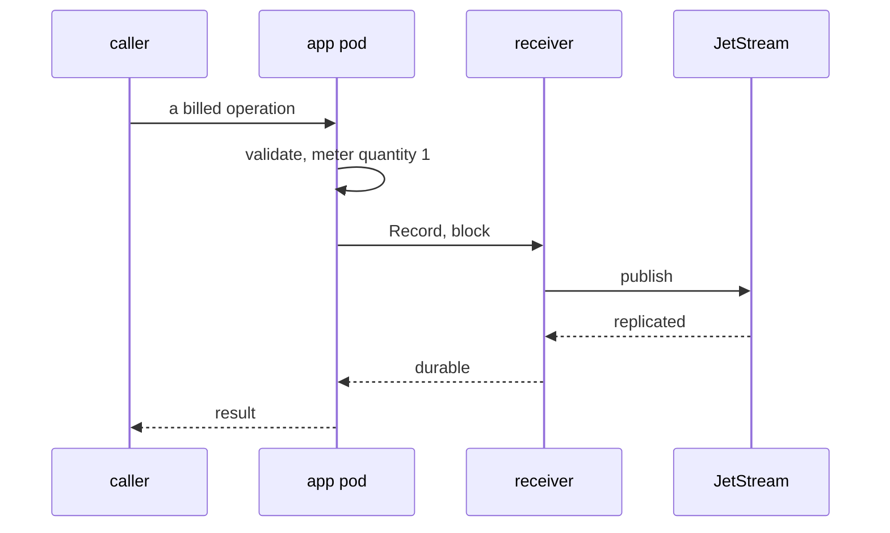
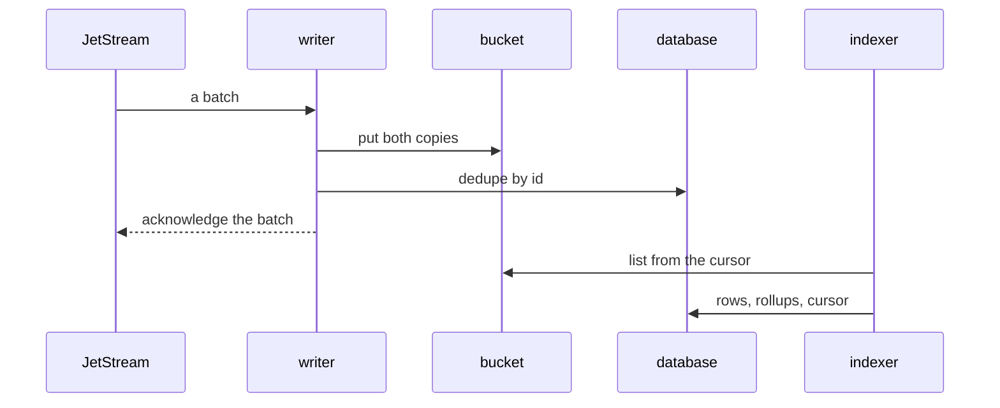

# Stream mode

The receiver publishes to a JetStream stream and acknowledges when the
stream says the record is replicated. Writers are separate pods that consume
the stream and put the objects; the indexer follows the bucket. Nothing in the application's
request path waits for S3.

This is the shape for a product: many application pods, a record rate that
makes batching worth having, a metering profile, and — if quotas are wanted
— a second consumer of the same stream.

## What it looks like

**Write path.** Pods emit to the receiver, which publishes to JetStream; the writers drain it into the object bucket and the database, and the usage consumer feeds the quota cache.

**Read path and jobs.** The query service, the CronJobs and the billing statement read the same database and bucket; the console reaches the query service with its own token.

**Read path and jobs.** The query service, the CronJobs and the billing statement read the same database and bucket; the console reaches the query service with its own token.

**A billed operation, answered.** The caller gets its result as soon as JetStream has replicated the record.

**Then, moments later.** The writer drains JetStream into the bucket and the database, and the indexer follows the bucket.

The writer acknowledges to the stream only after the objects are in the
bucket, so a writer that dies mid-batch causes a redelivery and the dedupe
table absorbs it.

It also gathers before it writes. Fetching from a stream returns whatever is
there, and writing each fetch straight through would make an object of each; an
archive of many small objects costs a request to put, an entry in every listing,
forever. So the writer accumulates until one of three is reached —
`roll.maxRecords`, the roller's byte limit, or `roll.interval` — and writes
once. Nothing waits on this but the object: the records are already durable on
the stream, and they stay unacknowledged until the put, so a writer that dies
mid-window leaves them for the next one.

`stream.ackWait` must therefore exceed `roll.interval` plus the longest a put
can take. The writer refuses to start otherwise, because a stream that gives up
waiting sooner offers the same records to a second writer and the day's objects
quietly double.

## Who the query service trusts

In this shape the console is usually behind a gateway that issues its own
token, so the page calls the query service directly with the token the
person's session already has. The query service lists that issuer and
audience in its grants, and the grants decide which profiles and tenants the
person may read.

An application whose console keeps a session of its own instead — a cookie,
not a gateway token — reaches the query service through the console, which
mints a short token per person. Both are described in
[integrating](../how-to/connect-an-application.md#the-audit-page).

## Scaling

Receivers scale with the application's request rate, writers with the record rate and the
number of profiles, and the stream is sized for the longest writer outage you want to
survive. The values and the rest are in
[run the chart in stream mode](../how-to/run-stream-mode.md).
