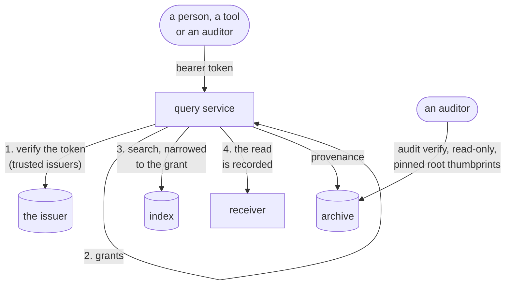

# Read the trail

## Purpose

Read the audit trail as a person or a program through the query service, from Go or TypeScript, and let an auditor check the archive without trusting anyone.

## Preconditions

- The query service is enabled (`query.enabled`) with grants naming your issuer ([configuration](../reference/configuration-observe-query.md#query-service)).
- A bearer token from a trusted issuer. The Go code is [`examples/read`](../../../audit/examples/read/main.go), compiled on every run of the gate.

## Before you start

- **The query service is the only way back in.** Nothing in the write path can hand a record to a caller, and every read is itself recorded (`audit.get`, `audit.search`).
- **Grants decide what a caller may read:** the query service trusts only the issuers its grants name, and a group's name can be the grant.

## Steps

How people and programs read the audit trail: who may see what, the API with
examples, the Go and TypeScript clients, and how an auditor checks the archive
without trusting anyone. The Go code is
[`examples/read`](../../../audit/examples/read/main.go), compiled on every run of the
gate.

The query service is the **only** way back in. Nothing in the write path can
hand a record to a caller, and every read is itself recorded.



### Access

The query service trusts only the issuers its **grants** name
(`query.grants` in the chart, the file the query service's `grants` names),
and grants only what they say:

```yaml
issuers:
  - url: https://id.example.com          # exactly as the tokens' iss claim says it
    audience: audit                      # required: this installation's own audience

# Groups named <scope>:audit:<role> grant themselves — see the table below.
presets:
  - name: access-roster
    issuer: https://id.example.com

# Anything a group name cannot say is an explicit rule.
rules:
  - name: assessor-2026-q3               # an external assessor: one period only
    issuer: https://id.example.com
    claim: groups
    value: all:audit:assessor
    grant:
      all_tenants: true
      profiles: [security]
      operations: [search, get]
      from: 2026-07-01T00:00:00Z
      until: 2026-10-01T00:00:00Z
```

Where the application's console is behind a gateway that issues its own
tokens, the issuer named here is that gateway and the audience is the
installation's, so the Audit page can call the query service directly with the
token the person's session already has
([the Audit page](connect-an-application.md#the-audit-page)).

With the `access-roster` grants preset (sluis's group grammar), a group's name is the grant:

| group | may |
|---|---|
| `<tenant>:audit:viewer` | search, facets, get on the history profile of that tenant |
| `all:audit:security` (or `<tenant>:…`) | search, facets, get, tail, export on the security profiles |
| `all:audit:auditor` | search, facets, get, export on every profile but billing |
| `all:audit:billing` | search, facets, get, export on the billing profiles |
| `all:audit:evidence` | search, get, export on the evidence profile |

`all:audit:viewer` grants nothing, and **no group name grants `resolve`**. A
caller holding several groups gets their union on each profile, never across
profiles. The service refuses to start if the grants name no issuer, an issuer
has no audience, or a rule could be satisfied by more than one issuer. The
full rules are in
[the configuration reference](../reference/configuration-observe-query.md#query-service).

Every read — search, facets, get, export, resolve — is itself recorded in the
trail, naming the caller and the rule that allowed it.

#### What a caller may read

`Access` reports which profiles the caller may read, with the operations it
holds on each, the tenants and the period:

```sh
curl -s …/audit.v1.QueryService/Access \
  -H "Authorization: Bearer $TOKEN" -H 'Content-Type: application/json' -d '{}'
```

It is the same grants and the same rules every other call is held to, so a
page can offer exactly what the caller may open without its host knowing the
installation's profile names. This is how the Audit page decides what to show:
with no `profiles` passed, it asks `Access` and renders a tab per profile that
comes back. It reads no record and is not recorded.

### The API

Connect RPC, so every method is a `POST` with a JSON body (or binary
protobuf). JSON field names are snake_case. The contract is
[`query.proto`](../../../audit/proto/audit/v1/query.proto); the reference, with the
operators and limits, is [API](../reference/api.md).

**Search**, newest first, one page at a time:

```sh
curl -s https://audit-query.example.com/audit.v1.QueryService/Search \
  -H "Authorization: Bearer $TOKEN" -H 'Content-Type: application/json' \
  -d '{
    "profile": "security",
    "filter": [{
      "occurred_at": {"between": {"from": "2026-09-01T00:00:00Z", "to": "2026-09-18T00:00:00Z"}},
      "action":      {"prefix": "shop.order."},
      "outcome":     {"in": {"values": ["failure", "denied"]}}
    }],
    "limit": 100
  }'
```

The response has `items`, the normalised `query`, and `cursors`. Send
`cursors.next` back as `"cursor"` with the same query for the next page. The
last page's `next` never disappears: asked again later, it returns what was
recorded since, which is how a **tail** works. A search that matches nothing
has no `items` key at all.

Filters are up to four OR-joined conjunctions of typed predicates (`equal`,
`in`, `prefix`, time ranges, predicates on the extension properties a
catalogue marks filterable). There is no free text and no regular expression:
both are unbounded work on a table that only grows.

**Facets**, for navigation:

```sh
curl -s …/audit.v1.QueryService/Facets -H "Authorization: Bearer $TOKEN" -H 'Content-Type: application/json' \
  -d '{"profile": "security", "fields": ["action", "outcome"], "limit_per_field": 10}'
```

**Get** one record, with where its copy is and, once seals exist, whether one
vouches for it:

```sh
curl -s …/audit.v1.QueryService/Get -H "Authorization: Bearer $TOKEN" -H 'Content-Type: application/json' \
  -d '{"profile": "security", "id": "0199b100-0000-7000-8000-00000000001a"}'
```

`provenance.object_key` and `line` locate the copy in the archive. `digest_id`
(named from before seals) is the key of the seal that covers the object's hour,
when the service is given the archive and the hour is sealed
([0061](../../decisions/0061-seals.md)); empty means not sealed yet, the ordinary
state of the current hour. It says an hour is sealed, not that anyone has
checked the seal: `verified_at` stays empty until a verifier marks it, which
`audit verify` does not do and the follower's verification marks will, and a
reader should take empty as not verified.

**Export** starts a job, **GetExport** polls it and returns a short-lived
download link:

```sh
curl -s …/audit.v1.QueryService/Export -H "Authorization: Bearer $TOKEN" -H 'Content-Type: application/json' \
  -d '{"profile": "security", "filter": [{"action": {"prefix": "shop."}}], "format": "FORMAT_NDJSON"}'
curl -s …/audit.v1.QueryService/GetExport -H "Authorization: Bearer $TOKEN" -H 'Content-Type: application/json' \
  -d '{"job_id": "…"}'
```

**Resolve** maps a pseudonym back to the identity behind it, for the cases the
law requires. It needs the `resolve` operation, which no read grant implies
and no group name gives — only an explicit rule — and it is recorded before it
answers:

```sh
curl -s …/audit.v1.QueryService/Resolve -H "Authorization: Bearer $TOKEN" -H 'Content-Type: application/json' \
  -d '{"profile": "security", "tenant_id": "acme", "pseudonym": "ps_…"}'
```

**Resolve is refused as `unimplemented` where the deployment runs no key
provider**, which is the default (no `keys` in the query service's
configuration, or `provider: none`): there are no
pseudonyms to undo, the identifiers in a record are the ones the application
wrote, and the service says so rather than returning nothing
([0055](../../decisions/0055-no-pseudonymisation-keys-by-default.md)). Where keys
are configured, resolving is impossible once the tenant's key has been
destroyed — `failed_precondition`, which is what erasure means here.

Errors are Connect codes a client can act on: `permission_denied`,
`invalid_argument`, `resource_exhausted`, `not_found` (also for a record
outside your grant), `failed_precondition`, `unimplemented`, and `unavailable`
— retry that one.

### From Go

```go
client := auditv1connect.NewQueryServiceClient(httpClientWithYourBearer, "https://audit-query.example.com")
page, err := client.Search(ctx, connect.NewRequest(&auditv1.SearchRequest{Profile: "security", Limit: 100}))
```

[`examples/read`](../../../audit/examples/read/main.go) builds a filtered search, pages
it to the end, and reads one record with its provenance.

### From TypeScript

`@truvity/audit` is the client, the typed contract, the qualifier box compiled
to the typed filter, and records rendered as their catalogues' sentences.
It has no UI dependency. The hooks and a default MUI view are the separate
package `@truvity/audit-react`, below. Both are built from `ts/` and `react/`
and published to GitHub Packages at each release tag's version (the same
version for both): `npm install @truvity/audit @truvity/audit-react` with the
`@truvity` scope pointed at `https://npm.pkg.github.com`.

```ts
import { createConnectTransport } from "@connectrpc/connect-web";
import { compileQualifiers, createQueryClient, Sentencer } from "@truvity/audit";

const audit = createQueryClient(createConnectTransport({
  baseUrl: "https://audit-query.example.com",
  jsonOptions: { useProtoFieldName: true },
  interceptors: [(next) => async (req) => {
    req.header.set("Authorization", `Bearer ${await token()}`);
    return next(req);
  }],
}));

const { filter, errors } = compileQualifiers("outcome:failure,denied since:24h");
const page = await audit.search({ profile: "security", filter: [filter], limit: 100 });
const words = new Sentencer([myCatalogue]); // from `audit messages catalogue.yaml`
for (const r of page.items) console.log(words.sentence(r));
```

### The page

`@truvity/audit-react` has the view that goes in the **application's own
console**. It takes a client over the host's transport, so the console's own
sign-in is what authenticates it, and it holds no credentials:

```tsx
import { AuditProvider, AuditView } from "@truvity/audit-react";

<AuditProvider client={audit} sentences={[myCatalogue]}>
  <AuditView permalink={(p, id) => `/audit/${p}/${id}`} />
</AuditProvider>
```

It has:

- a tab per profile the caller may read: the service says which (`Access`),
  unless the host passes `profiles`;
- the qualifier box and a time range, and counts to narrow by;
- records as sentences, newest first;
- a row that opens to the record, with a chip per value to narrow to it or
  away from it, a link, and whether a verified seal covers it;
- live updates, which need a searcher that orders by recorded time: the index
  does, the archive scan does not.

`useSearch`, `useTail`, `useFacets`, `useRecord` and `useAccess` are the same
logic without the MUI view, for a console that draws its own.

**Sentences** come from catalogues. `audit messages catalogue.yaml` prints
what the view needs as JSON; ship it with the console. The component's own
actions (`audit.*`) are built in.

Where the page sits and how it reaches the query service is
[the Audit page](connect-an-application.md#the-audit-page); what it does with a record is
[its design](../explanation/audit-page.md). There is one page, and the
application's own console hosts it: an installation belongs to one
application, so there is nothing for a console of its own to front.

### For an auditor

An auditor does not have to trust the operator, the database or this service.
With read-only access to the archive and nothing else:

```sh
audit verify --profile security --from 2026-09-01 --to 2026-09-18 \
  --bucket example-audit --prefix audit/app
```

It checks every record object ingested in the range: its key, its metadata, the
SHA-256 of its bytes and the hash of every record in it, and with
`--deployment` any lock shorter than the profile requires. Exit status zero
means nothing was found. Both shapes write the same archive, so the same
command verifies either. It does not show that nothing was removed; seals will.
An archive written before the v1 layout needs the previous release's CLI
(v0.6.x). See [verification](verify-the-trail.md).

The query service can be held to its contract the same way, from outside, with
nothing but a sign-in that may read:

```sh
audit conformance --query https://audit-query.example.com --profile security \
  --token-file token --verified-before 48h
```

It walks each profile's records and checks what the search contract promises:

- every record comes back once, newest first;
- the last page keeps its `next` cursor;
- `Get` returns what `Search` returned, and says where the copy is;
- a filter on id, action, tenant or time returns only what matches;
- a cursor is refused with another query, and an unknown id is not found;
- with `--verified-before`, a record older than that is covered by a verified
  seal (until seals exist, no record is).

It reads and never writes: a run that wrote test records would leave them in a
locked archive for years. Its reads are recorded like anyone's. A non-zero
exit names the checks that failed.

## Afterwards

- An auditor needs no query service: `audit verify` against the archive ([verify the trail](verify-the-trail.md)).
- Run `audit conformance` against the query service after changing grants.
