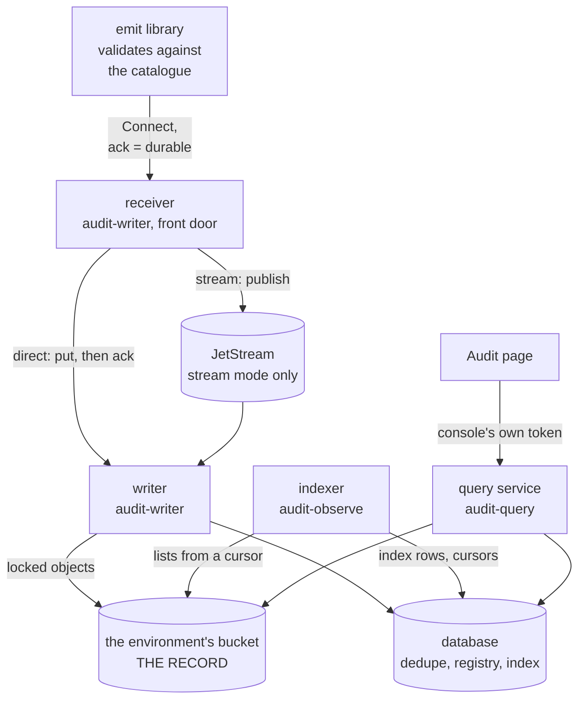

# How is audit built?

One installation belongs to one application. [Concepts](concepts.md) defines the vocabulary. [Direct mode](direct-mode.md) and [stream mode](stream-mode.md) show each shape as run.

The [bucket contract](../../reference/audit/bucket-contract.md) and the [capabilities](../../reference/audit/capabilities.md) matrix state what exists per platform.

## The parts

| part | runs as | holds | never holds |
|---|---|---|---|
| emit | library in the application | compiled-in catalogue, bounded in-memory queue | bucket, index or stream credentials |
| receiver | `audit-writer`, one or two pods | stream credentials in stream mode | none |
| writer | consumer mode, N pods; the receiver in direct mode | write on its prefix, a dedupe and registry role | the index, any way to hand a record back |
| indexer | `audit-observe`, one pod | read on the archive, the index role | write on the archive, the dedupe table |
| notary | `audit-notary`, hourly CronJob | read on the prefix, put under `seals/`, the seal key | write on `records/` |
| verify | nightly CronJob | read on the prefix | write on the archive |
| query service | `audit-query`, one or two pods | read-only index role, read on the prefix | write on the archive or index |
| Audit page | React component in the console | nothing | credentials |
| usage consumer | small Deployment, [quotas](../../guides/audit/operate/enable-usage-quotas.md) only | the counter cache | none |

The application holds no credentials for the trail. A compromised application pod can reach the archive only by emitting records. Nothing in the write path can read a record back. The query service is the only way in, and it records every read.

The bucket is one per environment, Object Lock in compliance mode where a profile demands it. The index is one database in the application's Postgres: rows, facet counts, cursors, rollups, and the writer's dedupe table under another role. Nothing in it is unrebuildable.

## The catalogue

One YAML file lives with the application code, with a JSON Schema per action that carries data. It names each action's operation, framework categories, profile copies, subject, actors, data schema, delivery and sentence template.

- A catalogue is one per application. It names [framework profiles](../../../audit/profiles/README.md) and never defines them.
- Every record names its catalogue version. The archive keeps every version.
- The catalogue reaches the receiver at start-up over `RegisterCatalogue`. A malformed catalogue is refused and the application does not start. An unreachable receiver is retried.
- Use one constructor per action, so `check-emitters` can hold the code to the file.

CI runs `audit validate` and `check-emitters`. The emit library refuses a mismatching record. The receiver and writer validate again. The query service renders sentences from it. See [the catalogue reference](../../reference/audit/catalogue.md).

## What an acknowledgement means

Delivery is set per action in the catalogue.

| delivery | the call returns | receiver down | for |
|---|---|---|---|
| `block` | when the receiver acknowledges durability | the action fails | privileged sign-in, key destruction, billable operations |
| `async` (default) | at once | the record waits in a bounded queue and retries with backoff | everything else |

The acknowledgement states durability. `Archived` is the object in the bucket, which the receiver puts before answering in direct mode. `Queued` is a replicated queue's acknowledgement. `Logged` is a log line. The start-up guard `sink.Require` refuses a chain that can never give what the deployment needs.

## What each mode can lose

A `block` record is never lost. For `async`:

| event | direct mode | stream mode |
|---|---|---|
| application pod dies with records queued | unacknowledged records: one flush interval (default one second) plus the batch in flight | the same, shorter |
| writer dies holding stream records | not applicable | nothing, because the stream redelivers |
| receiver or writer crashes | nothing | nothing |
| long receiver outage overflows the queue | oldest dropped and counted | the same |
| container restarts, pod intact | the queue is gone, as in row one | the same |

The emitter logs each record the queue gives up, with its identifier and reason. Alert on `audit.emit.records.dropped`. Watch `audit.emit.queue.pending`.

## The life of one record

1. The emitter fills id, time, source, sequence, client address and ids. It validates against the catalogue and delivers as declared.
2. The receiver stamps `recorded_at`, the observer from the caller's verified token, and `origin_hash`. In stream mode it stamps here, because writers have no caller to verify. They keep a stamp whose hash matches and stamp afresh otherwise.
3. The writer splits the record into one copy per profile, keeps only the allowed fields, and treats each identity by category. See [the writer](split-writer.md).
4. The writer rolls copies into objects per ingest batch, profile and tenant, keyed by the hour of ingest. It puts each under an Object Lock retention computed from the profile. A record it cannot take goes to the dead-letter prefix.
5. The writer marks the id as written. The indexer lists the bucket once an object passes the settle window and writes the rows and facet counts a couple of minutes later.
6. The verify job checks the previous day's objects nightly. The notary makes [seals](integrity.md) hourly, checked with `--root`.
7. A reader asks the query service. Their grant becomes one term of the query, and the read is recorded.

The writer and every job record their own activity in the archive.

## The two shapes

| | [direct](direct-mode.md) | [stream](stream-mode.md) |
|---|---|---|
| for | internal service, low volume, no stream | product with many pods, metering, quotas |
| receiver | is the writer and puts to the bucket | publishes to JetStream |
| writers | the receiver's pods | N consumers, scaled apart |
| needs | bucket, database | bucket, database, NATS account |

Switching from direct to stream changes only the receiver's configuration. The archive layout is the same, so installations on different versions can share a bucket.

## Extensions

Both are projections switched on per installation and add nothing to the request path.

- [Billing](../../guides/audit/operate/enable-billing.md): rollups at index time and an immutable monthly statement.
- [Usage quotas](../../guides/audit/operate/enable-usage-quotas.md): a second stream consumer counting into a cache, a decision point, and an hourly reconciler.

Receiver and writer never combine records. They batch many records into one object per profile, tenant and day per batch. Projections (index rows, facet counts, rollups, usage counters) rebuild from the archive with `audit reindex`, so none is backed up.

## What is built

| | state |
|---|---|
| record, catalogue, framework profiles, emitter, writer, query service, v1 bucket layout, verify, legal holds, retention addenda | built |
| searchers: Postgres, archive scan, memory | built |
| signers: key file, AWS KMS, OpenBAO transit | built |
| key providers `local`, OpenBAO `transit` and AWS KMS | built, off by default |
| one validated configuration file per binary | built |
| chart per application, golden per shape | built |
| `@truvity/audit`, `@truvity/audit-react` | built; published to GitHub Packages at each release tag |
| TypeScript emitter | designed, not built |
| billing statement, usage consumer, reconciler | designed, not built |
| exporters (OCSF, ECS, Parquet), adapters | designed, not built |

## Decided in

- [0053 One installation per service or product](../../decisions/0053-one-installation-per-service-or-product.md).
- [0058 Three parts installed independently](../../decisions/0058-three-parts-installed-independently.md).
- [0059 Sink durability and transports](../../decisions/0059-sink-durability-and-transports.md).
- [0061 Seals](../../decisions/0061-seals.md).
- [0062 Observe follows the bucket](../../decisions/0062-observe-follows-the-bucket.md).
- [0065 Archive retention and lifecycle](../../decisions/0065-archive-retention-and-lifecycle.md).
- [0066 Indexer and query are separate processes](../../decisions/0066-indexer-and-query-are-separate-processes.md).
