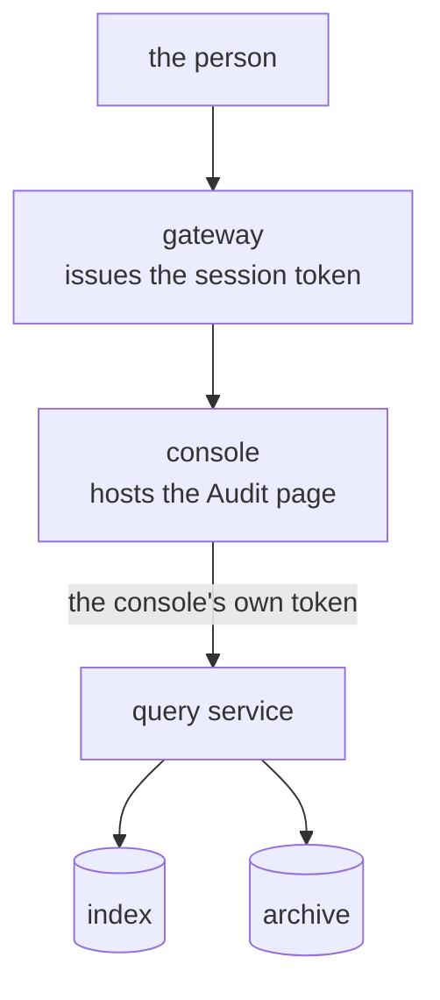

# What is the Audit page?

The Audit page is a React component from `@truvity/audit-react`, over the query client `@truvity/audit` in `ts/`. The application's own console renders it. It calls the query service of the installation in that application's namespace.

There is no standalone console. An installation belongs to one application, which already has a console.

## Whose token it uses

The page holds no credentials and does no authentication. It receives a transport with a bearer, and the query service decides what that bearer may read.

The usual bearer is the console's gateway-issued session token. The query service lists that issuer and audience among its grants, and the grants say which profiles, tenants, operations and period the person may read. Configure only the query service's address in the console.

A console whose session is a cookie has no bearer. It proxies the query service and mints a short-lived token per person from its session claims, with an audience the query service trusts. The token never reaches the browser. This needs a signing key, a mint path and a proxy route, so prefer a gateway-issued token when you have one. See [a console with a session of its own](../../guides/audit/connect/connect-an-application.md#a-console-with-a-session-of-its-own).

## Where the query service lives

A console in the cluster keeps the query service address in-cluster, or proxies. The installation then has no public name. You need `<host>/<installation>` or `<app host>/audit` only when the console runs outside the cluster. The chart publishes it through Gateway API with `query.route`; see the [chart README](../../../charts/audit/README.md#publishing-the-query-service) and [integrating](../../guides/audit/connect/connect-an-application.md#the-audit-page).

## Navigation

Profiles are the top level. A person sees only the profiles their grant allows, as the query service's `Access` reports them. Inside a profile:

- a facet sidebar;
- a qualifier box (`actor:`, `action:`, `target:`, `outcome:`, `tenant:` and a time range) that compiles to the typed filter;
- the reverse-chronological table.

A tenant scope and a histogram are planned. The page shows one application's trail. A view over several applications is a read across several prefixes.

## Row

A row shows a sentence rendered from the catalogue template (ICU MessageFormat, locale-aware), the outcome and the time with its UTC offset. Expanding a row shows:

- the JSON, with filter-for and filter-out on its values;
- pivots by request id, trace id, actor and target;
- a permalink by event id;
- a seal badge: not sealed yet, sealed but not verified, or verified.

A client-address column and an old-versus-new diff are planned.

With `keys.provider: none`, the default, an identity shows as written and the page offers no resolve. The query service refuses it as unimplemented.

## Actions

The page offers live tail, which polls the tail cursor, and copy permalink. An export action is planned. Each action is a read, and the query service records it.

## Grafana

Grafana's Postgres datasource suits operator dashboards over the counts table. It cannot scope by the viewer's tenant claim, render catalogue sentences, run export jobs or show integrity. It complements the page.

## Decided in

- [0049 Authentication and authorization plug points](../../decisions/0049-authentication-and-authorization-plug-points.md).
- [0053 One installation per service or product](../../decisions/0053-one-installation-per-service-or-product.md).
- [0055 No pseudonymisation keys by default](../../decisions/0055-no-pseudonymisation-keys-by-default.md).
