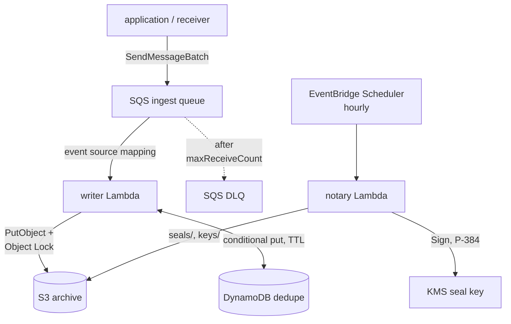

# How do the writer and notary run on AWS Lambda?

Audit runs on AWS without Kubernetes as two Lambda functions, an SQS queue before the writer, an S3 bucket, two KMS keys and alarms. The Pulumi Go library `github.com/truvity/sluis/audit/deploy/pulumi` builds all of it.

Tests use Pulumi mocks, fakes and LocalStack (`just pulumi-test`). No run in an account has happened, so [capabilities](../../reference/audit/capabilities.md) marks every AWS row 🧪.

## The shape

The writer cannot sign. The notary cannot write a record. Observe is the third [part](../../decisions/0058-three-parts-installed-independently.md); the library only creates its bucket-read role. Both functions send OTLP under their role identity, and CloudWatch alarms reach the alert ingress through SNS.

Each function is a zip on `provided.al2023`, `arm64`, with `bootstrap` at its root, named `audit-{writer,notary}-lambda_<version>_linux_arm64.zip`. Set `Writer.Package` and `Writer.PackageSHA256` from the release `checksums.txt`. The library refuses any other file.

The functions run outside a VPC and reach S3, DynamoDB, SQS, KMS and STS over regional public endpoints. There is no NAT and no interface endpoint.

## The writer

`cmd/audit-writer-lambda` wraps the `audit-writer` package with the `require: archived` guard.

An SQS event source mapping with `ReportBatchItemFailures` feeds the handler, which writes each batch in one call and returns the messages not archived.

| outcome | result |
|---|---|
| write succeeds | the platform deletes the batch |
| write fails | every decoded message returns, and deduplication absorbs any that landed |
| the sink refuses a record | that message returns |
| the message is not a record | it returns at once and reaches the DLQ after `MaxReceiveCount` deliveries |

Deduplication uses `dedupe/dynamodbdedupe`: one item per record id, `pk = DEDUPE#<id>`, with the TTL attribute `expires_at` in epoch seconds.

`Seen` is a consistent `BatchGetItem` and marks nothing. An expired item counts as absent, though DynamoDB deletes it up to two days late. Marking is a conditional put, `attribute_not_exists(pk) OR expires_at < :now`, made once the copies are durable.

The window is the widest any framework profile asks for, unless you set `dedupe.dynamodb.window`. Set it to at least the queue retention, 14 days at most.

The handler re-reads legal holds at the start of each invocation. A failed refresh keeps the last answer.

Telemetry uses `OTEL_*` only, flushed at the end of each invocation. The histogram `audit.queue.message.age` (`audit_queue_message_age_seconds`, label `transport=sqs`) reports message age from `SentTimestamp`. CloudWatch owns the queue [alarms](../../reference/audit/aws-pulumi-library.md#alarms).

## The notary

`cmd/audit-notary-lambda` runs `internal/cli.Notary` per invocation. EventBridge Scheduler runs it hourly at `cron(15 * * * ? *)` UTC, without retry. A run is idempotent, so the next run seals what is missing. The Errors alarm covers failures.

Its file follows `schemas/config/audit-notary.schema.json`, with `signer.kms` naming the seal key by alias. A run that cannot seal a tenant fails the invocation.

Outside a VPC the notary cannot reach an in-cluster writer, so it records `audit.seal.written` only when `sink` names one it can reach. The seals in the bucket are the record, and `audit.seal.age` over OTLP reports lag.

## Configuration as a layer

The rendered `audit.yaml`, the profile document and the catalogues ship as a layer version `<name>-writer-config`. The notary's layer, `<name>-notary-config`, holds `audit.yaml` alone. Lambda extracts the zip's `audit/` to `/opt/audit/`.

The environment is `AUDIT_CONFIG=/opt/audit/audit.yaml`, `AUDIT_CONFIG_LAYER=<layer version ARN>` and the telemetry `OTEL_*`. The writer schema is `schemas/config/audit-writer-lambda.schema.json`.

A layer version is immutable and the library keeps old versions (`SkipDestroy`), so a rollback finds its configuration. The library refuses a `Writer.Keys` secret, because a layer is never destroyed.

The writer records the digests of the file, profile document and catalogues, and the layer ARN, in `audit.writer.started` ([configuration](../../reference/audit/configuration.md#evidence-the-writers-start-up-record)).

## Why no secret is in the environment

The library sets no secret in a function's environment. The binary refuses `secrets.source: env` when `AWS_LAMBDA_FUNCTION_NAME` is set. A secret reaches the function through SSM Parameter Store, read at cold start with the function's role: [store the writer's secrets in SSM](../../guides/audit/operate/aws-store-secrets-in-ssm.md).

## The lock modes

Each install preset has its own bucket, prefix, region, optional endpoint and key alias. Object Lock COMPLIANCE exists only on an attested preset's S3 bucket. A store at an endpoint such as R2 has no lock.

`Archive.ObjectLockMode` is required. Move from NONE to GOVERNANCE, and to COMPLIANCE after sign-off.

| mode | effect |
|---|---|
| NONE | No Object Lock configuration. `archive.lockMode` is `none`; no retention or legal-hold header is sent; the roles lack `PutObjectRetention` and `PutObjectLegalHold`. The bucket is versioned, so you can turn the lock on later. Objects written meanwhile stay unlocked. |
| GOVERNANCE | Adds the configuration. A principal with `s3:BypassGovernanceRetention` can shorten a retention. No role in the stack holds it. Use it to rehearse retention values, key layout and lifecycle. |
| COMPLIANCE | Nobody can shorten or remove a retention, including the account root. Needs `AcknowledgeCompliance: true`, or the library refuses to build. |

The writer refuses to start under NONE when a profile's frameworks demand a stricter mode.

Pulumi `protect` covers the bucket, its versioning and both KMS keys in every mode. To change the mode, see [turn the Object Lock on](../../guides/audit/operate/aws-turn-on-object-lock.md).

## Decided in

- [0056 Lock modes and store tiers](../../decisions/0056-lock-modes-and-store-tiers.md).
- [0058 Three parts installed independently](../../decisions/0058-three-parts-installed-independently.md).
- [0059 Sink durability and transports](../../decisions/0059-sink-durability-and-transports.md).
- [0063 One validated configuration file](../../decisions/0063-one-validated-configuration-file.md).
- [0065 Archive retention and lifecycle](../../decisions/0065-archive-retention-and-lifecycle.md).
- [0067 Configuration is immutable per instance](../../decisions/0067-configuration-is-immutable-per-instance.md).
- [0068 Storage is configured per preset](../../decisions/0068-storage-is-configured-per-preset.md).
