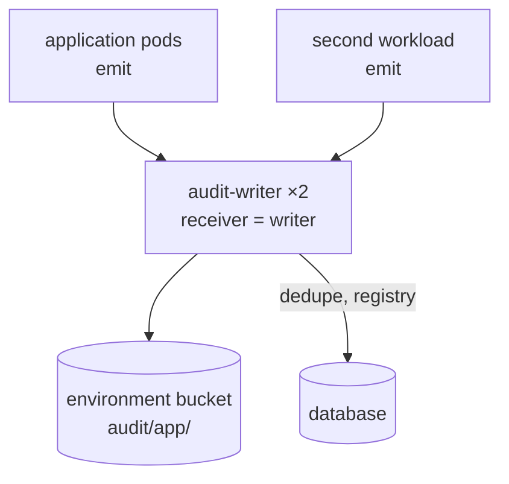
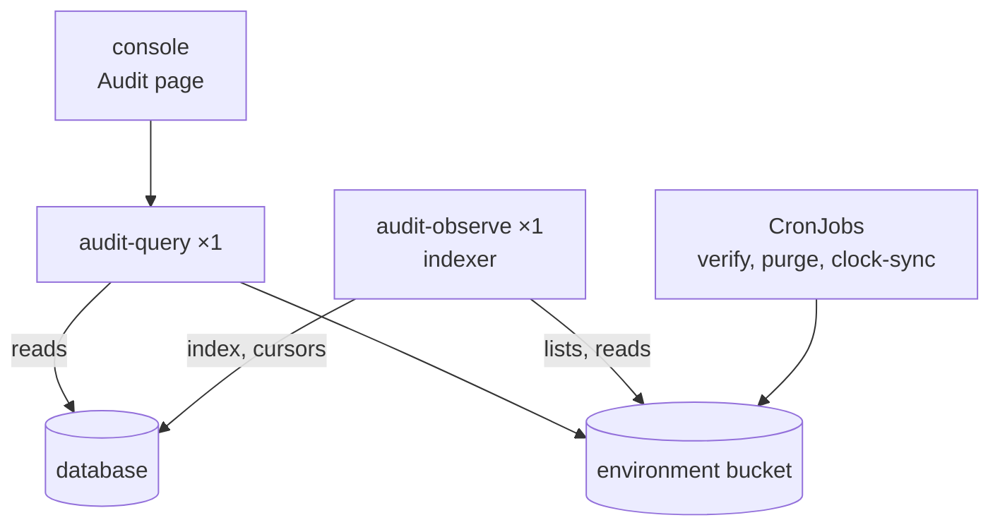
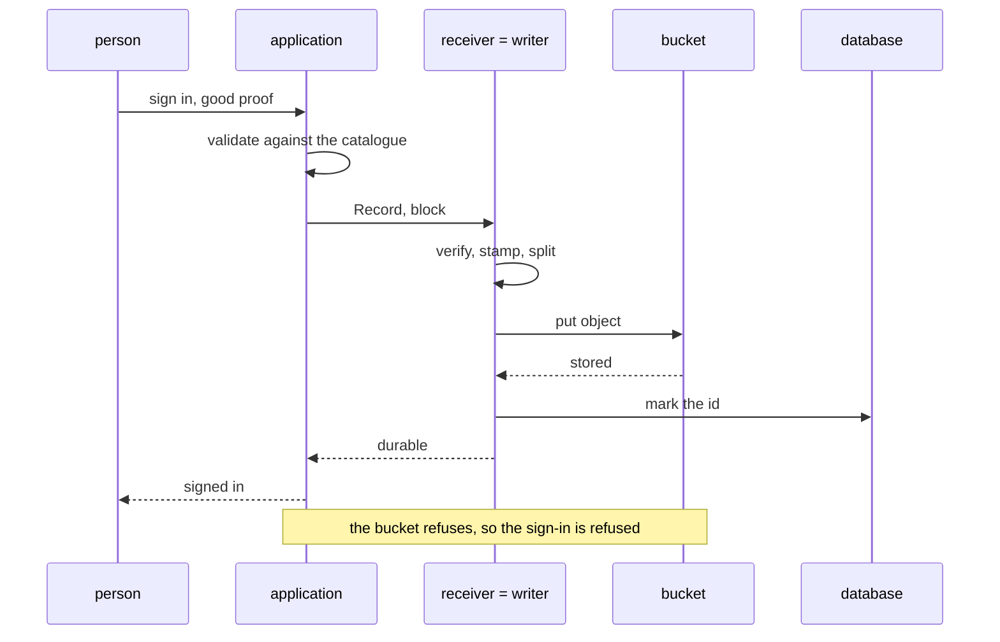

# What is direct mode?

The receiver is the writer. A record arrives over Connect, is validated, split per profile, rolled into an object and put into the bucket. The receiver acknowledges only then. There is no stream and nothing to consume.

Use it for an internal service with tens or hundreds of records a minute, or for a cluster without a message stream.

## Write path

Every workload of the application emits to the same writer. The writer puts the object in the bucket and marks the id in the database.

Two receiver replicas are safe. The deduplication table is in Postgres, so two pods cannot write one record twice. The application's client follows the Service to whichever pod is ready.

## Read path and jobs

The indexer fills the index. The query service answers the console's Audit page. The CronJobs verify and purge the bucket.

## One record

A privileged sign-in is declared `block` in the catalogue.

An `async` record takes the same path without the wait. The application queues it, batches it with the queued records, then puts and acknowledges the batch as one.

The record stays queued from `Record` until that acknowledgement. One flush interval plus a round trip is the loss window if the pod dies. The emitter's `Flush` and `Batch` tune it.

## Running it

The index lags the archive by the indexer's settle window, two minutes by default. Anything that must see a record sooner reads the sink's acknowledgement, not the index.

The values and checks are in the [Kubernetes tutorial](../../get-started/audit/kubernetes.md) and [prepare the database](../../guides/audit/operate/prepare-the-database.md). The chart's tests render all of [`charts/audit/examples/direct.yaml`](../../../charts/audit/examples/direct.yaml). For failures, see [recover from an outage](../../guides/audit/operate/recover-from-an-outage.md).

## Decided in

- [0053 One installation per service or product](../../decisions/0053-one-installation-per-service-or-product.md)
- [0062 Observe follows the bucket](../../decisions/0062-observe-follows-the-bucket.md)
