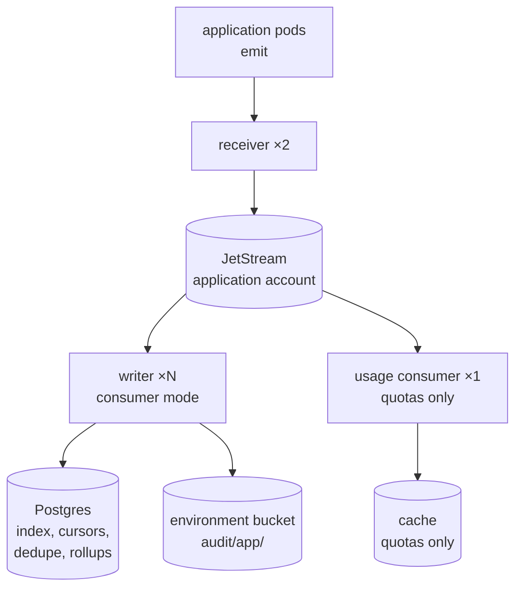
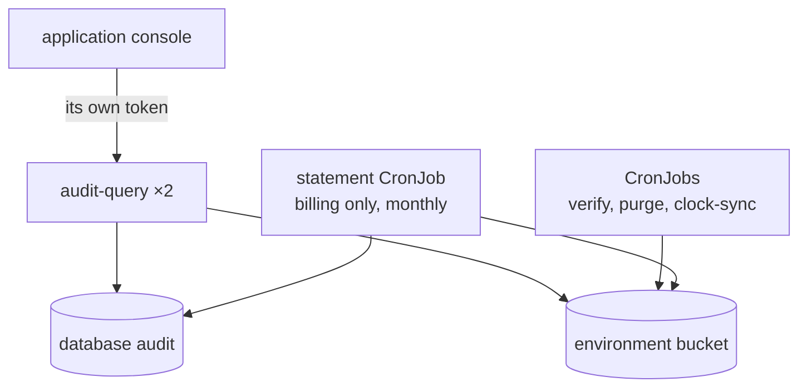
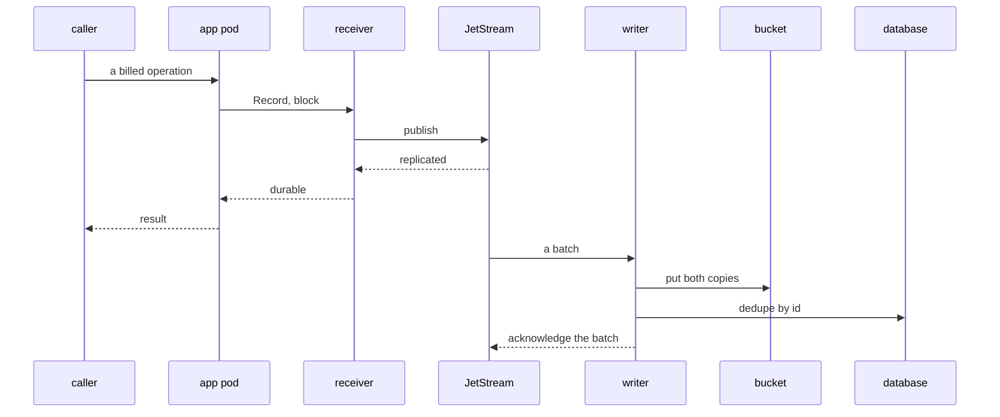

# What is stream mode?

The receiver publishes to a JetStream stream and acknowledges when the stream reports the record replicated. Separate writer pods consume the stream and put the objects. The indexer follows the bucket. Nothing in the application's request path waits for S3.

Use it for a product with many application pods, a record rate that makes batching worth having, a metering profile, or quotas.

## Write path

Pods emit to the receiver, which publishes to JetStream. The writers drain it into the bucket and the database. The usage consumer feeds the quota cache.

## Read path and jobs

The query service, the CronJobs and the billing statement read the same database and bucket. The console reaches the query service with its own token.

## One billed operation

The caller gets its result as soon as JetStream has replicated the record. The writer drains the stream moments later.

The writer acknowledges the stream only after the objects are in the bucket. A writer that dies mid-batch causes a redelivery, and the dedupe table absorbs it.

## Rolling objects

A fetch returns whatever is waiting, and one object per fetch would fill the archive with small objects. The writer accumulates until `roll.maxRecords`, the roller's byte limit or `roll.interval` is reached, then writes once.

Records stay durable on the stream and unacknowledged until the put. A writer that dies mid-window leaves them for the next one.

`stream.ackWait` must exceed `roll.interval` plus the longest put. The writer refuses to start otherwise. A shorter wait offers the same records to a second writer and doubles the day's objects.

## Who the query service trusts

If the console sits behind a gateway that issues its own token, the Audit page calls the query service with the person's session token. The query service lists that issuer and audience in its grants. The grants decide which profiles and tenants the person reads.

If the console keeps its own session, such as a cookie, the console mints a short token per person and calls the query service. Both are in [the Audit page](../../guides/audit/connect/connect-an-application.md#the-audit-page).

## Scaling

Receivers scale with the request rate. Writers scale with the record rate and the number of profiles. Size the stream for the longest writer outage you want to survive. See [run the chart in stream mode](../../guides/audit/operate/run-stream-mode.md).

## Decided in

- [0059 Sink durability and transports](../../decisions/0059-sink-durability-and-transports.md)
