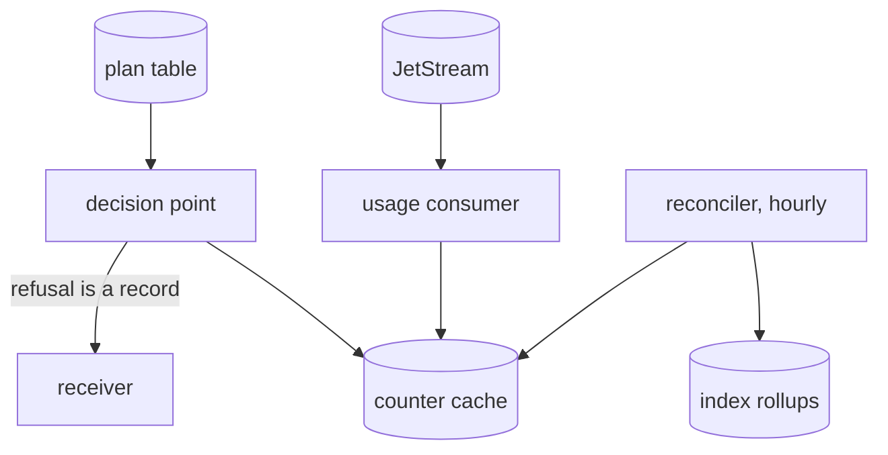

# Usage quotas

A quota, such as ten thousand verifications a month on a plan, counts the meter that [billing](billing.md) uses. It counts quickly into a cache and is corrected slowly from the index. The records stay the source of truth.

A quota is not burst rate limiting. A limit of fifty requests a second is decided before the request is served, from an authoritative counter, in the gateway's rate-limit service. A quota is a monthly total that tolerates seconds of lag and agrees with the invoice.

Quotas need [stream mode](stream-mode.md). Without a stream a second consumer has nothing to read.

## The five slots

| # | slot | what it does | whose |
|---|---|---|---|
| 1 | catalogue | the same `meter:` as billing | the application's |
| 2 | usage consumer | a second durable consumer: dedupes by record id and increments `tenant:meter:period`, success outcomes only | shipped here, run by the application |
| 3 | decision | the gateway's external authorisation or application middleware reads one key and joins the tenant's plan | the application's |
| 4 | reconciler | an hourly CronJob copies exact rollups from the index into the cache | shipped here, run by the application |
| 5 | denial | a refusal is an `async` action in the catalogue | the application's |

## Fail open

A cold cache has no counter, which reads as zero use. The decision point serves the request and records that it decided without a count. The next hourly reconciliation restores the exact number.

Quotas are a commercial control, not a security one. Refusing paid customers after a cache restart would turn it into an outage.

## Counting levels

The cache is evicted, not backed up and not verifiable later. It can be rebuilt from the index. The index can be rebuilt from the archive with `audit reindex`.

## What to watch

| signal | meaning |
|---|---|
| usage consumer lag | quotas are decided on stale counts; it is separate from the writer's lag |
| reconciler drift | a growing drift means the consumer misses records |
| denials | a sudden rise is an attack or a misconfigured plan |

To enable quotas, see [enable usage quotas](../../guides/audit/operate/enable-usage-quotas.md).

## Decided in

- [0054 Two deliveries and a durable ack](../../decisions/0054-two-deliveries-and-a-durable-ack.md)
- [0062 Observe follows the bucket](../../decisions/0062-observe-follows-the-bucket.md)
