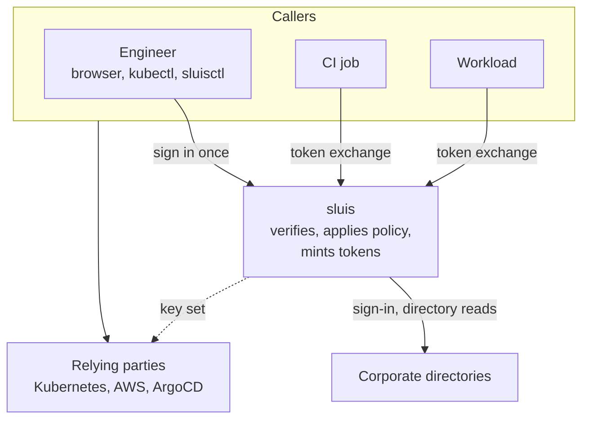
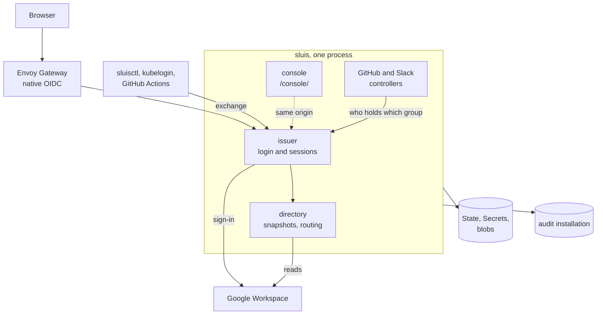

# What are the pieces of sluis?

Diagrams follow the C4 model as Mermaid. The trust rule behind every arrow is [trust](trust.md).

## Context

People, CI jobs and workloads exchange a proof with sluis. sluis signs people in against the corporate directory, and relying parties trust its key set.

sluis is not a database of record and authenticates nobody. The directories hold the people and the relying parties hold their own roles. sluis holds the policy, a directory snapshot, open sessions and what an operator connected through the console. The snapshot and sessions are disposable.

The one thing it writes that outlives it is the audit trail, kept by an audit installation in the same namespace. See [audit](audit.md).

## Containers

Browsers, the CLI and CI reach one process.

The controllers are loops in the same process, not services. They read the console's API with the pod's own ServiceAccount token and report into a record the console shows. See [the GitHub controller](github-controller.md) and [the Slack reconciler](slack-reconciler.md).

The issuer holds the root of the hostname. The issuer URL is the `iss` claim in every token, and discovery sits at `/.well-known/openid-configuration`. The same document is served as RFC 8414 metadata at `/.well-known/oauth-authorization-server`. The console is mounted under `/console/`. See [the console](console.md).

A login makes no network call except to the corporate directory. A client that identifies itself by a URL adds one bounded, cached HTTPS fetch of its own document, from an allow-listed host. While that host is unreachable and the ten-minute cache is cold or expired, that client cannot sign in.

Each adapter chooses where State, Secrets and blobs live. See [ports](ports.md), [the store](store.md) and [adapters](../../reference/sluis/adapters.md). Replicas coordinate through the State port. See [high availability](../../guides/sluis/operate/high-availability.md).

## Fan-in and fan-out

One issuer sits in the middle. Everything to its left is a source of identity, and everything to its right trusts it.

| Many of | One row or binding each |
|---|---|
| Corporate directories | A workspace: credential, served domains, synced groups. Google is built. Entra is designed, not built. |
| Clusters, for people | The cluster trusts the issuer. RBAC binds `<env>:k8s:<role>`. The kubeconfig runs `sluisctl kube-token`. |
| Clusters, for workloads | A row naming the cluster's ServiceAccount key set. |
| AWS accounts | The issuer registered as an IAM OIDC provider, and `sluisctl aws` as the credential process. |
| GitHub organisations | A controller App per organisation, and `github` bindings in the policy. |
| Slack workspaces | A bot per workspace, and channels as policy or as console records. |
| CI platforms | A federated issuer row, and `ci` rules on repository, ref and visibility. |
| Consoles and applications | A client row each. A console without OpenID uses [Envoy Gateway OIDC](../../guides/sluis/connect/envoy-gateway-oidc.md) or [oauth2-proxy](../../guides/sluis/connect/oauth2-proxy.md) ([ADR 0003](../../decisions/0003-deprecate-access-proxy.md)). |

The issuer URL, signing key, policy file, console and login page never multiply. The grants and exchange subjects are in [verify and issue](verify-and-issue.md).

## Where each decision is made

Three layers, and none is the fallback for another.

- The issuer decides who may hold a token. Every client names the internal groups an identity must hold, and an empty list means nobody. A resource has its own groups too, and both must be satisfied.
- The gateway or proxy decides whether a browser is signed in. It runs the code flow, holds the session and forwards the token.
- The application decides what the token opens, from its own tables or from the `groups` claim.

## Who owns what

| | sluis | The directories | The relying parties |
|---|---|---|---|
| Holds | The policy, a snapshot, open sessions, one signing key, read credentials | The people: passwords, MFA, devices, groups | Their own roles |
| Decides | Who may hold a token for which client | Who exists and who is in which group | What a group opens |
| Authenticates | Nobody | Everybody | Nobody |
| When down | No new sign-ins. Sessions and tokens live to expiry. Recovery by cluster proof. | The last snapshot stands for the hold window. | Unaffected |

For failures, see [failure semantics](failure-semantics.md).

## Decided in

- [ADR 0003: deprecate and remove the proxy chart](../../decisions/0003-deprecate-access-proxy.md)
- [ADR 0037: one process everywhere](../../decisions/0037-one-process-everywhere.md)
