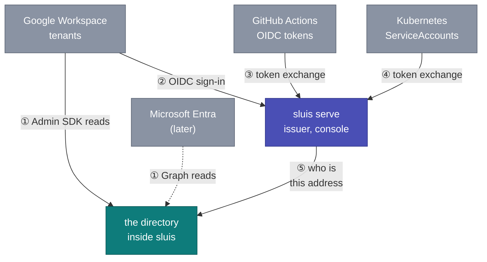
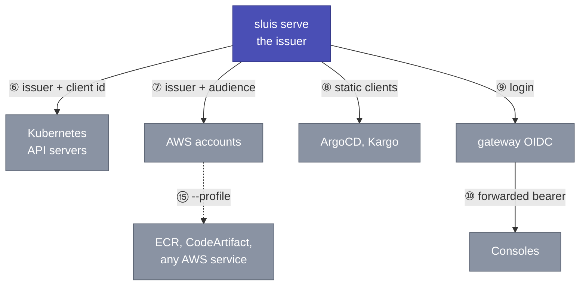
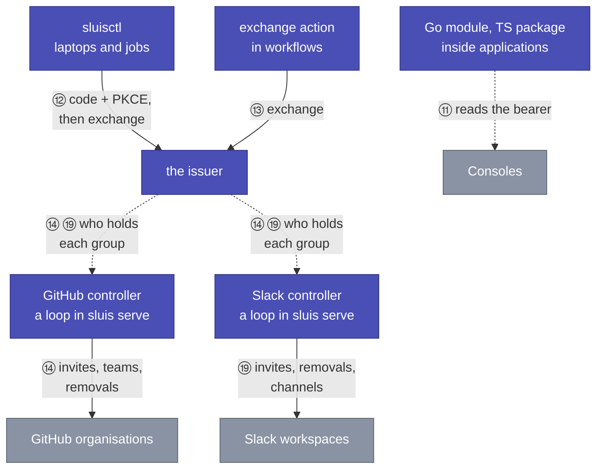

# How does sluis connect to everything around it?

Every point where something outside talks to sluis is numbered once here. The structural drawing is [architecture](architecture.md). The how-to for each relying party is under [connect](../../guides/sluis/connect/README.md). What ships, as charts, packages and binaries, is in [artifacts](../../reference/sluis/artifacts.md).

Every arrow rests on one of two trust anchors, chosen by scope ([trust](trust.md)). The cluster anchors a workload calling a service in the same cluster. The issuer anchors everything further away.

## Identity in

Directories, GitHub Actions and cluster ServiceAccounts give sluis its proofs (①–⑤). The issuer asks the directory who an address is.

## Access out

The issuer is the trusted issuer of every relying party (⑥–⑩, ⑮). A gateway turns a login into a bearer for the consoles.

## Clients and controllers

Libraries, `sluisctl` and the workflow action reach the issuer (⑪–⑬). The two controllers ask the console who holds each group and act in GitHub and Slack (⑭, ⑲).

## Case by case

Cases ⑥, ⑦ and ⑧ read `aud` as the client asking. A client may instead name a **resource** it wants a token for (RFC 8707), gated by that resource's own `requires`. A client the installation does not deploy may present a URL as its `client_id`, admitted only from an allow-listed origin. Both are off unless declared: see [policy](../../reference/sluis/policy.md#resources--what-a-token-is-for).

| # | Case | Anchor | What happens | Guide |
|---|---|---|---|---|
| ① | A corporate directory to sluis | the directory's own OAuth | Admin consent or a service-account key with domain-wide delegation. sluis discovers the tenant and its domains and re-reads on a schedule. | [Corporate directory](../../guides/sluis/connect/corporate-directory.md) |
| ② | A person signs in | the issuer; the corporate IdP is the proof | Routed to the tenant by domain, MFA there, then the issuer asks the directory (⑤) and mints. | [Design](design.md), [Google Workspace](../../guides/sluis/connect/google-workspace.md) |
| ③ | A CI job | the issuer; GitHub's token is the proof | The job exchanges GitHub's identity token for a client's audience, gated by an owner allow-list and matchers on repository, ref and visibility. | [GitHub Actions](../../guides/sluis/connect/github-actions.md) |
| ④ | A workload | the cluster that issued the token, by its published key set | Exchange against that key set. sluis never calls TokenReview. | [Service to service](../../guides/sluis/connect/service-to-service.md) |
| ④b | An AWS workload | the AWS account that issued the token, by its published key set | The IAM role asks STS for an outbound-federation token and exchanges it. One row per account, matchers on account, role and path. | [AWS workloads](../../guides/sluis/connect/aws-workloads.md) |
| ⑤ | The issuer asks the directory | none | A function call in one process. A failure is an error, never an empty answer. | [Design](design.md) |
| ⑥ | A Kubernetes cluster | the issuer; the API server reads `groups` | One OIDC provider and one public client per cluster, RBAC bound to internal group names as the policy spells them. | [Kubernetes cluster](../../guides/sluis/connect/kubernetes-cluster.md) |
| ⑦ | An AWS account | the issuer; the trust policy reads `aud` | One IAM OIDC provider per account, one trust policy per role, `AssumeRoleWithWebIdentity`. | [AWS account](../../guides/sluis/connect/aws-account.md) |
| ⑧ | ArgoCD and Kargo | the issuer | Their own OIDC login reads `groups` through their own policy. | [ArgoCD](../../guides/sluis/connect/argocd.md), [Kargo](../../guides/sluis/connect/kargo.md) |
| ⑨+⑩ | A console behind a proxy | the issuer | Gateway-native OIDC on Envoy Gateway, or oauth2-proxy run by hand on any other gateway. | [Console app](../../guides/sluis/connect/console-app.md), [business surface](../../guides/sluis/connect/business-surface.md), [oauth2-proxy](../../guides/sluis/connect/oauth2-proxy.md) |
| ⑪ | An application reads who is calling | the listener's own anchor | The Go module or TypeScript package verifies a bearer and reads `groups`. | [Go module](../../sdk/go/sluis.md), [TypeScript package](../../sdk/typescript/sluis.md) |
| ⑫ | A person's laptop | the issuer | `sluisctl login` once. `kubeconfig`, `aws-config`, `token`, `bao`, `r2` and `pg`/`psql` exchange the cached sign-in. | [sluisctl](../../reference/sluis/sluisctl.md) |
| ⑬ | A workflow | the issuer, by exchange (③) | One shell-only step exchanges the job's token and writes a kubeconfig and an AWS profile. | [GitHub Actions](../../guides/sluis/connect/github-actions.md) |
| ⑭ | GitHub teams | a GitHub App per organisation | The controller invites, adds, promotes and removes. This is the sync model. | [GitHub organisation](../../guides/sluis/connect/github-organisation.md), [GitHub Apps](../../guides/sluis/connect/github-apps-catalogue.md), [infrastructure as code](../../guides/sluis/connect/infrastructure-as-code.md) |
| ⑮ | Registries and other AWS services | an AWS credential from ⑦ | `--profile <role>@<account>`, then the service's own login, such as ECR's credential helper or `aws codeartifact login`. | [Registries and artifacts](../../guides/sluis/connect/registries-and-artifacts.md) |
| ⑯ | Break-glass | the cluster, as the floor | A person mints a ServiceAccount token and signs in with it when the directory is broken. | [Lost operator access](../../guides/sluis/operate/lost-operator-access.md) |
| ⑰ | A secret manager that mints certificates | the issuer; the JWT mount reads `aud` and `groups` | Exchange for `openbao`, log in on the mount, make one `sign` call, revoke the manager's token. | [OpenBao](../../guides/sluis/connect/openbao.md) |
| ⑱ | An R2 credential broker | the issuer; the broker verifies a standard OIDC token | `sluisctl r2` exchanges for the broker's audience and runs the broker's CLI. The broker maps group to bucket, prefixes and permission. | [R2 storage](../../guides/sluis/connect/r2-storage.md) |
| ⑲ | Slack channels | a Slack App per workspace | The controller creates or adopts channels, invites people and, in a strict private channel, removes them after the directory vouches. This is the sync model. Slack Connect channels are console records and never lose members. | [Slack workspace](../../guides/sluis/connect/slack-workspace.md), [Slack Connect channels](../../guides/sluis/connect/slack-connect-channels.md), [Slack Apps](../../guides/sluis/connect/slack-apps-catalogue.md) |
| ⑳ | A secret store receives recovery copies and projected App credentials | the store's own access | External Secrets copies the Secrets the console writes that nothing else can re-deliver (`directory.push`, `githubApps.push`, `slackState.push`). A catalogue App with `push` also projects its credential. Off unless written out, and what lands there is a real credential. | [Back up and restore](../../guides/sluis/operate/back-up-and-restore.md), [GitHub App projection](../../guides/sluis/connect/github-app-keys.md#projecting-one-app-to-a-secret-store), [Slack App projection](../../guides/sluis/connect/slack-apps-catalogue.md#projecting-one-apps-bot-token-to-a-secret-store) |

## Claims model and sync model

Cases ⑥, ⑦, ⑧, ⑩, ⑮, ⑰ and ⑱ are the **claims model**. The decision rides in a token, because a cluster, a cloud account or a session cannot call a directory.

Cases ⑭ and ⑲ are the **sync model**. sluis writes the decision where it is enforced, because GitHub and Slack accept writes. Both models draw on the same directory and policy. The relying party's capabilities choose the model.

## Two anchors

Only ⑯ stands on the cluster: recovery, the way in when the directory is broken, which depends on nothing else. Everything else stands on the issuer, including ④, because sluis proves a workload against the key set its own cluster publishes.

Third-party parts stay third-party: Google Workspace for sign-in, MFA and the directory, GitHub Actions OIDC, Envoy Gateway or oauth2-proxy, kubelogin, kubectl and the AWS CLI.

## Decided in

- [ADR 0002](../../decisions/0002-mission-boundary-tokens-and-memberships.md): mission boundary: tokens and memberships
- [ADR 0008](../../decisions/0008-credentials-only-where-we-govern-membership.md): credentials only where we govern membership
- [ADR 0030](../../decisions/0030-workload-identity-on-both-platforms.md): workload identity
- [ADR 0037](../../decisions/0037-one-process-everywhere.md): one process
