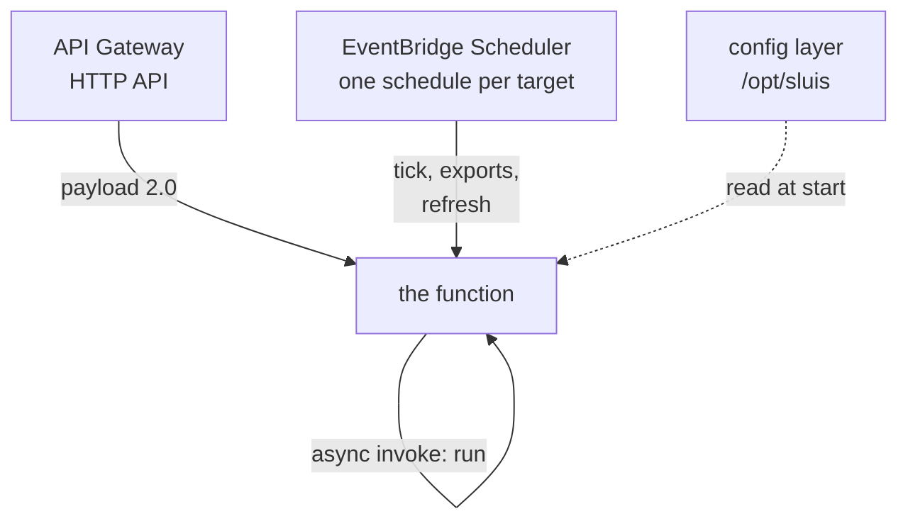
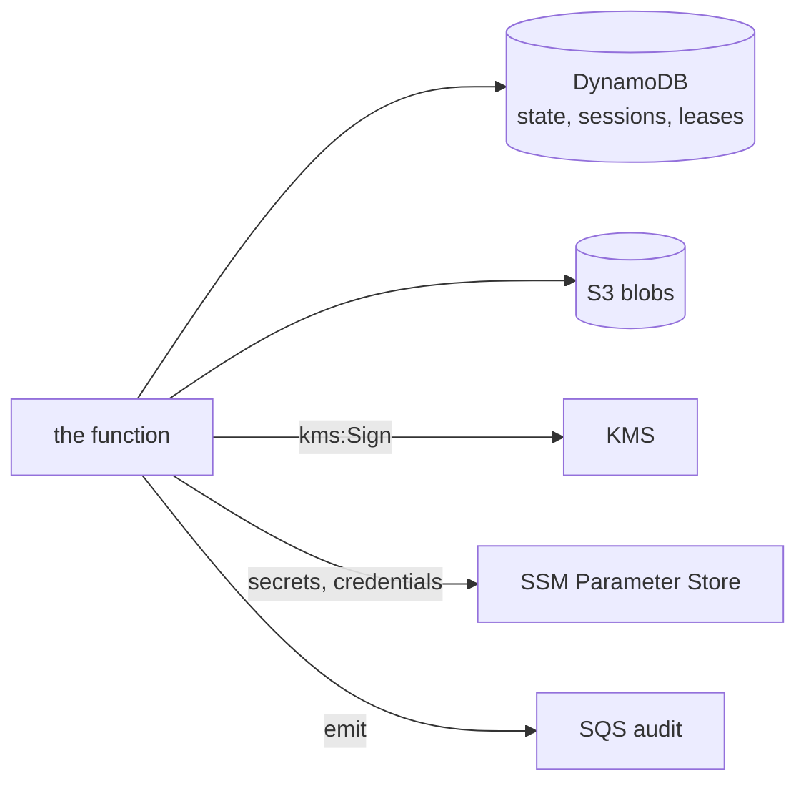

# sluis on AWS Lambda

sluis runs as ONE AWS Lambda function from one zip. Nothing is in a VPC: every dependency (DynamoDB, S3, KMS, SSM, SQS,
Lambda) is an AWS API the function reaches over its role, and the only inbound path is an API Gateway HTTP API. The
Kubernetes build is unchanged and stays what an estate runs where it runs Kubernetes; Lambda is the other platform
([decision 0026](../../decisions/0026-two-platforms-permanently-kubernetes-and-aws-lambda.md)). The events, the
environment, the role and the version rules are in the [reference](../../reference/sluis/lambda.md).

**Calls in.** The only inbound paths are the API Gateway HTTP API and EventBridge Scheduler (one schedule per target); the function also invokes itself asynchronously and reads its config layer at start.

**Calls out.** Every dependency is an AWS API the function reaches over its role.

## One binary, one zip, one function

Since v1.63 sluis is one process everywhere ([decision 0037](../../decisions/0037-one-process-everywhere.md),
[one process](one-process.md)): the one function serves the issuer and the console and runs the controllers' passes. The
controllers do not loop on Lambda; each pass is assembled for its invocation, runs once under the target's lease and
returns, because the platform freezes the process between invocations and a background loop would have nothing to run
on. A schedule per target stands in for the loop, and the console's "run now" is an asynchronous invoke of the function
itself.

The cost of one function is isolation. The controllers' code runs with the issuer's permissions, so the per-role
separation of v1.62 (a controller role that could not read `private/config` or sign) is gone by decision. The writes to
the State are the trust boundary ([signing on AWS](signing-on-aws.md#trust-boundary)).

## The zip is the release, byte for byte

The Pulumi library deploys the file it was given, after checking its SHA-256 (`PackageSHA256`, from the release's
checksums), so an installation can show that the code that runs is the code that was released. What makes the function
an installation's is not in the zip but in a configuration layer.

## Configuration is a layer

The service document and the policy live in one immutable Lambda layer, mounted last. A function's configuration then
changes only by publishing a new layer version and updating the function, AWS replaces every instance at once, and
nothing is edited in place ([decision 0036](../../decisions/0036-configuration-is-immutable-per-instance.md)). There are no
aliases and no canary: a rollback is re-pointing the function at the previous layer version, which is why old versions
are kept. The consequence for secrets: a layer outlives the deploy that made it and the function can read its own, so a
secret pasted into a document would persist in every layer version and in Pulumi state. The documents name secrets and
hold none; they are SSM parameters read by path.

## Cold start, and what is not here

- The configuration is the layer's, read once; the secrets are read from SSM at cold start and again every five minutes.
  The state, sessions, leases and the targets' reports are in DynamoDB and S3, so no invocation depends on another's
  memory. A sign-in's half-finished state is in the session records, not the process.
- The directory snapshot is refreshed on read when it is stale, and on a schedule. The Kubernetes process refreshes it on
  a timer; a function has no process between invocations to keep one in, and a refresh a request started is finished
  before the response is returned to the platform. (Before v1.61.1 the snapshot was never refreshed after the first one,
  and sign-in failed after 30 minutes: [CHANGELOG](../../../CHANGELOG.md).)
- The service (issuer and console) is assembled once per execution environment and kept across invocations. A controller
  is assembled per invocation, as `sluis tick` does.
- The binary is built without the Kubernetes and Valkey clients, so they are not 30 MB of cold start
  ([how it is held](../../reference/sluis/lambda.md#package)).

## Security notes

- **`PackageSHA256` is a pin, not a download.** It must come from a reviewed value in the stack's source. A digest
  fetched at deploy time next to the zip is checked against the same hand that could have replaced the zip. A local
  `Package` is copied to a temporary file before it is hashed and deployed, so what is checked is what runs.
- **The configuration layer is retained** (`SkipDestroy`), so that a rollback is re-pointing a function. If a secret got
  into a document, rotate it and delete the layer versions that hold it with `aws lambda delete-layer-version`.
- **The library refuses what would redirect the function's reads.** A document naming an `endpoint` the function calls
  (`secrets.endpoint`, `ports.dynamodb.endpoint`, ...; R2 presets aside) is refused unless `AllowEndpoints` is set: a
  forged endpoint serves forged secrets and State. `Telemetry.Env` takes only the layer's own variables: the
  environment cannot carry `SLUIS_*`, `LD_*` or another `AWS_*` variable.
- **An `aws` matcher with no `role` admits every role of the account**, including roles created later; the issuer warns
  at start ([the reference](../../reference/sluis/lambda.md#how-a-controller-authenticates-to-the-console)).
