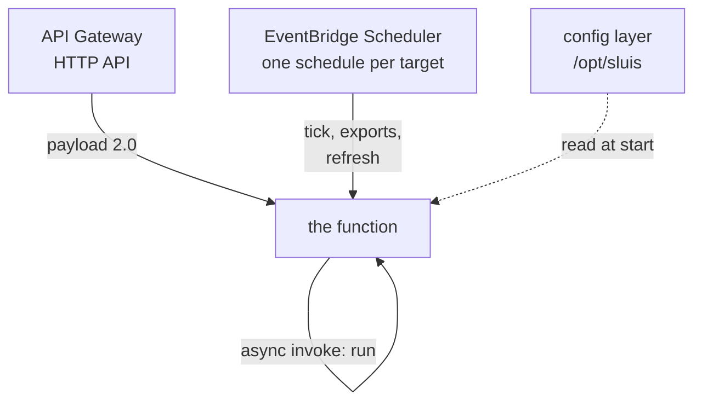
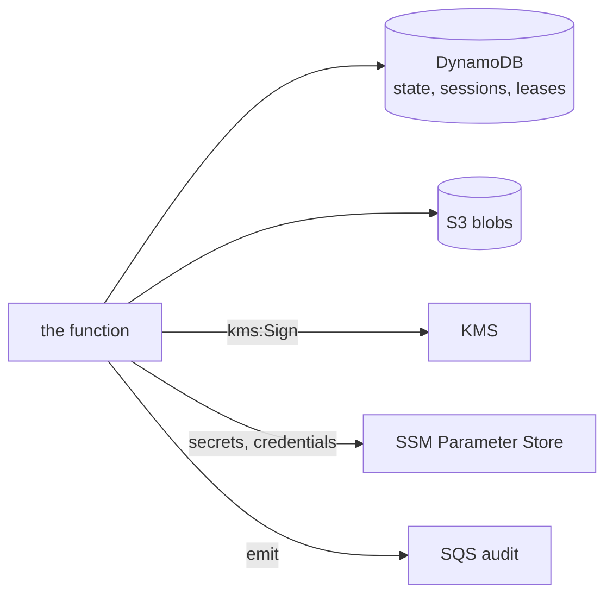

# How does sluis run on AWS Lambda?

sluis runs as one Lambda function from one zip. Nothing is in a VPC. Every dependency is an AWS API the function reaches
over its role. The only inbound path is an API Gateway HTTP API. Kubernetes stays the other platform. The events,
the environment, the role and the version rules are in the [reference](../../reference/sluis/lambda.md).

The inbound paths are the HTTP API and EventBridge Scheduler, one schedule per target. The function also invokes itself
asynchronously and reads its config layer at start.

## What does one function run?

The one function serves the issuer and the console and runs the controllers' passes ([one process](design.md#one-process)).
Controllers do not loop on Lambda. Each pass is assembled for its invocation, runs once under the target's lease and
returns, because the platform freezes the process between invocations.

A schedule per target replaces the loop. The console's "run now" is an asynchronous invoke of the function itself.

The cost of one function is isolation. The controllers run with the issuer's permissions. The writes to the State are
the trust boundary ([signing on AWS](signing-on-aws.md#trust-boundary)).

## What is deployed?

The Pulumi library deploys the zip it was given after checking its SHA-256 (`PackageSHA256`, from the release's
checksums). The zip is the release byte for byte. What makes the function an installation's is a configuration layer.

The service document and the policy live in one immutable Lambda layer, mounted last. Configuration changes by
publishing a new layer version and updating the function. Each change publishes a function version, and every caller
invokes the alias `live`, which moves to it at once; there is no canary. The previous version stays, so a rollback
points the alias back.

A layer outlives the deploy that made it and the function can read its own. The documents therefore name secrets and
hold none: secrets are SSM parameters read by path.

## What lives where at runtime?

The configuration is the layer's, read once. Secrets are read from SSM at cold start and again every five minutes. State,
sessions, leases and the targets' reports are in DynamoDB and S3, so no invocation depends on another's memory.

The directory snapshot refreshes on read when it is stale, and on a schedule. A refresh a request started finishes before
the response returns to the platform. The service is assembled once per execution environment. A controller is assembled
per invocation, as `sluis tick` does.

The binary is built without the Kubernetes and Valkey clients, which keeps cold start short
([how it is held](../../reference/sluis/lambda.md#building-and-checking-the-binary)).

## What do you check before deploying?

`PackageSHA256` is a pin. Take it from a reviewed value in the stack's source, never from a digest fetched next to the zip.
A local `Package` is copied to a temporary file before it is hashed and deployed, so the checked file is the one that runs.

If a secret reaches a document, rotate it and delete the layer versions that hold it with `aws lambda delete-layer-version`.
The layer is retained (`SkipDestroy`) so that rollback works.

The library refuses a document that names an `endpoint` the function calls (`secrets.endpoint`, `ports.dynamodb.endpoint`; an R2 preset's is not one).
`AllowEndpoints` lifts that for a LocalStack test. `Telemetry.Env` takes only the layer's own variables, so the environment
cannot carry `SLUIS_*`, `LD_*` or another `AWS_*` variable.

An `aws` matcher with no `role` admits every role of the account, including roles created later. The issuer warns at
start ([the reference](../../reference/sluis/lambda.md#two-audiences-two-doors)).

## Decided in

- [ADR 0026](../../decisions/0026-two-platforms-permanently-kubernetes-and-aws-lambda.md): two platforms permanently
- [ADR 0036](../../decisions/0036-configuration-is-immutable-per-instance.md): configuration is immutable per instance
- [ADR 0037](../../decisions/0037-one-process-everywhere.md): one process everywhere
