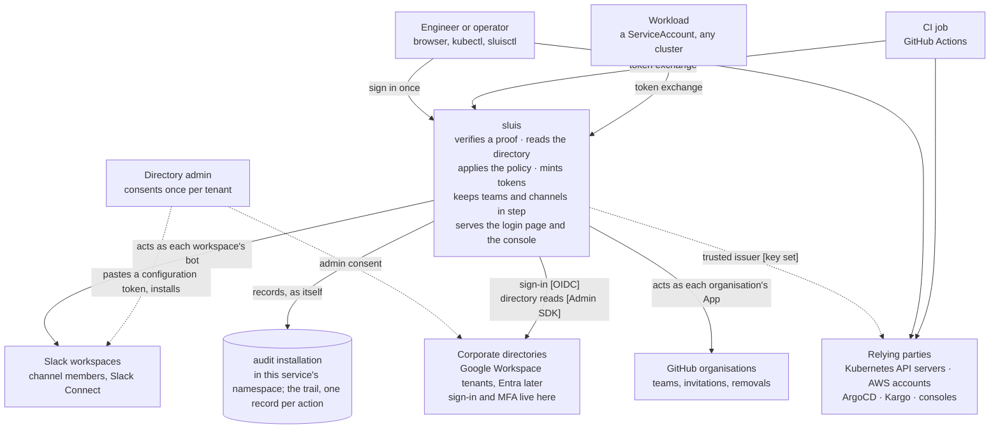
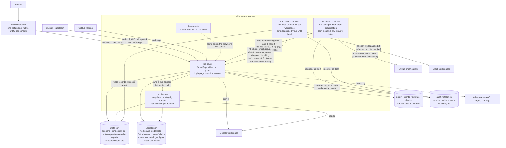

# Architecture

Every container, what it holds, and why the pieces are arranged this way.
Decisions and their reasons are in the design documents
([trust](trust.md), [the service](design.md));
contracts are under [reference/](../reference/). Diagrams follow the C4 model
as Mermaid, which GitHub renders inline.

## The rule under everything

Every arrow here rests on one of exactly two roots of trust, chosen by how far away the caller is, never by
preference: **the issuer** (its signing key, published as a key set: everything, for people, CI, workloads and every
relying party) and **the cluster** (a ServiceAccount token the API server checks: recovery alone). Whichever proved a
caller, a service acts on one thing: a flat list of internal group names, the `groups` claim, never re-mapped.
[trust.md](trust.md) is the argument and the naming; it is not repeated here.

## Context

Nothing in sluis is a database of record. Nothing authenticates anyone. The directories hold the people; the relying
parties hold their own roles; sluis holds the policy, a snapshot of the directory, the sessions it has open, and what
an operator connected through the console: directory credentials, GitHub Apps, people's GitHub links, Slack workspace
connections and the console's own Slack channel records. All of that is behind the State and Secrets ports (see
"What each store holds" below); the snapshot and the sessions are disposable, rebuilt from the directory and
re-opened at the next sign-in. The audit trail is the one thing it writes that outlives it, and it is kept by an audit
installation of its own, rendered beside it in the same namespace.

## Containers

**The GitHub and Slack controllers are loops in the same process, not services** (since v1.63,
[0037](../decisions/0037-one-process-everywhere.md): each had a Deployment of its own before). The accepted cost is that
their code runs with the service's permissions, and a controller that cannot start stops the process. Each reads the
console's API with the pod's own ServiceAccount token, the way any workload would, and reports into a record the
console shows.

- **GitHub** holds the GitHub App keys and writes to GitHub: one pass per organisation every
  `config.controllers.github.interval` (15 minutes). Every organisation is a dry run until the policy lists it in
  `policy.controllers.github.enabledOrgs`.
- **Slack** holds each workspace's bot token and writes to Slack: one pass per workspace every
  `config.controllers.slack.interval` (15 minutes), reading its records and writing its report through the State port.
  Every workspace is a dry run until `policy.controllers.slack.enabledWorkspaces` lists it.

Removing a name from either list is the emergency stop. A pass also runs without waiting when the credentials or
records it reads change, or an operator presses **Refresh**. The two share one set of rails (`internal/rails`): the
pass loop and its policy-retry backoff, the two questions put to the console (who holds a group, does the directory
vouch for this address) gated by the policy digest, the held-once ledger, the last-good-report journal, the removal
breaker and its fingerprint, the dry-run switch, and the wake-up. See
[Connect a GitHub organisation](../how-to/connect/github-organisation.md),
[Connect a Slack workspace](../how-to/connect/slack-workspace.md) and [the design](design.md#the-slack-reconciler).

**A login makes no network call except to the corporate directory** — and,
for a client that identifies itself by a URL instead of a policy row, one
bounded, cached HTTPS fetch of that client's own document, from an
allow-listed host only ([policy.md](../reference/policy-clients.md#clients-that-describe-themselves)).
The answer about a person is a function call, so the ConnectRPC hop, the
TokenReview, the NetworkPolicy hop and the class of failure where two
halves disagreed about one person are all gone. That fetch is the one
exception: a document client cannot sign in while its host is
unreachable and the ten-minute cache is cold or expired, because there is
deliberately no stale fallback.

**One hostname.** The issuer holds the root of it: the issuer URL is the
`iss` claim in every token, and discovery must sit at
`/.well-known/openid-configuration` at an origin root. The console is
mounted under `/console/`, same-origin with the issuer, so its session
pages call the issuer with the browser's own cookie and no bearer in
JavaScript. Each console request is checked against the SSO session with the
same function the silent sign-in uses: the absolute limit and the directory's
answer, [the hold window](directory-model.md) included
([sessions](sessions.md#what-the-console-asks-of-the-sso-session)).

**What each store holds, and what losing it costs.** Where each one lives is the adapter's choice
([ports](ports.md), [adapters](../reference/adapters.md)): `dynamodb` for State with SSM or OpenBao for Secrets and S3
for blobs on AWS; the `legacy` adapter keeps the ConfigMaps, Secrets and Valkey of the older estates until their
cutover ([0031](../decisions/0031-a-generic-migration-tool.md)). Replicas coordinate through the State port, not
through a Valkey of their own ([high availability](../how-to/high-availability.md)).

| Store | Holds | Lost means |
|---|---|---|
| State | auth requests, tokens, per-client sessions, the single sign-on record, the signing-key schedule, the console's records (directory, GitHub and Slack connections, channel records), the controllers' reports | everyone signs in again, and one refresh per directory; the connection records are what a restore brings back |
| Blobs | directory snapshots, controller reports too large for an item | one refresh per directory |
| Secrets port | the directories' credentials, each GitHub organisation's App, the link App, people's link tokens, the runner Apps, the catalogue Apps, each Slack workspace's bot token and App credentials | whatever delivered them; reconnect from the console, and a link token that rotated since means that person links again ([restoring](../how-to/back-up-and-restore.md)) |
| The mounted documents | the policy, the clients, the federated clusters, the signing key | git |
| the audit installation | the audit trail: one record per action, kept, locked and signed by the installation | its own archive; while its writer is unreachable records wait in each pod's queue, and a recovery sign-in is refused rather than left unrecorded |

## Fan-in and fan-out

One issuer in the middle. Everything to its left is a source of
identity; everything to its right trusts it. Each row says how it is
expressed in configuration and whether it is built.

| Many of | Expressed as | Status |
|---|---|---|
| corporate directories | one workspace per tenant: credential, served domains, synced groups; Google today, Entra as a second backend behind the same workspace record | **built**; Entra designed, not built |
| clusters, for people | each cluster's identity-provider association names the issuer; RBAC binds `<env>:k8s:<role>`; one kubeconfig whose exec plugin is `sluisctl kube-token`, the same file for a laptop and a CI job | **built** |
| clusters, for workloads | one row per cluster naming its ServiceAccount-token key set; token exchange | **built**. The issuer's own cluster is a row like any other, and the issuer holds access to none of them |
| AWS accounts | the issuer registered once per account as an IAM OIDC provider; a `requires` list per role client; `sluisctl aws` as the credential process, one `aws.ini` for a laptop and a job | **built** |
| GitHub organisations | one controller App per organisation, created and installed by its owner from the console; `github` bindings in the policy naming internal groups, with an `ignore` list per organisation; an account becomes a person's by their own link, a public-profile match or an import, and a link is checked every pass; one runner App per organisation per tier for self-hosted runners | **built and acting**: joiners, movers and leavers with nobody in the loop, and the controller stops itself where somebody is needed — seats, removals over half an organisation, owners |
| Slack workspaces | one bot per workspace, connected from the console by pasting a configuration token once (the owning directory is chosen there); channels as **policy** (`slack.workspaces.<key>.channels`, internal groups) or as **console records** (directory groups and individual addresses, ordinary or Slack Connect); strict channels (private only) also remove; a person with no Slack account is waited for, never created | **built; acting only where listed in `policy.controllers.slack.enabledWorkspaces`**: adds people, removes only from strict private channels and only on a directory-vouched answer under the breakers; never creates accounts, never touches user groups, never removes from a public channel |
| CI platforms | one federated issuer row; `ci` rules on repository, ref and visibility | **built**: the verifier, `sluisctl` inside a job, and the GitHub Action at the repository root — `curl` and `jq`, so nothing of ours is downloaded into a job |
| consoles and applications | one client row each, with a display name and description the sign-in page shows; for consoles with no OpenID flow of their own, use gateway-native OIDC ([Envoy Gateway](../how-to/connect/envoy-gateway-oidc.md)) or, on another gateway, [oauth2-proxy run by hand](../how-to/connect/oauth2-proxy.md); back-channel logout for applications that opt in | **built**: the directory console (it signs in as a client of the issuer it shares an origin with), Kargo and its CLI, `sluisctl` as a public client |

What never multiplies: the issuer URL, the signing key, the policy file,
the console, the login page.

## The six grants

The issuer serves these and nothing else. Each exists for one of three
needs: a browser reaching a web UI, a CLI on a laptop with a browser to
confirm in, and a machine that already holds a token.

| Grant | For |
|---|---|
| authorization code + PKCE | every browser flow, and every CLI: `sluisctl login` and kubelogin open a browser and listen on a loopback port |
| refresh | sessions that outlive a token |
| userinfo | relying parties that ask |
| `end_session` | sign-out ends the sign-in, not one application's cookie |
| revocation | "sign out everywhere", and the operator's revoke |
| **token exchange** | the one machine grant, and the CLI's re-audiencing for a cluster, AWS or any other audience |

Token exchange takes three kinds of subject, all verified the same way,
against a key set the issuer trusts and holding no credential for:

| Subject | Verified against | Rule kind |
|---|---|---|
| a GitHub Actions token | GitHub's key set, an owner allow-list | CI job: repository, ref, visibility |
| a ServiceAccount token from any cluster | that cluster's key set | workload: cluster, namespace, name |
| the access token of a CLI sign-in, presented by that client | our own key set, and the client's `sign_in_exchange` | none needed: re-audiencing for a cluster, AWS or another audience |

Of the tokens the issuer signs itself, only that last one is a proof. An
ID token names a person too, and is handed to every relying party they
sign in to, so it is refused: a holder of one could otherwise exchange
it for any audience the person's groups admit.

That is what makes one issuer serve many clusters cheaply: a new cluster
is one row naming its key set, not a credential held anywhere. Device
flow, client credentials and JWT bearer were served through 0.11 and are
gone; introspection never applied, because these are JWTs verified
offline ([why](../reference/endpoints.md)).

Three of the six are grants and three are endpoints, so
`grant_types_supported` prints three: `authorization_code`,
`refresh_token` and token exchange. Userinfo, `end_session` and
revocation are advertised in fields of their own. They are counted
together because they answer one question — what does this issuer serve
— and listing an endpoint as a grant type would be the metadata lying in
a new way.

## Where each decision is made

Three layers, and none is the fallback for another.

- **The issuer decides who may hold a token.** Every client names the
  internal groups an identity must hold before a token is minted for it.
  An empty list means nobody, and the issuer refuses to start on one.
  Where a token is minted for a **resource** rather than for the client
  asking, that resource names its own groups too, and both must be
  satisfied: the client says who may ask, the resource says what may be
  asked for.
- **The gateway or proxy decides whether a browser is signed in.** Nothing more.
  It runs the code flow, holds the session, forwards the token. For Envoy
  Gateway, use the native OIDC filter. For another gateway, run upstream
  oauth2-proxy yourself ([recipe](../how-to/connect/oauth2-proxy.md); the `access-proxy` chart was removed in v1.32.0,
  [0003](../decisions/0003-deprecate-access-proxy.md)).
- **The application decides what the token opens.** From its own
  tables, or from the `groups` claim. An application with no roles of
  its own is exactly the one whose check sits at the issuer.

## Who owns what

| | sluis | the directories | the relying parties |
|---|---|---|---|
| holds | the policy, a directory snapshot, open sessions, one signing key, the directories' read credentials | the people: passwords, MFA, devices, groups | their own roles |
| decides | who may hold a token for which client, and what groups it carries | who exists and who is in which group | what a group opens |
| authenticates | nobody | everybody | nobody; they verify |
| when down | no new sign-ins; sessions and tokens live to expiry; recovery by cluster proof | last snapshot stands for the hold window, then answers are provisional | unaffected by the others |

## Use cases, in one line each

| A person… | What happens |
|---|---|
| opens a console for the first time | the gateway sends the browser to the issuer, the issuer to Google, Google back; the issuer asks the directory who this is, checks the client's `requires`, mints; the gateway sets its cookie |
| opens a second console | the gateway sends the browser to the issuer; the issuer recognises its own session and completes silently |
| runs `kubectl` | `sluisctl kube-token`, the kubeconfig's exec plugin, exchanges the laptop sign-in for a token audienced at that cluster; the cluster trusts the issuer and reads `groups` |
| needs AWS credentials | `sluisctl aws`, the profile's credential process, exchanges the same sign-in for one audienced at AWS; STS trusts the issuer |
| needs an SSH, database or client certificate | `sluisctl bao ssh -mode=ca ...` / `sluisctl bao write ...` / `sluisctl psql` exchange the same sign-in for `openbao`, log in on the JWT mount and make ONE `sign` call; the certificate names the roster subject |
| links their GitHub account | authorizes the link App once; every pass the controller checks the link and puts them in the teams the policy binds their groups to |
| signs out | the gateway clears its cookie and calls `end_session`; the issuer ends the sign-in AND every session that browser opened, so every other console asks again rather than refreshing on |
| leaves the company | the next snapshot no longer lists them; within the freshness window, the next refresh anywhere is refused |
| is waiting for a Slack channel | their row says *waiting for them: no Slack account yet*; the controller never creates the account and invites them on the pass after it exists |

| A machine… | What happens |
|---|---|
| is a GitHub Actions job | presents GitHub's token; a CI rule names its repository and ref; the exchange returns a token for AWS or a cluster |
| is a workload in a cluster | presents its ServiceAccount token; a workload rule names it; same exchange |
| is the recovery path | a person mints a short-lived ServiceAccount token proving cluster access; a workload rule puts that subject in the operator group; it works when the directory does not — and it is the one sign-in refused when its audit record cannot be written |
| is the GitHub controller | each pass, asks the console who holds the groups an organisation's teams are bound to, compares with GitHub, invites, adds, promotes and removes — in the organisations it may act in — and reports the rest as what it would do |
| is the Slack controller | each pass, asks the console who holds the internal groups the policy's channels are bound to and who is in the directory groups and addresses the console's channels name; reads each Slack workspace whole; invites, creates, adopts, joins and (strict channels only) removes — in the workspaces it may act in — and reports the rest, with a reason, as what it would do |

## The audit trail and who writes it

Three writers, each recording as itself: the service (sign-ins, token exchanges, every console action), the GitHub
controller (invitations, additions, removals, holds) and the Slack controller (channels, invitations, removals, Slack
Connect, holds, leavers). The catalogue is `internal/audit/catalogue/roster.yaml`; its version moves with any change,
and an installation refuses a changed document under a version it already holds. A Slack channel's page in the console
is the trail narrowed to its targets. Directory groups and addresses that feed a console channel are targets
(`directory_group`, `directory_user`), never data. [Audit in the design](design.md#audit) has the rest.

## Failure semantics

| Situation | What consumers and operators see |
|---|---|
| Probe failed, snapshot still young | answers from the snapshot, `authoritative=false` |
| Snapshot older than the freshness window | same |
| Full refresh failed a page | old snapshot kept; nothing partial is ever served |
| Domain claimed by two workspaces | `authoritative=false` for that domain on both |
| Address in no served domain | `in_domain=false`: no opinion |
| Account missing from the snapshot | one live read first; `found=false` only after the backend said so |
| the State store unreachable | every domain non-authoritative until it returns; sign-ins that need State fail |
| Credential revoked or admin suspended | probe fails → provisional; reconnect is the recovery |
| A request would wait on the directory | it does not: the work runs detached and the answer is *first snapshot pending* |
| A signed-in operator's own account turns non-authoritative | last granted role kept for a bounded window; nothing new granted |
| A policy the issuer refuses to load | the new pod does not start and the previous pods keep serving the previous policy; nothing visible changes except the new clients are absent |
| sluis is down | no new sign-ins anywhere; existing sessions and tokens live to expiry; recovery is by cluster proof |
| the audit installation unreachable | records wait in each pod's queue and are delivered when its writer answers; the queue is bounded, and past its bound the oldest are dropped and counted; the Audit page cannot be read; a recovery sign-in is refused meanwhile |
| a GitHub pass fails | the last report with rows stands; the pass is retried next interval; nothing is removed on a failed read |
| the console answers the controller under another policy | the pass changes nothing and is tried again within seconds, six times at most before the interval resumes: during a rollout old and new pods overlap, and a removal decided across that gap would be wrong |
| an organisation's seats cannot be read | nobody is invited into it until they can |
| a Slack workspace is not connected or not installed yet | that workspace reports a `waiting` pass with no error; nothing else is affected |
| a Slack pass cannot read the workspace whole (missing scope, rate limit that outlasts retries, a failed page) | the workspace's report is kept with the failure on it; nothing is decided or changed on a partial read |
| the directory cannot be read, or an owning directory is gone | only the Slack workspaces that depend on it fail their pass; nobody is removed |
| a removal set is over half of a channel or of the workspace's managed members | nobody in that set is removed until an operator confirms that exact fingerprint (valid 24 hours; one confirmation covers every gate it fits) |
| a channel is defined in both git and the console | held on both sides, unchanged, until one definition is removed |
| a private channel of the declared name exists that the bot cannot see; a visibility mismatch; an archived channel of that name | held with the reason; never duplicated under another name, never converted, never unarchived |

The rule under all of them: **access is removed only on an authoritative
answer.** Everything that can go wrong degrades to *provisional*, never
to "gone". The one exception is a policy the issuer would load but that was
wrong; the render validates its own output for that reason.
