# Integrations — the helicopter view

Every point where something outside talks to something in this
repository, numbered once here and explained case by case below. The
structural drawing is [architecture.md](architecture.md); the how-to per
relying party is under [how-to/connect/](../how-to/connect/README.md).

Every arrow below rests on one of the **two trust anchors**, chosen by scope ([trust.md](trust.md)): the cluster for a
workload calling a service in the same cluster, the issuer for everything further away. Each case names its anchor.

```mermaid
flowchart TB
  subgraph in["Identity comes from"]
    direction LR
    gws["Google Workspace tenants<br/>(one per company)"]:::ext
    entra["Microsoft Entra<br/>(later)"]:::ext
    gh["GitHub Actions<br/>OIDC tokens"]:::ext
    sa["Kubernetes<br/>ServiceAccounts"]:::ext
  end

  subgraph ar["sluis"]
    direction LR
    hub["the directory<br/>inside sluis"]:::hub
    iss["sluis serve<br/>the issuer, the console"]:::token
    ghr["the GitHub controller<br/>a loop inside sluis serve"]:::token
    slr["the Slack controller<br/>a loop inside sluis serve"]:::token
    lib["Go module · TS package<br/>inside applications"]:::token
    ctl["sluisctl<br/>on laptops and in jobs"]:::token
    act["exchange action<br/>in workflows"]:::token
  end

  subgraph out["Access goes to"]
    direction LR
    eks["Kubernetes API servers<br/>(one issuer each)"]:::ext
    aws["AWS accounts<br/>(IAM OIDC provider each)"]:::ext
    argo["ArgoCD · Kargo"]:::ext
    proxy["gateway OIDC<br/>Envoy SecurityPolicy, or oauth2-proxy by hand"]:::ext
    consoles["Consoles<br/>(ours and business test surfaces)"]:::ext
    ghteams["GitHub organisations<br/>teams, and runner Apps"]:::ext
    slack["Slack workspaces<br/>channels, Slack Connect"]:::ext
    reg["ECR · CodeArtifact · any AWS service<br/>(on top of the profiles)"]:::ext
  end

  gws -- "① Admin SDK reads<br/>admin consent or SA key" --> hub
  entra -. "① Graph reads (later)" .-> hub
  gws -- "② OIDC sign-in<br/>people" --> iss
  gh -- "③ token exchange<br/>jobs" --> iss
  sa -- "④ token exchange<br/>workloads, by the cluster's key set" --> iss
  iss -- "⑤ who is this address<br/>a function call" --> hub
  iss -- "⑥ issuer + client id<br/>groups claim" --> eks
  iss -- "⑦ issuer + audience<br/>trust policy per role" --> aws
  iss -- "⑧ static clients<br/>groups claim" --> argo
  iss -- "⑨ login" --> proxy
  proxy -- "⑩ forwarded bearer" --> consoles
  lib -. "⑪ reads the bearer,<br/>serves /.access/whoami" .-> consoles
  ctl -- "⑫ code + PKCE on loopback,<br/>then exchange" --> iss
  act -- "⑬ exchange, shell only" --> iss
  iss -. "⑭ who holds each group<br/>console API, the pod's own ServiceAccount token" .-> ghr
  ghr -- "⑭ invites, teams, removals<br/>as each organisation's App" --> ghteams
  iss -. "⑲ who holds each group, who is in each directory group<br/>console API, the pod's own ServiceAccount token" .-> slr
  slr -- "⑲ invites, removals, channels<br/>as each workspace's App" --> slack
  aws -. "⑮ AWS's own tooling<br/>with --profile" .-> reg

  classDef ext fill:#8A93A3,stroke:#5E6675,color:#fff
  classDef hub fill:#0E7C7B,stroke:#0A5958,color:#fff
  classDef token fill:#4A4FB5,stroke:#33378A,color:#fff
  style in fill:none,stroke:#8A93A3,stroke-dasharray:5 5
  style out fill:none,stroke:#8A93A3,stroke-dasharray:5 5
  style ar fill:none,stroke:#4A4FB5,stroke-dasharray:5 5
```

## The batteries, by kind of artifact

| Kind | Name | What it is | Who deploys or uses it | Status |
|---|---|---|---|---|
| **Service** | `sluis serve` | the whole of sluis | the platform, once per installation | **running** since 0.6; the directory folded in at 0.12 ([design](design.md)); all four OpenID profiles run with no failure ([conformance](conformance-findings.md)) |
| **Service** | the GitHub controller (`config.controllers.github` of `sluis serve`; `sluis controller github` is deprecated for one release) | the GitHub controller: one loop inside the service process that keeps every connected organisation's teams as the policy says | the platform, in the same process (since 1.63) | **acting** since 1.5; each organisation a dry run until listed in `policy.controllers.github.enabledOrgs` |
| **Service** | the Slack controller (`config.controllers.slack` of `sluis serve`; `sluis controller slack` is deprecated for one release) | the Slack controller: one loop inside the service process that keeps every connected workspace's channels as the policy says ([connect](../how-to/connect/slack-workspace.md)) | the platform, in the same process (since 1.63) | **acting** since 1.41; each workspace a dry run until listed in `policy.controllers.slack.enabledWorkspaces` |
| **Helm chart** | `sluis` | the whole service, one Deployment from one image (since v1.63, [0037](../decisions/0037-one-process-everywhere.md)); needs an audit installation to record into, and the State port's store ([adapters](../reference/adapters.md)) | the platform | published per tag |
| **Go module** | `github.com/truvity/sluis` | `identity` (the two verifiers and a net/http middleware), `policy`, `tokens`, and `backend`, the contract a directory backend implements | every Go service and console | published per tag |
| **TypeScript package** | `@truvity/sluis`, on GitHub Packages | `useIdentity()`, `<UserBadge/>` over `/.access/whoami`; `/server` verifies a bearer in Node | every console UI, and Node services | published per tag |
| **CLI** | `sluisctl` | the broker for people and jobs (login, kubeconfig, AWS profiles, `bao`, `psql`, `r2`) and the renderer of an installation's documents (`render`); [why a CLI](sluisctl.md), [every command](../reference/sluisctl.md) | people, on laptops, and a CI job with the same files; estates, in CI | built; a Nix flake on every release, for devbox |
| **GitHub Action** | `truvity/sluis` (root `action.yml`), pinned to a release | shell only: exchanges the job's token, writes a kubeconfig and AWS profiles | every workflow that deploys | built |
| **Store** | the audit trail | not this service's: an installation of [truvity/audit](https://github.com/truvity/audit) in this service's namespace keeps it, locks it and signs it. This service declares what it can record in a catalogue, sends a record per action, and reads that installation's query service for the console's Audit page | the platform, one installation per application | connected since 1.26; kept in a bucket of its own until then, which ages out under its lock. A recovery sign-in is the one action refused when its record cannot be kept |
| **File format** | the policy | groups, claims, lifetimes, clients, resources, client documents, GitHub bindings, `people` and Slack channels — one schema for the service and both controllers | the platform, in its own repository, rendered from its access matrix | in force |
| **Contracts** | `proto/directory/v1`, `proto/directoryroster/v1` | DirectoryService and the console's own services | consumers of sluis | now |
| **Documentation** | `docs/how-to/connect/*` | one guide per kind of relying party, plus the recipes that run on top of the profiles | everyone | now |

## What is ours and what is third-party

| Ours (this repository) | Third-party, used as is |
|---|---|
| sluis and its two controllers (GitHub and Slack), the Go module, the TypeScript package, sluisctl, the exchange action, the policy schema | Google Workspace (sign-in, MFA, directory) — Entra the same way once its backend is built, GitHub Actions OIDC, Envoy Gateway (gateway-native OIDC), **oauth2-proxy** (if run by hand on a non-Envoy gateway, [recipe](../how-to/connect/oauth2-proxy.md)), kubelogin, kubectl, the AWS CLI, `curl` and `jq` in the action, the OpenID Provider library the issuer is built on |

Cases ⑥, ⑦ and ⑧ read `aud` as the client asking. Since v1.29.0 a client
may instead name a **resource** it wants a token *for* (RFC 8707) — a
service the client is not itself, gated by that resource's own
`requires` alongside the client's — and a client this installation does
not deploy may present a URL as its own `client_id` instead of a policy
row, admitted only from an allow-listed origin. Both are declared and off
unless written; [reference/policy.md](../reference/policy.md#resources--what-a-token-is-for)
is where each is defined.

## Case by case

Each row: who is involved, what trusts what, in one line, and the guide
with the full mechanism — the flow, what to configure, what you get.

| # | Case | Anchor | What happens | Guide |
|---|---|---|---|---|
| ① | A corporate directory → sluis | none of ours — the directory's own OAuth | admin consent, or a service-account key with domain-wide delegation; the service discovers the tenant and its domains and re-reads on a schedule | [how-to/connect/corporate-directory.md](../how-to/connect/corporate-directory.md) |
| ② | A person signs in → the issuer | produces the issuer anchor; the corporate IdP is the proof | routed to the right tenant by domain, signs in there with MFA, and the issuer asks the directory (⑤) then mints | [design](design.md), [Google Workspace](../how-to/connect/google-workspace.md) |
| ③ | A CI job → the issuer | produces the issuer anchor; GitHub's token is the proof | the job exchanges GitHub's identity token for a client's audience, gated by an owner allow-list and matchers on repository, ref and visibility | [how-to/connect/github-actions.md](../how-to/connect/github-actions.md) |
| ④ | A workload proves itself → the issuer | the cluster that issued the token, by its own published key set | exchange, verified against the key set the workload's own cluster publishes — never a TokenReview against a cluster this service would then have to hold access to | [how-to/connect/service-to-service.md](../how-to/connect/service-to-service.md) |
| ④b | An AWS workload proves itself → the issuer | the AWS account that issued the token, by its own published key set | the IAM role (Lambda, ECS, EC2) asks STS for an outbound-federation token for the issuer's audience and exchanges it; one row per account, matchers on account, role and path | [how-to/connect/aws-workloads.md](../how-to/connect/aws-workloads.md) |
| ⑤ | The issuer asks the directory | — | every login and refresh is a function call, in one process; a failure is an error and never an empty answer, which is what a bounded hold window rests on | [design](design.md) |
| ⑥ | The issuer → a Kubernetes cluster | the issuer; the API server reads `groups` | one OIDC provider per cluster, one public client, RBAC bound to internal group names exactly as the policy spells them | [how-to/connect/kubernetes-cluster.md](../how-to/connect/kubernetes-cluster.md) |
| ⑦ | The issuer → an AWS account | the issuer; the trust policy reads `aud` | one IAM OIDC provider per account, one trust policy per role, `AssumeRoleWithWebIdentity` | [how-to/connect/aws-account.md](../how-to/connect/aws-account.md) |
| ⑧ | The issuer → ArgoCD and Kargo | the issuer | their own OIDC login, reading `groups` through their own policy, unchanged | [how-to/connect/argocd.md](../how-to/connect/argocd.md), [how-to/connect/kargo.md](../how-to/connect/kargo.md) |
| ⑨+⑩ | A console behind a proxy | the issuer, only | gateway-native OIDC on Envoy Gateway, or upstream oauth2-proxy run by hand on any other gateway ([recipe](../how-to/connect/oauth2-proxy.md); the `access-proxy` chart was removed in v1.32.0) | [how-to/connect/console-app.md](../how-to/connect/console-app.md), [how-to/connect/business-surface.md](../how-to/connect/business-surface.md) |
| ⑪ | An application reads who is calling | whichever its listener was built for | the Go module or the TypeScript package verifies a bearer and reads `groups`; no relying party re-maps a name | [Go module](../sdk/go/sluis.md), [TypeScript package](../sdk/typescript/sluis.md) |
| ⑫ | A person's laptop | the issuer | `sluisctl login` once; `kubeconfig`, `aws-config`, `token`, `bao`, `r2` and `pg`/`psql` all exchange the cached sign-in | [reference/sluisctl.md](../reference/sluisctl.md) |
| ⑬ | A workflow | the issuer, by exchange (③) | one shell-only step exchanges the job's own token and writes a kubeconfig and an AWS profile | [how-to/connect/github-actions.md](../how-to/connect/github-actions.md) |
| ⑭ | GitHub teams | none of ours — a GitHub App per organisation | the controller asks who holds each bound group and invites, adds, promotes and removes — the **sync model**, because GitHub can be written to | [how-to/connect/github-organisation.md](../how-to/connect/github-organisation.md), [how-to/connect/github-apps-catalogue.md](../how-to/connect/github-apps-catalogue.md), [how-to/connect/infrastructure-as-code.md](../how-to/connect/infrastructure-as-code.md) |
| ⑮ | Registries, artifacts and every other AWS service | none of ours — an AWS credential from ⑦ | `--profile <role>@<account>`, then the service's own login: ECR's credential helper, `aws codeartifact login`, and so on | [how-to/connect/registries-and-artifacts.md](../how-to/connect/registries-and-artifacts.md) |
| ⑯ | Break-glass | the cluster, used deliberately as the floor | a person mints a ServiceAccount token and signs in with it, for the day the directory is broken and the issuer's own anchor is unavailable by construction | [day-two#lost-operator-access](../how-to/lost-operator-access.md) |
| ⑰ | The issuer → a secret manager that mints certificates | the issuer; the manager's JWT mount reads `aud` and `groups` | exchange for `openbao`, log in on the mount, one `sign` call, the manager's token is revoked | [how-to/connect/openbao.md](../how-to/connect/openbao.md) |
| ⑱ | The issuer → an R2 credential broker | the issuer; the broker verifies a standard OIDC token, reading `aud` and `groups` | `sluisctl r2` exchanges for the broker's audience and execs the broker's own CLI with the token in its environment; the broker maps **group only** to a bucket, prefixes and a permission — none of that decision lives here | [how-to/connect/r2-storage.md](../how-to/connect/r2-storage.md) |
| ⑲ | Slack channels | none of ours — a Slack App per workspace | the controller asks who holds each bound internal group and who is in each directory group (or individual address) a console channel names, then creates or adopts channels, invites people and, in a strict private channel, removes them after the directory vouches — the **sync model**; Slack Connect channels between the installation's own workspaces are records on the console and are never removed from | [how-to/connect/slack-workspace.md](../how-to/connect/slack-workspace.md), [how-to/connect/slack-connect-channels.md](../how-to/connect/slack-connect-channels.md), [how-to/connect/slack-apps-catalogue.md](../how-to/connect/slack-apps-catalogue.md) |
| ⑳ | A secret store receives recovery copies and projected App credentials | none of ours — the store's own access | External Secrets copies, whole and bundled under one remote key each, the Secrets the console writes that nothing else can re-deliver (`directory.push`, `githubApps.push`, `slackState.push` with its two keys), and, per catalogue App that carries `push`, exactly that App's credential (GitHub: the three property keys; Slack: the bot token) for a program that cannot ask the issuer at run time. Off unless written out; what lands there is a real credential | [reference/configuration.md](../how-to/back-up-and-restore.md), [how-to/connect/github-apps-catalogue.md](../how-to/connect/github-app-keys.md#projecting-one-app-to-a-secret-store), [how-to/connect/slack-apps-catalogue.md](../how-to/connect/slack-apps-catalogue.md#projecting-one-apps-bot-token-to-a-secret-store) |

## Reading the two models together

Cases ⑥ ⑦ ⑧ ⑩ ⑮ ⑰ ⑱ are the **claims model**: the decision rides in a token,
because a cluster, a cloud account or a session cannot call a directory.
Cases ⑭ and ⑲ are the **sync model**: the decision is materialized where it is
enforced, because GitHub and Slack can be written to. Both draw from the same directory
and the same policy; the choice per relying party is dictated by what that
relying party can consume, never by preference.

And underneath both, the **two anchors** — and the split between them
has moved. ⑯ alone stands on the cluster now: recovery, the way in on the
day the directory is broken, which must depend on nothing else.
Everything else stands on the issuer, ④ included, because a workload is
proven against the key set its OWN cluster publishes rather than by
asking an API server we would have to hold access to.
