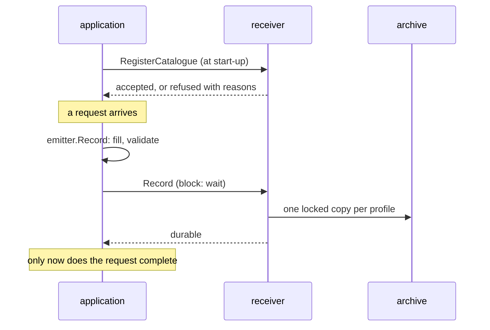

# Emit records from Go

Record an application's actions from its own process: register the catalogue at start-up, create the emitter, record.

## Before you start

- You need a [catalogue](connect-an-application.md#the-catalogue), a receiver in the application's namespace and the application's projected ServiceAccount token.

- The emitter is a Go module of its own: `go get github.com/truvity/sluis/audit/sdk`. It does not bring in the writer's database driver or object-store client ([layout](../../../reference/audit/repository-layout.md)).

- A `block` action fails while the receiver is down. An `async` record queues and drops only when the queue overflows ([recover from an outage](../operate/recover-from-an-outage.md)).

The working code is [`examples/emit`](../../../../audit/examples/emit/main.go).



## Steps

### 1. Register the catalogue

```go
err := emit.Register(ctx, emit.Registration{
	URL:    receiverURL,
	Source: shop.Source, Version: shop.Version,
	Document: document,
	Schemas:  map[string][]byte{"https://schemas.example.com/shop/order-placed.json": schema},
	HTTP:     auth.TokenFile(os.Getenv("AUDIT_TOKEN_FILE")),
})
```

Do not start if `Register` returns `emit.ErrCatalogueRefused`. Retrying cannot fix a malformed document. You may retry an unreachable receiver. Registering the same version again is not an error.

Mount a projected token with the installation's audience, default `audit`, and point `AUDIT_TOKEN_FILE` at it. `auth.TokenFile` re-reads it on every request.

```yaml
volumes:
  - name: audit-token
    projected:
      sources:
        - serviceAccountToken: { path: token, audience: audit, expirationSeconds: 3600 }
```

### 2. Create the emitter

```go
emitter, err := emit.New(emit.Options{
	Source:    shop.Source,
	Catalogue: shop,
	Sink:      sink.NewClient(auth.TokenFile(tokenPath), receiverURL),
	Version:   "1.0.0",
	Instance:  os.Getenv("HOSTNAME"),
	Queue:     1024,              // how many async records may wait; this is the default
	Hooks: emit.Hooks{
		OnDropped: func(r *record.Record, reason string) { /* alert, and log it */ },
	},
})
defer emitter.Close()
```

`Queue`, `Batch` and `Flush` size the `async` path: 1024 records, 100 per send and one second by default. Wrap the hooks with `emit.Instrument(hooks, otel.GetMeterProvider())` to count written, dropped and refused records.

Watch `audit.emit.queue.pending`: a climbing number means the receiver is slow or gone. Alert on `audit.emit.records.dropped`. The emitter also logs each drop through `Options.Logger`.

### 3. Record

```go
err := emitter.Record(r.Context(), &record.Record{
	Action:    "shop.order.placed",
	Operation: auditv1.Operation_OPERATION_CREATE,
	TenantId:  "acme",
	Actor:     &record.Actor{Kind: "customer", Id: customerID},
	Targets:   []*record.Target{{Type: "order", Id: orderID}},
	Outcome:   &record.Outcome{Result: auditv1.Outcome_RESULT_SUCCESS},
	Data:      data,
})
if err != nil {
	// block: the action did not happen as far as anyone can prove.
}
```

The emitter fills the identifier, times, versions and sequence, and validates the record against the catalogue. Set `TenantId` to the customer organisation, or `@platform` for the application's own operations. Put identifiers in the record, never names or e-mail addresses. Record failures too: `RESULT_FAILURE` or `RESULT_DENIED` with a reason.

Wrap the HTTP handler in `emit.Middleware(trustedHops)` to add client address, user agent, request id and trace id. If `trustedHops` is wrong, the trail records your load balancer as every actor's address.

### 4. Record from TypeScript

There is no TypeScript emitter. Call the receiver with the generated contract in [`ts/src/gen`](../../../../audit/ts/src/gen).

```ts
import { readFileSync } from "node:fs";
import { createClient } from "@connectrpc/connect";
import { createConnectTransport } from "@connectrpc/connect-node";
import { Delivery, SinkService } from "./gen/audit/v1/sink_pb";

const receiver = createClient(SinkService, createConnectTransport({
  baseUrl: process.env.AUDIT_RECEIVER!,
  httpVersion: "1.1",
  interceptors: [(next) => async (req) => {
    req.header.set("Authorization", `Bearer ${readFileSync(tokenFile, "utf8").trim()}`);
    return next(req);
  }],
}));
await receiver.write({ records: [record], delivery: Delivery.BLOCK });
```

Fill `id` (a UUIDv7), `occurred_at`, `schema_version`, `catalogue_version` and `source` yourself. The receiver dead-letters a record the catalogue does not match.

## Verify

Perform an action, then find it with [read the trail](read-the-trail.md).

## Decided in

[0053](../../../decisions/0053-one-installation-per-service-or-product.md), [0054](../../../decisions/0054-two-deliveries-and-a-durable-ack.md).
