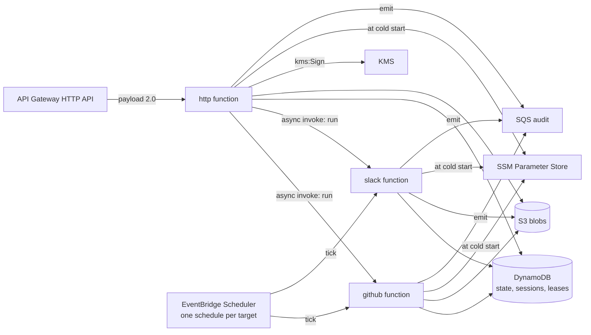

# sluis on AWS Lambda

sluis runs as three AWS Lambda functions from one zip. Nothing is in a VPC: every
dependency (DynamoDB, S3, KMS, SSM, SQS, Lambda) is an AWS API the function reaches
over its role, and the only inbound path is an API Gateway HTTP API.

The Kubernetes build is unchanged and stays what kernel and hive run where they run
it. This page is the other platform
([decision 0026](../decisions/0026-two-platforms-permanently-kubernetes-and-aws-lambda.md)).

## One binary, one zip, three functions

The release attaches `sluis-lambda_<version>_linux_arm64.zip`. It holds one file,
`bootstrap`, at the zip root: an arm64 Linux binary for the `provided.al2023` runtime.
It is about 50 MB, and the zip about 14 MB (for reference, the Kubernetes binary is
about 80 MB). The same zip is deployed as three functions, and the environment
variable `SLUIS_ROLE` chooses what each one is:

| Function | `SLUIS_ROLE` | What it runs | Invoked by |
|---|---|---|---|
| `http` | `http` | The issuer and the console: the same `net/http` mux the Kubernetes server serves | API Gateway HTTP API, payload format 2.0 |
| `github` | `github` | The GitHub roster controller: ONE pass for ONE organisation | EventBridge Scheduler, and an async invoke from `http` |
| `slack` | `slack` | The Slack roster controller: ONE pass for ONE workspace | EventBridge Scheduler, and an async invoke from `http` |

The binary reads `SLUIS_ROLE` once, at cold start. A missing or unknown role stops the
start (an Init error in the platform's terms) and the log line says which.



## Events

**`http`** receives an API Gateway HTTP API event, payload format 2.0 (a REST API or an
ALB sends another shape and is refused). The function turns it into an `http.Request`
and runs the handler:

- the method, `rawPath` and `rawQueryString` are the request line, and `host` the Host;
- the headers arrive lower-cased, and the `cookies` array becomes one `Cookie` header;
- a base64 body is decoded;
- the source IP is `RemoteAddr`.

The response carries the status and the headers, with several values of one header
joined by a comma. `Set-Cookie` goes in the response's `cookies`, as the gateway
requires: it drops a header of that name. A body that is not UTF-8 text, or has a
`Content-Encoding`, is base64 with `isBase64Encoded`. A handler that panics answers
500, a request that cannot be read 400, and a response over the platform's 6 MB limit
502 with a log line that says why.

**`github` and `slack`** receive one of two JSON events, which run the same pass:

```json
{"kind":"tick","target":"<id>"}
{"kind":"run","target":"<id>"}
```

`tick` is what an EventBridge Scheduler schedule sends, one schedule per target.
`run` is "run a pass now": the `http` function sends it with an asynchronous invoke
when a console write concerns the target. A target is a GitHub organisation's login
(or `github:links`, the link check) for `github`, and a workspace's key for `slack`.

Each invocation assembles the controller, runs ONE pass of the target under the
target's lease in DynamoDB, closes it (which flushes the audit queue) and returns:

```json
{"kind":"tick","target":"acme","outcome":"ran"}
```

| `outcome` | Meaning |
|---|---|
| `ran` | The pass ran to its end. |
| `contended` | Another invocation holds the target's lease. This one ends cleanly: it returns success, so the platform does not retry it or count an error. The other invocation's pass is the one that counts. |
| `unknown` | A `run` for a target this controller does not run. Only a `run`: see below. |

A failed pass returns an error, which the scheduler's retry policy sees. A `tick` for
a target the controller does not run is also an error: a schedule that names nobody's
target is a mistake to see. A `run` is a hint, and the one for an unknown target ends
cleanly as `unknown`.

The leases are `Create` and `Update` with a TTL on the State port, which is DynamoDB
here, so two invocations (a schedule firing while somebody pressed "run now") cannot
both run. The controller refuses to run its pass when the State is not shared, so a
function that was configured with `memory` fails at its first event and not by
acting twice.

**`http` also receives `{"kind":"exports"}`**, from an EventBridge Scheduler
schedule (15 minutes, on the `sluis-http` function; the infrastructure library's default). The
Kubernetes process keeps the exports current with a loop that also watches the
sources; a function has neither, so each invocation makes every declared export
once (the secrets under `/sluis/export/...` and the other targets of `exports:`),
each under its own lease in DynamoDB, and returns:

```json
{"kind":"exports","outcome":"ran","exports":2,"done":2,"contended":0,"failed":0}
```

A pass is idempotent (a copy of what is already there writes nothing), and two
invocations cannot both make one export. `contended` exports are another
invocation's. `outcome` is `none` when the deployment declares no export. If any
export could not be made the invocation FAILS, so the schedule's retry and an
alarm on the function's errors see a copy that is going stale. A change to a
source is picked up at the next schedule, up to one interval later. Any other
`kind` on `http` is refused.

### Run now

The `http` function's console notifies the `trigger` port when a write concerns a
target. On Lambda that port is the `invoke` adapter: `Notify` is an asynchronous
invoke (`InvocationType: Event`) of the controller function with
`{"kind":"run","target":"<id>"}`, and returns as soon as the platform queues it.
`Subscribe` is unused, since the platform starts the function. The adapter is told
which kind a target is by the policy that declares it (a declared Slack workspace is
`slack`, a bound GitHub organisation is `github`), so one function is invoked. A target
the policy does not declare invokes both, and the one that does not run it ends
as `unknown`.

## Environment

| Variable | Function | Meaning |
|---|---|---|
| `SLUIS_ROLE` | all | `http`, `github` or `slack`. Required. |
| `SLUIS_CONFIG_FILE` | all | The configuration file in the zip. Default `/var/task/config/sluis.yaml`. |
| `SLUIS_SECRET_FILES` | all | SSM parameters written to files under `/tmp` at cold start, see below. |
| `<NAME>=ssm:/sluis/private/...` | all | A secret read from SSM into a variable at cold start, see below. |
| `OTEL_*` | all | OpenTelemetry's own, as on Kubernetes. The telemetry layer sets the endpoint. |

There is no other variable and no flag. A retired variable of the old environment
configuration (`PORT`, `LOG_LEVEL` and the rest listed in
[configuration](../reference/configuration.md)) stops the start, as it does on
Kubernetes. The run-now functions' names are in the file, not in the environment
(`adapters.trigger.settings`).

## Configuration is in the zip

The deploy tooling ADDS the estate's configuration to the zip at deploy time:

```text
bootstrap
config/sluis.yaml        the http function's file (a `serve` configuration)
config/github.yaml       the github function's file (a `controller-github` configuration)
config/slack.yaml        the slack function's file (a `controller-slack` configuration)
config/...               the policy, the GitHub and Slack catalogues the files name
```

So a change of configuration is a new deployment: there is no mounted ConfigMap to
change under a running function, and the function that reads it is the version that
was released with it. The three roles read three schemas, as the three commands do
(`schemas/config/serve.schema.json`, `controller-github.schema.json`,
`controller-slack.schema.json`), so each function sets `SLUIS_CONFIG_FILE` to its own
file. The default names `sluis.yaml` for a function that sets none. The file is
validated against its schema at cold start, before the function takes an event. The
release zip holds none of this: `bootstrap` only.

On Lambda a file selects its adapters by name per concern
([ports](../design/ports.md)):

```yaml
# config/sluis.yaml (the http function)
platform: { aws: true, runtime: lambda }   # or: preset: aws-serverless
adapters:
  state:   { adapter: dynamodb, settings: { table: sluis } }
  blobs:   { adapter: s3,       settings: { bucket: sluis-blobs, prefix: blobs/ } }
  trigger: { adapter: invoke,   settings: { github: sluis-github, slack: sluis-slack } }
```

`legacy` is refused on the Lambda runtime. The controllers' files take the
same `platform`, `preset` and `adapters` keys as the service's, so that all three
functions resolve the same table: the state (and so the leases), the blobs and the
audit sink. The audit adapter is `sqs` (`adapters.audit.settings.queueURL`); on Lambda
each record is sent before the call that made it returns, and every function flushes
what is still queued before its invocation returns, since the platform freezes the
process afterwards (a controller does it by closing, which delivers its queue).

### Secrets

Configuration secrets (a Google OAuth client secret, the admin password, a GitHub
App's key, a Slack signing secret) are read from SSM Parameter Store at cold start,
under the same layout as the dynamic secrets (decision D1a): `/sluis/private/...` for
sluis's own and `/sluis/export/...` for what it exports. The file keeps naming the
variable that holds a secret (`oauthClient.secretEnv: OAUTH_CLIENT_SECRET`), and the
function's environment says where to read it:

```text
OAUTH_CLIENT_SECRET=ssm:/sluis/private/config/oauth/client-secret
```

At cold start every variable whose value begins with `ssm:` is replaced by the
parameter's decrypted value, before the file is read. A path outside the two roots is
refused, and a missing parameter stops the start naming the path and never a value.
A function with no such variable calls SSM not at all. This is a small reader of
configuration. The `ssm` adapter of the secrets concern, which stores the service's
dynamic secrets, is another piece.

#### Secret files

Many settings name a FILE, not a variable: the GitHub App key files, the Slack
secrets, `signingKey.kms.stateSecretFile`. There is no mounted Secret on Lambda, so
the variable `SLUIS_SECRET_FILES` lists parameters to write to files at cold start,
before the configuration is read:

```text
SLUIS_SECRET_FILES=[{"parameter":"/sluis/private/config/issuer/state-secret","path":"/tmp/sluis/state-secret"}]
```

```yaml
signingKey:
  kms:
    stateSecretFile: /tmp/sluis/state-secret   # the file the variable above wrote
```

Each entry is a decrypted SSM parameter (under `/sluis/private/` or `/sluis/export/`)
written byte for byte, with no newline added, to a path under `/tmp/`, mode 0600 in
directories of mode 0700. A path anywhere else, one with `..`, or a parameter outside
the roots stops the start. Every `*File` setting then works as it does on Kubernetes by
naming one of those paths, and the secret never enters the zip. The issuer's state
secret is generated into `/sluis/private/config/issuer/state-secret` (base64 of 32 random
bytes) by the infrastructure code and read this way by every function.

## IAM: one role per function

Each function has its own role (decision D5a), and only `http` can sign a token:

| Permission | `http` | `github` | `slack` |
|---|:-:|:-:|:-:|
| `kms:Sign`, `kms:GetPublicKey` on the token-signing key | yes | no | no |
| `dynamodb:GetItem`, `PutItem`, `UpdateItem`, `DeleteItem`, `Query` on the table | yes | yes | yes |
| `s3:GetObject`, `PutObject`, `DeleteObject`, `ListBucket` on the blob bucket and prefix | yes | yes | yes |
| `ssm:GetParameter`, `PutParameter`, `DeleteParameter`, `GetParametersByPath` on `/sluis/private/*` and `/sluis/export/*`, for the secrets adapter (`ssm`) that keeps the service's dynamic secrets | yes | yes | yes |
| `ssm:GetParameters` on the parameters its variables and `SLUIS_SECRET_FILES` name, under `/sluis/private/*` (and `kms:Decrypt` on the key encrypting them) | yes | yes | yes |
| `sqs:SendMessage` on the audit queue | yes | yes | yes |
| `lambda:InvokeFunction` on the `github` and `slack` functions | yes | no | no |
| `sts:GetWebIdentityToken` (the controller's proof to the console, see below) | no | yes | yes |
| `logs:*` as usual | yes | yes | yes |

Narrow the SSM permission to the parameters each function's variables name: a
controller needs a GitHub App's key and not the OAuth client's secret. EventBridge
Scheduler needs its own role, with `lambda:InvokeFunction` on the function it
schedules.

## How a controller authenticates to the console

A controller reads the console's API (who holds a group, the organisations'
credentials) as a workload. In a cluster that is its projected ServiceAccount
token. On Lambda it is the function role's **outbound web identity token**: the
controller calls `sts:GetWebIdentityToken` for the console's own audience (see below),
presents the token as the bearer of every call, and reuses it for under four
minutes (a warm execution environment reuses it across invocations). The `http`
function's issuer verifies it against the account's published key set, with the
same per-account verifiers token exchange uses, and takes the role as the caller.

The cache is by **age**, not by expiry. The issuer refuses a token whose `iat` is
older than the federation file's `maxAge` (default 5 minutes) whatever its `exp`
says, so the controller requests the shortest lifetime it can reuse (5 minutes,
STS's default; AWS allows from 1 minute to 1 hour) and mints a new token once the
old one is four minutes old. If you raise `maxAge`, the four minutes stay safe.

### Two audiences, two doors

An AWS role's token is a proof at two doors, and each has its own audience, so a
token minted for one is no proof at the other:

| Door | Audience | Set in |
|---|---|---|
| Token exchange (`/token`) | `exchange.aws.audience` of the policy document | the policy document |
| The console's API (a controller's bearer) | `console.awsAudience`, default `<issuerURL>/console` | the `http` config |

The controllers request the console audience: `console.auth.aws.audience` in the
`github.yaml` and `slack.yaml` files must equal the issuer's `console.awsAudience`.
The issuer refuses to start with the same value for both doors.

```yaml
# http config
console:
  awsAudience: https://sluis.example/console   # optional: this is the default
```

```yaml
# the policy document
exchange:
  aws:
    audience: sluis-exchange
    accounts: [...]
```

```yaml
# github.yaml and slack.yaml
console:
  auth:
    aws:
      audience: https://sluis.example/console  # = the issuer's console.awsAudience
```

Absent, the controller reads `tokenFile`, as on Kubernetes. Three things must agree:

1. **IAM.** The `github` and `slack` roles are allowed `sts:GetWebIdentityToken`
   (the account has outbound identity federation enabled), and the permission can be
   held to the console audience with the condition key
   `sts:IdentityTokenAudience`:

   ```json
   {"Effect":"Allow","Action":"sts:GetWebIdentityToken","Resource":"*",
    "Condition":{"ForAnyValue:StringEquals":{"sts:IdentityTokenAudience":"https://sluis.example/console"}}}
   ```

   So a controller role can mint a console bearer and nothing for token exchange.
   Only a role that is meant to exchange gets the exchange audience.
2. **The issuer.** The policy document's `exchange.aws.accounts` lists the account
   (`issuer` from `aws iam get-outbound-web-identity-federation-info`). The console
   door uses the same accounts with `console.awsAudience`.
3. **The policy.** The role is entitled to what the policy's `aws` matchers say,
   and to nothing without one. Declare the controllers as viewers (enough to read
   who holds a group):

```yaml
groups:
  all:sluis:viewer:
    matchers:
      - aws: { account: "111122223333", role: sluis-github }
      - aws: { account: "111122223333", role: sluis-slack }
```

A role the policy does not name is nobody at the console, however well its token
verifies. An `aws` matcher with no `role`, or a bare `*`, admits **every** role of
its account, including roles created later. It is not refused (a policy may rely on
it), but the issuer logs a warning at start naming the groups that have one: name
the role unless that is meant.

## Cold start, and what is not here

- The state, sessions, leases and the target's reports are in DynamoDB and S3, so no
  invocation depends on another's memory. A sign-in's half-finished state is in the
  session records, not the process.
- The directory snapshot is refreshed on read when it is stale, as the hub already
  does. The Kubernetes process also refreshes it on a timer; a function has no process
  between invocations to keep one in, and a refresh a request started is finished
  before the response is returned to the platform.
- `http` is one assembled service per execution environment, kept across
  invocations. A controller is assembled per invocation, as `sluis tick` does.
- The exports' runner, a background loop, is not started: the `exports` event makes the copies on a schedule instead.

## Telemetry

The only telemetry layer is `truvity/observability`'s OTLP Lambda layer
(`otlp-lambda-layer_<version>_linux_<arch>.zip` in its releases, documented in
[its integration page](https://github.com/truvity/observability/blob/master/docs/integrations/aws-lambda.md)).
It runs the OTLP proxy on the loopback address, authenticates with the function role's
identity, and sends the platform's own logs. sluis ships no layer and no extension:
the one this repository used to build (`sluis-lambda-layer`, installed as
`extensions/access-roster-otlp`) was removed once nothing deployed it. Set the layer's
`OTEL_EXPORTER_OTLP_ENDPOINT` as the layer's page says; the function exports metrics
and traces with the OpenTelemetry SDK it already has, and flushes them at the end of
every invocation, because the platform freezes the process when one returns.

## Building and checking the root

`cmd/sluis-lambda` is built with `-tags lambda,lambda.norpc`. The `lambda` tag leaves
out the Kubernetes, NATS and Valkey storage the other binary carries (see
`internal/store/store_lambda.go`), and `lambda.norpc` is the Lambda library's own tag
for the `provided` runtimes. `cmd/sluis-lambda/imports_test.go` lists the root's
transitive imports and fails on `k8s.io/`, `github.com/nats-io/`,
`github.com/valkey-io/` and the packages that wrap them, and on a sweep that finds
nothing. It runs in `just test`, so a client-go import three packages down is a red
build and not 30 MB of cold start.

```sh
GOOS=linux GOARCH=arm64 CGO_ENABLED=0 go build -trimpath -tags lambda,lambda.norpc \
  -ldflags '-s -w' -o bootstrap ./cmd/sluis-lambda
```
