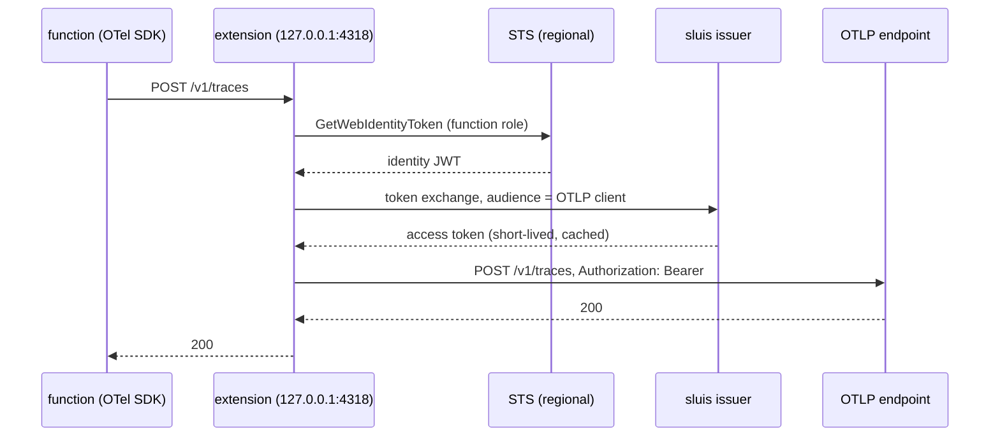

# AWS Lambda — telemetry with the function role's identity

> **Deprecated: the extension moved to
> [truvity/observability](https://github.com/truvity/observability/blob/master/docs/integrations/aws-lambda.md).**
> The source is `github.com/truvity/observability/lambdaext` and the layer is
> `otlp-lambda-layer_<version>_linux_<arch>.zip` in that repository's
> releases. This repository keeps building `sluis-lambda-layer` for one more
> release so that a consumer can switch, and then stops. This page is kept for
> that one release. The `SLUIS_*` names with the `ACCESS_ROSTER_*` fallback are
> read by a wrapper in `cmd/sluis-lambda` until observability releases the same.

A Lambda function can send its OpenTelemetry data to an OTLP endpoint that
trusts sluis **without holding any secret**. The release carries an
extension layer, `sluis-lambda-layer_<version>_linux_<arch>.zip`,
that does three things for the function:

1. asks STS for an identity token for the role the function already runs as
   (`sts:GetWebIdentityToken`, AWS outbound identity federation);
2. trades it at the sluis issuer (RFC 8693 token exchange) for a
   short-lived access token audienced at the OTLP endpoint;
3. runs an OTLP/HTTP proxy on `127.0.0.1:4318` that forwards every export to
   the endpoint with that token as the bearer;
4. subscribes to the Lambda **Telemetry API** and sends the platform's own
   events (timeouts, out-of-memory kills, init errors, the `REPORT` metrics)
   as OTLP logs through the same upstream and token, with no CloudWatch in
   the path ([Platform logs](#platform-logs)).

The function's own OpenTelemetry SDK needs no credential and no auth
configuration. It exports to the loopback address, with any language's
standard OTLP/HTTP exporter:

```
OTEL_EXPORTER_OTLP_ENDPOINT=http://127.0.0.1:4318
OTEL_EXPORTER_OTLP_PROTOCOL=http/protobuf   # or http/json
```

gRPC OTLP is not supported (HTTP protobuf and JSON only).



## Why a proxy, and why on demand

A Lambda execution environment is **frozen between invocations**: no timer
runs while it is frozen, so a token refreshed by a background loop can be
expired when the environment thaws and the function exports. The extension
therefore checks the clock on every export: a token is cached until a third
of its life remains, and a caller that finds it inside that window waits for
a new one (concurrent callers share one refresh). The extension also warms
the token on each `INVOKE`, so the usual export finds a fresh one waiting.

Forwarding is **synchronous**. Answering the exporter early and forwarding
later would let the environment freeze with the export still in memory.

## Platform logs

The function's own OTel SDK cannot report that it was killed: a timeout, an
out-of-memory kill or a failed init ends the process before it can export
anything. Lambda reports those itself, to the Telemetry API, and the
extension forwards them as OTLP **logs** to `<endpoint>/v1/logs` (protobuf,
`Authorization: Bearer`, the same token source as the proxy).

The extension starts a listener, subscribes to the Telemetry API
(`PUT /2022-07-01/telemetry`, schema `2022-12-13`) naming it as the
destination, and Lambda POSTs batches to it. The platform's own buffering
(`maxItems`, `maxBytes`, `timeoutMs`) decides how often; the extension
answers each POST at once and exports in the background, and always exports
what it holds **before** it asks for the next event, because that is the
moment the environment may be frozen.

| Event | Severity | Body (shape) | Attributes |
|---|---|---|---|
| `platform.initStart` | INFO | `INIT_START Runtime Version: <v> Phase: <p>` | `initializationType`, `phase` |
| `platform.initRuntimeDone` | INFO, ERROR if `status` is not `success` or `errorType` is set | `INIT_RUNTIME_DONE Phase: <p> Status: <s>` | `status`, `errorType` |
| `platform.initReport` | as above | `INIT_REPORT Phase: <p> Status: <s> Duration: <ms>` | `status`, `durationMs` |
| `platform.start` | INFO | `START RequestId: <id> Version: <v>` | `requestId` |
| `platform.runtimeDone` | INFO, ERROR on `failure`, `error`, `timeout` | `RUNTIME_DONE RequestId: <id> Status: <s>` | `status`, `errorType`, `durationMs`, `producedBytes` |
| `platform.report` | INFO, ERROR on `error`, `timeout`, or any `errorType` (`Task.Timedout`, `Runtime.OutOfMemory`, ...) | `REPORT RequestId: <id> Duration: ... Billed Duration: ... Memory Size: ... Max Memory Used: ... Init Duration: ...` | `status`, `errorType`, `durationMs`, `billedDurationMs`, `memorySizeMB`, `maxMemoryUsedMB`, `initDurationMs`, `restoreDurationMs` |
| `platform.restoreStart` / `restoreRuntimeDone` / `restoreReport` | as above | `RESTORE_...` | `status`, `errorType`, `durationMs` |
| `platform.logsDropped` | WARN | `LOGS_DROPPED Reason: <r>` | `droppedRecords`, `droppedBytes` |
| `platform.telemetrySubscription` and other `platform.*` | INFO | the event name and status | `status` |
| `function` (opt-in) | INFO, or the JSON log's `level` | the line | `requestId` for JSON logs |
| `extension` (opt-in) | INFO | the line | |

Every record has `event.name` (the event type above), `requestId` and
`faas.invocation_id` where the event has one, and the event's own timestamp.
When the event carries X-Ray tracing (`tracing.value`), the record carries
the trace id from `Root=`, the span from `tracing.spanId` (else `Parent=`)
and the sampled flag, so a log lines up with the function's own trace.

The resource of every record is `service.name` (`OTEL_SERVICE_NAME`, else the
function name), `faas.name`, `faas.version`, `faas.instance` (the log
stream), `faas.max_memory`, `cloud.provider=aws`, `cloud.platform=aws_lambda`
and `cloud.region`.

**Function and extension logs are off by default.** A function that already
exports its logs through OpenTelemetry would then send each line twice (once
through its SDK, once as a Telemetry API `function` record), and would pay for
it twice. Turn `ACCESS_ROSTER_FUNCTION_LOGS` on for a function that writes to
stdout and has no OTel logs SDK: it is then the way those lines reach the
log store without CloudWatch. Platform events are never in the SDK's logs, so
they have no duplicate. Note that Lambda still writes the same lines to
CloudWatch Logs unless the function role's logging is denied there; the
extension does not turn that off.

The queue is bounded in memory (`ACCESS_ROSTER_TELEMETRY_BUFFER_QUEUE_ITEMS`,
5000 records, a few MB at most). If exports cannot keep up, the **oldest**
records are dropped and the next export starts with a WARN record saying how
many were. The export is fail-open like the rest: with no token or a failing
upstream the batch is dropped, one log line is written per failure window and
one when it recovers, and the invocation is never held up. A `401` drops the
token and retries once. On `SHUTDOWN` the extension stops the listener and
exports what is left within the shutdown deadline.

Outside Lambda, and in the Runtime Interface Emulator, the Telemetry API is
absent (the emulator answers the subscription `202 Telemetry.NotSupported`):
the extension logs one line and runs without it.

## What the extension does when something is wrong

It is **fail-open**: telemetry never blocks, slows or crashes an invocation.

- No token (STS refused, the issuer is down or refuses the role): the proxy
  answers `503` with `Retry-After`, which OTLP exporters treat as retryable,
  and the extension logs **one line per failure window** (and one when it
  recovers). After a failure it does not call STS again for 5 seconds, so an
  exporter's retries are not a request storm. A token that is still valid is
  used even if its replacement failed.
- Missing or invalid configuration, or the port is taken: one log line, and
  the extension keeps answering the platform (an extension that exits is
  reported by Lambda as a crash of the invocation). Exports then find nothing
  listening.
- The upstream answers `401`: the cached token is dropped and the next export
  obtains a new one. Other upstream statuses are relayed unchanged.
- `SHUTDOWN`: the proxy stops accepting, lets in-flight forwards finish within
  the shutdown deadline, and exits.

Tokens are held in memory only (plus the optional file below) and are never
logged.

## Configuration

All settings are environment variables on the function.

Since the rename to sluis each one is read as `SLUIS_<NAME>` first and as
`ACCESS_ROSTER_<NAME>` second: both work, and `SLUIS_*` wins when both are set.
The table lists the `ACCESS_ROSTER_*` names, which are unchanged; write
`SLUIS_ISSUER` where it says `ACCESS_ROSTER_ISSUER`, and so on. The contract
name `ACCESS_ROSTER_ISSUER` as a GitHub variable (`vars.ACCESS_ROSTER_ISSUER`)
is not this variable and does not change.

| Variable | Default | Meaning |
|---|---|---|
| `ACCESS_ROSTER_ISSUER` | required | The issuer's base URL. |
| `ACCESS_ROSTER_AUDIENCE` | required | The audience asked of STS for the identity token. What the issuer's AWS verifier expects; the role policy pins it (below). |
| `ACCESS_ROSTER_OTLP_ENDPOINT` | required | The OTLP/HTTP base URL, `https`. The extension appends `/v1/traces`, `/v1/metrics`, `/v1/logs`. Plain `http` is accepted only for a loopback host. |
| `ACCESS_ROSTER_OTLP_AUDIENCE` | `otlp` | The exchange's audience and client id: the roster client that the OTLP endpoint accepts. |
| `ACCESS_ROSTER_LISTEN` | `127.0.0.1:4318` | The proxy's address. |
| `ACCESS_ROSTER_STS_DURATION_SECONDS` | `300` | Lifetime asked of the STS token (60 to 3600). It is used once, for the exchange. |
| `ACCESS_ROSTER_STS_ALGORITHM` | `ES384` | Signing algorithm asked of STS (`ES384` or `RS256`). |
| `ACCESS_ROSTER_PLATFORM_LOGS` | `true` | Subscribe to Telemetry API `platform` events and forward them as OTLP logs. |
| `ACCESS_ROSTER_FUNCTION_LOGS` | `false` | Also forward `function` logs (the function's stdout/stderr). Duplicates logs the function exports itself; see [Platform logs](#platform-logs). |
| `ACCESS_ROSTER_EXTENSION_LOGS` | `false` | Also forward `extension` logs (other extensions' output). |
| `ACCESS_ROSTER_TELEMETRY_LISTEN` | `sandbox.localdomain:4243` | The Telemetry API destination. Bound on all interfaces of the sandbox at that port when the host is `sandbox.localdomain`. |
| `ACCESS_ROSTER_TELEMETRY_BUFFER_MAX_ITEMS` | `1000` | The platform's batch size in events (1000 to 10000). |
| `ACCESS_ROSTER_TELEMETRY_BUFFER_MAX_BYTES` | `262144` | The platform's batch size in bytes (262144 to 1048576). |
| `ACCESS_ROSTER_TELEMETRY_BUFFER_TIMEOUT_MS` | `1000` | The platform's longest wait before delivering a batch (25 to 30000). |
| `ACCESS_ROSTER_TELEMETRY_BUFFER_QUEUE_ITEMS` | `5000` | Records held in the extension waiting for an export (100 to 1000000); beyond it the oldest are dropped and counted. |
| `ACCESS_ROSTER_TOKEN_FILE` | unset | If set, each access token is also written here (mode 0600, replaced atomically; the directory is created 0700). For a function that runs its own collector with a bearer-token-from-file extension. Off by default. Use a path under `/tmp`. |

STS needs a **regional** endpoint (the global one does not support the
call): the SDK picks it from `AWS_REGION`, which Lambda sets. The extension
needs egress to the regional STS endpoint, the issuer and the OTLP endpoint;
a VPC function without a NAT needs an STS interface endpoint.

## IAM and account setup

1. **The account must have outbound identity federation enabled** (IAM
   account settings, or `aws iam enable-outbound-web-identity-federation`).
   Without it STS answers `OutboundWebIdentityFederationDisabled`, which the
   extension logs.
2. **The function role** needs `sts:GetWebIdentityToken`, and the policy
   should pin the audience (and, optionally, the lifetime and algorithm):

```json
{
  "Effect": "Allow",
  "Action": "sts:GetWebIdentityToken",
  "Resource": "*",
  "Condition": {
    "ForAllValues:StringEquals": {
      "sts:IdentityTokenAudience": "https://access.example"
    },
    "StringEquals": { "sts:SigningAlgorithm": "ES384" },
    "NumericLessThanEquals": { "sts:DurationSeconds": "300" }
  }
}
```

`sts:IdentityTokenAudience` is a multi-valued key (the API takes a list of
audiences), so it needs the `ForAllValues:StringEquals` operator. A plain
`StringEquals` evaluates to an implicit deny when the request carries the
audience as a list, and STS answers `AccessDenied ... no identity-based policy
allows the sts:GetWebIdentityToken action`. `ForAllValues` also passes on an
empty set, which is safe here only because `Audience` is a required parameter
of [GetWebIdentityToken](https://docs.aws.amazon.com/STS/latest/APIReference/API_GetWebIdentityToken.html).
`sts:SigningAlgorithm` is single-valued and keeps `StringEquals`.

3. **The roster** must admit the role: the issuer-side AWS verifier recognises
   the account, and a group matcher selects the role, for example
   `arn:aws:iam::111122223333:role/billing-*`. A role in no group is refused
   at the exchange, which shows up as a `503` plus the issuer's sentence in
   the extension's log line.

## The console's Audit page on Lambda

With the `sqs` audit sink there is no audit receiver, and the Audit page does not
need one: `audit.queryURL` is its own setting. Point it at the query service,
for example `https://audit.example.org/sluis`; a path prefix is kept and the
procedure path appended (`.../sluis/audit.v1.QueryService/Search`).

The browser never calls the query service. `sluis-http` forwards the page's
calls from the console's own origin, server-side, with a token it mints for the
person signed in (audience `audit.audience`, default `audit`). So the query host
needs **no CORS policy**, and the function needs egress to it: the functions
run outside any VPC, so the query host must be publicly reachable (through
Cloudflare, for example) and accept those tokens.

## Attaching the layer

Each release carries one zip per architecture:

| Lambda architecture | Release asset |
|---|---|
| `x86_64` | `sluis-lambda-layer_<version>_linux_amd64.zip` |
| `arm64` | `sluis-lambda-layer_<version>_linux_arm64.zip` |

The zip root is the layer root: it holds one file,
`extensions/access-roster-otlp` (mode 0755). Publish it as a layer version in
your own account and region, with the matching `--compatible-architectures`,
and add it to the function:

```
aws lambda publish-layer-version --layer-name access-roster-otlp \
  --zip-file fileb://sluis-lambda-layer_<version>_linux_arm64.zip \
  --compatible-architectures arm64
```

The release does not publish a layer version for you. The binary is a static
Go executable with no runtime dependency, so it works with every runtime,
including container-image functions (copy it to `/opt/extensions/`).

## Size and cold start

| | amd64 | arm64 |
|---|---|---|
| binary (stripped, `-trimpath`) | 10.06 MB | 9.31 MB |
| zip | 4.01 MB | 3.60 MB |

In the Lambda Runtime Interface Emulator the extension registers and init
completes in about 12 ms (the first token is fetched in the background,
after registering, so it does not delay init). Lambda bills extension time
like function time; the proxy is idle between exports.

## Tests

The extension's package (now `github.com/truvity/observability/lambdaext`) has unit tests (token cache, expiry after a freeze,
single flight, failure backoff, STS and exchange against fakes, proxy
headers/body/encoding, 503 and refusals) and end-to-end tests that run the
real binary against a fake Extensions API, STS, issuer and OTLP upstream. One
more test runs it in the real Lambda base image with `aws-lambda-rie`; it is
opt-in (`ACCESS_ROSTER_RIE=1`, needs docker and port 8080).

The Telemetry API is covered by tests against a fake Telemetry API
(subscription, batches POSTed to the extension's listener, records arriving at
the fake upstream with the bearer token, flush on `SHUTDOWN`) and by unit
tests of the event mapping with the AWS reference payloads (including a
timeout and an out-of-memory report). The emulator has no Telemetry API, so
the opt-in emulator test only proves the extension tolerates that.

Not covered by the layer: gRPC OTLP. The OTLP logs are written by a small
hand-rolled protobuf encoder rather than the generated packages, which would
add about 6.7 MB to the binary; a test decodes its output with the generated
schema.
