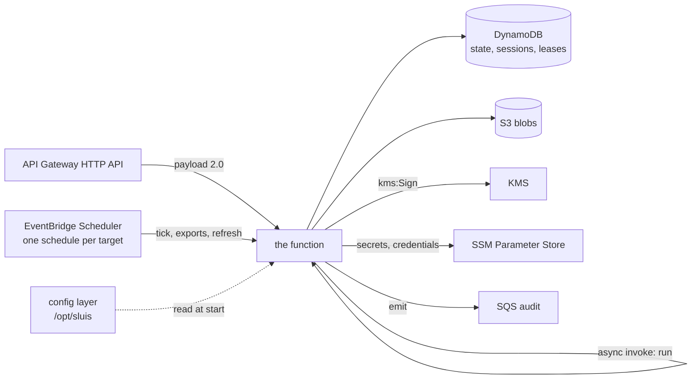

# sluis on AWS Lambda

sluis runs as ONE AWS Lambda function from one zip. Nothing is in a VPC: every
dependency (DynamoDB, S3, KMS, SSM, SQS, Lambda) is an AWS API the function reaches
over its role, and the only inbound path is an API Gateway HTTP API.

The Kubernetes build is unchanged and stays what kernel and hive run where they run
it. This page is the other platform
([decision 0026](../decisions/0026-two-platforms-permanently-kubernetes-and-aws-lambda.md)).

## One binary, one zip, one function

The release attaches `sluis-lambda_<version>_linux_arm64.zip`. It holds one file,
`bootstrap`, at the zip root: an arm64 Linux binary for the `provided.al2023` runtime.
It is about 50 MB, and the zip about 14 MB (for reference, the Kubernetes binary is
about 80 MB). The zip is deployed as ONE function (v1.63;
[decision 0037](../decisions/0037-one-process-everywhere.md)), and the function takes
four kinds of event:

| Event | What it runs | Sent by |
|---|---|---|
| An API Gateway HTTP API event, payload format 2.0 | The issuer and the console: the same `net/http` mux the Kubernetes server serves | API Gateway |
| `{"kind":"tick"\|"run","target":"<id>"}` | ONE pass of ONE target, run by the controller the policy says the target belongs to (the GitHub controller's organisations and `github:links`, the Slack controller's workspaces) | EventBridge Scheduler (`tick`), and an async invoke from the console (`run`) |
| `{"kind":"exports"}` | Every declared export, once | EventBridge Scheduler |
| `{"kind":"refresh"}` | One directory refresh | EventBridge Scheduler |

The controllers do not loop on Lambda: each pass is assembled for its invocation, as
before. `SLUIS_ROLE` is retired: a function that still sets it is refused at cold
start, and the log line says why. The function's timeout is 300 s by default (API
Gateway still cuts a request at 30 s) and its memory is one setting (512 MB); a
controller pass shares both with the issuer.

The zip is the release, **byte for byte**: the Pulumi library deploys the file it
was given, after checking its SHA-256 (`PackageSHA256`, from the release's
checksums), so an installation can show that the code that runs is the code that
was released. What makes the function an installation's is not in the
zip but in a configuration layer ([below](#configuration-is-a-layer)).



## Events

**An API Gateway event** is an API Gateway HTTP API event, payload format 2.0 (a REST API or an
ALB sends another shape and is refused). The function turns it into an `http.Request`
and runs the handler:

- the method, `rawPath` and `rawQueryString` are the request line, and `host` the Host;
- the headers arrive lower-cased, and the `cookies` array becomes one `Cookie` header;
- a base64 body is decoded;
- the source IP is `RemoteAddr`.

The response carries the status and the headers, with several values of one header
joined by a comma. `Set-Cookie` goes in the response's `cookies`, as the gateway
requires: it drops a header of that name. A body that is not UTF-8 text, or has a
`Content-Encoding`, is base64 with `isBase64Encoded`. A handler that panics answers
500, a request that cannot be read 400, and a response over the platform's 6 MB limit
502 with a log line that says why.

**A controller pass** is asked for by one of two JSON events, which run the same pass:

```json
{"kind":"tick","target":"<id>"}
{"kind":"run","target":"<id>"}
```

`tick` is what an EventBridge Scheduler schedule sends, one schedule per target.
`run` is "run a pass now": the function sends it to itself with an asynchronous invoke
when a console write concerns the target. A target is a GitHub organisation's login
(or `github:links`, the link check) for the GitHub controller, and a workspace's key for the Slack controller.

Each invocation assembles the controller, runs ONE pass of the target under the
target's lease in DynamoDB, closes it (which flushes the audit queue) and returns:

```json
{"kind":"tick","target":"acme","outcome":"ran"}
```

| `outcome` | Meaning |
|---|---|
| `ran` | The pass ran to its end. |
| `contended` | Another invocation holds the target's lease. This one ends cleanly: it returns success, so the platform does not retry it or count an error. The other invocation's pass is the one that counts. |
| `unknown` | A `run` for a target the policy does not declare. Only a `run`: see below. |

A failed pass returns an error, which the scheduler's retry policy sees. A `tick` for
a target no controller runs is also an error: a schedule that names nobody's
target is a mistake to see. A `run` is a hint, and the one for an unknown target ends
cleanly as `unknown`.

The leases are `Create` and `Update` with a TTL on the State port, which is DynamoDB
here, so two invocations (a schedule firing while somebody pressed "run now") cannot
both run. The controller refuses to run its pass when the State is not shared, so a
function that was configured with `memory` fails at its first event and not by
acting twice.

**The function also receives `{"kind":"exports"}`**, from an EventBridge Scheduler
schedule (15 minutes; the infrastructure library's default). The
Kubernetes process keeps the exports current with a loop that also watches the
sources; a function has neither, so each invocation makes every declared export
once (the secrets under `/sluis/<instance>/export/...` and the other targets of the policy document's `exports`),
each under its own lease in DynamoDB, and returns:

```json
{"kind":"exports","outcome":"ran","exports":2,"done":2,"contended":0,"failed":0}
```

A pass is idempotent (a copy of what is already there writes nothing), and two
invocations cannot both make one export. `contended` exports are another
invocation's. `outcome` is `none` when the deployment declares no export. If any
export could not be made the invocation FAILS, so the schedule's retry and an
alarm on the function's errors see a copy that is going stale. A change to a
source is picked up at the next schedule, up to one interval later. Any other
`kind` is refused.

### Run now

The console notifies the `trigger` port when a write concerns a target. On Lambda
that port is the `invoke` adapter: `Notify` is an asynchronous invoke
(`InvocationType: Event`) of the function itself with
`{"kind":"run","target":"<id>"}`, and returns as soon as the platform queues it.
`Subscribe` is unused, since the platform starts the function. Both `github` and
`slack` settings of the adapter name this one function, and the Pulumi library
writes them. The function runs the pass under the controller the policy says the
target belongs to (a declared Slack workspace is `slack`, a bound GitHub
organisation is `github`); a `run` of a target the policy does not declare ends
as `unknown`.

## Environment

| Variable | Function | Meaning |
|---|---|---|
| `SLUIS_CONFIG` | the function | The service document: `/opt/sluis/sluis.yaml` in the configuration layer. The library sets it. |
| `OTEL_*` | the function | OpenTelemetry's own, as on Kubernetes. The telemetry layer sets the endpoint. |

That is the whole environment: there is no other variable and no flag, and no
secret, since a document names its secrets and does not hold them. A retired
variable of the old environment configuration (`PORT`, `LOG_LEVEL` and the rest
listed in [configuration](configuration.md#migrating-from-environment-variables))
stops the start, as it does on Kubernetes, and so do `SLUIS_CONFIG_FILE`,
`SLUIS_SECRET_FILES` and any variable whose value is `ssm:<path>`: they belong to
the v1.61 library, and the error names the v1.62 library to deploy with. The
run-now functions' names are in the document, not in the environment
(`adapters.trigger.settings`).

## Configuration is a layer

The installation's configuration is **not** in the zip. It is one immutable
Lambda layer, `<prefix>-config` (`provided.al2023`, arm64), which the library
publishes from the two documents and mounts **last** in the function's layer
list, so nothing the telemetry layer or another brings can shadow it. Lambda
extracts a layer under `/opt`, and this one holds `sluis/`:

```text
/opt/sluis/sluis.yaml    the service document (`sluis/v3`, controllers included)
/opt/sluis/policy.yaml   the policy document `policy.file` names
```

`SLUIS_CONFIG` names the service document, and `policy.file` in it names
`/opt/sluis/policy.yaml`. The service document is the one the Kubernetes build
reads ([configuration](configuration.md#the-service-document-sluisyaml)),
validated against its schema at cold start, before the function takes an event.

Configuration and policy are **immutable for an instance**
([0036](../decisions/0036-configuration-is-immutable-per-instance.md)): a change
publishes a new layer version and updates the function, and AWS replaces every
instance at once. There are no aliases and no canary: the function stays on
`$LATEST`. Old layer versions are kept, so a rollback is pointing the function at the
previous one. A policy change is a manual `pulumi up`; nothing deploys it on merge.

The library holds each document to sluis's own loader (`config.Load`) **before it
publishes anything**, since a layer outlives the deploy that made it, so a
document the binary would refuse is refused there. Into the service document it
writes what is its own, and refuses a document that says otherwise, naming the key:

- `apiVersion` and `policy.file`;
- `secrets` (`{source: ssm, root: /sluis/<instance>, region}`),
  `recovery.passwordSecret`, `recovery.enabled` (from `Recovery`) and the state
  secret's name under `signingKey.kms` or `signingKey.kmsWrapped`;
- with the `invoke` trigger, `adapters.trigger.settings.github` and `.slack`: this
  function.

The policy is `Policy` (a document) or `PolicyPath` (a file or a directory of
layers, rendered by sluis's own renderer, the one `sluisctl policy render` runs).
The service document is `Config`.

On Lambda a document selects its adapters by name per concern
([ports](../explanation/ports.md)):

```yaml
# /opt/sluis/sluis.yaml
apiVersion: sluis.truvity.github.io/sluis/v3
platform: { aws: true, runtime: lambda }   # or: preset: aws-serverless
adapters:
  state:   { adapter: dynamodb, settings: { table: sluis } }
  blobs:   { adapter: s3,       settings: { bucket: sluis-blobs, prefix: blobs/ } }
  trigger: { adapter: invoke,   settings: { github: sluis, slack: sluis } }
```

`legacy` is refused on the Lambda runtime. The controllers share the document's
`platform`, `preset` and `adapters`, so the issuer and both controllers resolve the
same table: the state (and so the leases), the blobs and the audit sink. The audit adapter is `sqs` (`adapters.audit.settings.queueURL`); on Lambda
each record is sent before the call that made it returns, and the function flushes
what is still queued before its invocation returns, since the platform freezes the
process afterwards (a controller does it by closing, which delivers its queue).

### `Instance` and the SSM root

The library's `Instance` argument (required: lower-case letters, digits and dashes)
names the installation (hive: `hive`, Truvity's: `kernel`). Its SSM root is
`/sluis/<instance>` (layout v3), so two installations share an account without
colliding. `private` and `export` may not be used as an instance name: they would
put the root's parameters under another tree, and the root is refused at start.

```text
/sluis/<instance>/private/config/...        what an operator seeds and the stack generates
/sluis/<instance>/private/credentials/...   what sluis writes: its records' credentials
/sluis/<instance>/export/...                what sluis copies out, for consumers
```

### Secrets

A document names its secrets and holds none of them: `signingKey.kmsWrapped.stateSecret:
issuer/state-secret`, `recovery.passwordSecret: recovery/password`,
`oauthClient.provider`, a declared workspace's `keySecret`. The document's
`secrets` (`source: ssm`, which the library writes) delivers each name from the
SecureString `/sluis/<instance>/private/config/<name>`: at cold start the function
reads **every parameter under that prefix at once**, decrypted and paged, and again
once the five minutes of `secrets.refresh` have passed, so a rotated secret reaches
a running function without a deployment. A missing parameter stops the start naming
the path and never a value. The names are listed in
[configuration](configuration.md#secrets).

The library generates the two that are its own, in the paths above:

- `config/issuer/state-secret`: base64 of 32 random bytes, read by the function;
- `config/recovery/password`: 40 random letters and digits with no look-alikes, which
  an operator reads with `aws ssm get-parameter --with-decryption`
  ([Recovery on Lambda](../how-to/recover-on-lambda.md)).

Both keep their values across the upgrade; the parameters are replaced in place by
name, and the library overwrites a value `sluis migrate ssm-layout` copied first
instead of reporting a conflict. What an operator seeds (a Google OAuth client's
`providers/google/<id>/client-id` and `client-secret`, a confidential client's
`clients/<id>/secret`) is `put-parameter` as a SecureString under
`/sluis/<instance>/private/config/`.

## IAM: one role

The function has ONE role, named `<FunctionName>` (decision
[0037](../decisions/0037-one-process-everywhere.md)): the issuer's permissions and
the controllers' in one policy. **The controllers' code runs with the issuer's
permissions**, so the per-role isolation of v1.62 (a controller role could not read
`private/config` or sign) is gone by decision. Every SSM grant is still under
`/sluis/<instance>/`:

| Permission | The role |
|---|:-:|
| `kms:Sign`, `kms:GetPublicKey` on the token-signing key (remote signing), or `kms:GenerateDataKeyPairWithoutPlaintext` and `kms:Decrypt` on the symmetric key under the context `purpose=sluis-signing` (`kms-wrapped`) | yes |
| `dynamodb:GetItem`, `PutItem`, `UpdateItem`, `DeleteItem`, `Query` on the table | yes |
| `s3:GetObject`, `PutObject`, `DeleteObject`, `ListBucket` on the blob bucket and prefix | yes |
| `ssm:GetParameter`, `GetParameters`, `GetParametersByPath`, `PutParameter`, `DeleteParameter` on `<root>/private/credentials/*` and `<root>/export/*`, for the secrets adapter (`ssm`) that keeps the service's credentials and exports | yes |
| `ssm:GetParameter`, `GetParameters`, `GetParametersByPath` on `<root>/private/config/*`: the secrets the document names, read by path, never written | yes |
| `kms:Decrypt` through SSM on the key encrypting the parameters, when a customer key is set | yes |
| `sqs:SendMessage` on the audit queue | yes |
| `lambda:InvokeFunction` on the function itself (run now) | yes |
| `sts:GetWebIdentityToken` (the controllers' proof to the console, see below), held to `WebIdentityAudience` | yes |
| `logs:*` as usual | yes |

`<root>` is `/sluis/<instance>`. There are no explicit denials: the keyring is
writable by the one role. Every grant ends at the instance, so a second
installation in the account is out of reach of the first, and the IAM test holds
that no grant has a `*` but a trailing `/*`.

A consumer of the exports (an External Secrets Operator role) attaches
`ExportReadPolicy(region, account, instance, key)`, which reads `<root>/export/*`
and nothing else. EventBridge Scheduler needs its own role, which the library makes,
with `lambda:InvokeFunction` on the one function and nothing else.

## How a controller authenticates to the console

A controller reads the console's API (who holds a group, the organisations'
credentials) as a workload. In a cluster that is the pod's projected ServiceAccount
token. On Lambda it is the function role's **outbound web identity token**: the
controller calls `sts:GetWebIdentityToken` for the console's own audience (see below),
presents the token as the bearer of every call, and reuses it for under four
minutes (a warm execution environment reuses it across invocations). The same
function's issuer verifies it against the account's published key set, with the
same per-account verifiers token exchange uses, and takes the role as the caller.

The cache is by **age**, not by expiry. The issuer refuses a token whose `iat` is
older than the federation file's `maxAge` (default 5 minutes) whatever its `exp`
says, so the controller requests the shortest lifetime it can reuse (5 minutes,
STS's default; AWS allows from 1 minute to 1 hour) and mints a new token once the
old one is four minutes old. If you raise `maxAge`, the four minutes stay safe.

### Two audiences, two doors

An AWS role's token is a proof at two doors, and each has its own audience, so a
token minted for one is no proof at the other:

| Door | Audience | Set in |
|---|---|---|
| Token exchange (`/token`) | `exchange.aws.audience` of the policy document | the policy document |
| The console's API (a controller's bearer) | `console.awsAudience`, default `<issuerURL>/console` | the service document |

The controllers request the console audience: `controllers.github.console.auth.aws.audience` and
`controllers.slack.console.auth.aws.audience` must equal the issuer's `console.awsAudience`.
The issuer refuses to start with the same value for both doors.

```yaml
# the service document
console:
  awsAudience: https://sluis.example/console   # optional: this is the default
```

```yaml
# the policy document
exchange:
  aws:
    audience: sluis-exchange
    accounts: [...]
```

```yaml
# the service document, controllers section
controllers:
  github:
    console:
      auth:
        aws:
          audience: https://sluis.example/console  # = the issuer's console.awsAudience
  slack:
    console:
      auth:
        aws:
          audience: https://sluis.example/console
```

Absent, the controller reads `tokenFile`, as on Kubernetes. Three things must agree:

1. **IAM.** The function's role is allowed `sts:GetWebIdentityToken`
   (the account has outbound identity federation enabled), and the permission can be
   held to the console audience with the condition key
   `sts:IdentityTokenAudience`:

   ```json
   {"Effect":"Allow","Action":"sts:GetWebIdentityToken","Resource":"*",
    "Condition":{"ForAnyValue:StringEquals":{"sts:IdentityTokenAudience":"https://sluis.example/console"}}}
   ```

   So the role can mint a console bearer and nothing for token exchange.
   Only a role that is meant to exchange gets the exchange audience.
2. **The issuer.** The policy document's `exchange.aws.accounts` lists the account
   (`issuer` from `aws iam get-outbound-web-identity-federation-info`). The console
   door uses the same accounts with `console.awsAudience`.
3. **The policy.** The role is entitled to what the policy's `aws` matchers say,
   and to nothing without one. Declare the function's role as a viewer (enough to read
   who holds a group); it is the role that was `sluis-github` and `sluis-slack`:

```yaml
groups:
  all:sluis:viewer:
    matchers:
      - aws: { account: "111122223333", role: sluis }   # <FunctionName>
```

A role the policy does not name is nobody at the console, however well its token
verifies. An `aws` matcher with no `role`, or a bare `*`, admits **every** role of
its account, including roles created later. It is not refused (a policy may rely on
it), but the issuer logs a warning at start naming the groups that have one: name
the role unless that is meant.

## Version coupling

The binary and the Pulumi library move together. A binary of 1.63 refuses `SLUIS_ROLE` (and a v2 `controller` document is not a function's), and a binary of 1.62 refuses the v1.61
library's environment (`SLUIS_CONFIG_FILE`, `SLUIS_SECRET_FILES`, `ssm:` values) and
will not start on a function deployed that way; the library refuses a package older
than its own minor (read from `sluis-lambda_<version>_linux_<arch>.zip`, or from
`PackageVersion`; `MinPackageVersion` is 1.63), because an older binary cannot read the configuration layer. So a
function is on binary 1.63 **and** library 1.63, never one without the other, and the
library's module (`deploy/pulumi`, which requires the root module at the same
version) is pinned to the same release.

## Moving a v1.62 installation to v1.63 (one function)

Bump the binary and the library together, in one apply. No data moves: SSM,
DynamoDB and S3 are unchanged.

1. **Merge the three documents into one `sluis/v3` document** (`Config`). The
   `serve` document's keys stay where they are; the controllers' `consoleURL`,
   `console.auth.aws.audience` and `interval` go under `controllers.github` and
   `controllers.slack`. `ports`, `adapters`, `audit` and `secrets` are the one
   document's, and the controllers' copies are dropped. Remove `GitHubConfig`,
   `SlackConfig`, `HTTP`, `GitHub`, `Slack` and `Exports.Function` from `LambdaArgs`; set
   `Function` (`MemoryMB`, `TimeoutSeconds`) if the defaults do not fit.
2. **Keep the function in place: `FunctionName: "<prefix>-http"`.** The function, role,
   policy, log group and API integration then keep their identities and nothing is
   replaced. At the default (`sluis`) they are replaced under the new name, the new
   created before the old are deleted, and the old log group's events go with it.
3. **Admit the one role in the policy and the audit installation.** The policy's
   `aws` matchers (the controllers' viewer group above) and the audit installation's
   `workloadIdentity` map name the role that is now the function's
   (`<FunctionName>`), where they named `<prefix>-github` and `<prefix>-slack`.
   Add the new matcher in a policy change that ships first, so the function is
   admitted the moment it runs.
4. **Apply.** The library destroys the `<prefix>-github` and `<prefix>-slack`
   functions, roles, policies, log groups and invoke configs; the schedules keep
   their names and now point at the one function. Delete nothing by hand.
5. **Check.** `aws lambda list-functions` shows one function of the instance;
   a `{"kind":"tick","target":"<org>"}` test invoke returns `"outcome":"ran"`;
   a dashboard that selected `service_name` `github-roster` or `slack-roster` now selects `access-issuer`.

The Pulumi library's entry is in [deployment on AWS](pulumi-library.md).

## Moving an installation to v1.62

Deploy the library and the binary in one apply, after the secrets are where the
new documents will look for them:

1. **Copy the configuration secrets** to the instance's root, under the names the
   documents give them. The old parameters stay until the end:

   ```sh
   sluis migrate ssm-layout --to-root /sluis/<instance> --dry-run
   sluis migrate ssm-layout --to-root /sluis/<instance>
   ```

   It renames `oauth/client-id` and `client-secret` to
   `providers/google/default/client-id` and `client-secret` and `clients/<id>` to
   `clients/<id>/secret`; the report is JSON and names, never a value.
2. **Copy the credentials**, which are the Secrets port's, with `sluis migrate`
   from a document whose Secrets adapter names `/sluis` to one whose names
   `/sluis/<instance>` ([migrate](../how-to/migrate-state.md)). The exports are
   written again by the next exports pass.
3. **Retire the old asymmetric signing keys, as a step of its own** (only when the
   installation signs remotely and moves to `WrappedSigning`). See
   [below](#retiring-the-asymmetric-signing-keys): it is not part of this apply.
4. **Apply** the 1.62 library with the release zip, its `PackageSHA256` (a reviewed pin
   in the stack's source, never fetched at deploy time beside the zip), `Instance` and
   the documents. Keep the signing keys as they are in this apply.
5. **Delete the v2 parameters** under `/sluis/private` and `/sluis/export` once the
   installation runs on v3.

### Retiring the asymmetric signing keys

Switching from remote signing (`signingKey.kms`, two asymmetric keys) to
`kmsWrapped` **drops the old key ids from the JWKS at once**: a token they signed
and that is still in flight (for up to `lifetimes.token`, plus a relying party's
JWKS cache) can fail to verify. Do it as its own step, at low traffic, and not in
the apply that moves to 1.62. With `WrappedSigning` the library no longer declares
the two asymmetric keys (a `Config` naming `signingKey.kms` beside it is refused),
and they are protected in the stack, so removing them takes a decision:

1. **Record both key ids**: `pulumi stack output`, or `aws kms describe-key` on the
   aliases. You need them to roll back.
2. **Prefer `pulumi state delete`** on `<name>-signing-key` and
   `<name>-signing-key-rs256` (and their aliases), then apply with `WrappedSigning`.
   The keys stay in AWS untouched.
3. **`aws kms disable-key`** each old key by hand. Only after the token lifetime and
   the longest JWKS cache among the verifiers have passed, **`aws kms
   schedule-key-deletion`** (30 days of grace at least).
4. **Rollback**, while the keys exist: `aws kms cancel-key-deletion`, `aws kms
   enable-key`, then `pulumi import` the keys and aliases and apply without
   `WrappedSigning`.

The alternative is `pulumi state unprotect` on the two keys and an apply, which
schedules their deletion at once with the 30-day window: simpler, but the keys are
disabled by the deletion schedule and not by you, so there is no step at which to
stop and look. Prefer the first.

## Security notes

- **`PackageSHA256` is a pin, not a download.** It must come from a reviewed value in
  the stack's source. A digest fetched at deploy time next to the zip is checked
  against the same hand that could have replaced the zip. A local `Package` is
  copied to a temporary file before it is hashed and deployed, so what is checked is
  what runs.
- **The configuration layer is retained**, so that a rollback is re-pointing a
  function (`SkipDestroy`). A secret pasted into a document would persist in every
  layer version and in Pulumi state, and a function can read its own layer. The
  documents name secrets and hold none. If one got in, rotate it and delete the
  layer versions that hold it with `aws lambda delete-layer-version`.
- **The library refuses what would redirect the function's reads.** A document that
  names any `endpoint` (`secrets.endpoint`, `ports.dynamodb.endpoint`, ...) is refused
  unless `AllowEndpoints` is set for a LocalStack test: a forged endpoint serves forged
  secrets and State. `Telemetry.Env` takes `OTEL_*`, the telemetry layer's own
  (`ACCESS_ROSTER_*`, `OPENTELEMETRY_*`) and `AWS_LAMBDA_EXEC_WRAPPER`, and nothing else,
  so the environment cannot carry `SLUIS_*`, `LD_*` or another `AWS_*` variable.

## Cold start, and what is not here

- The configuration is the layer's, read once; the secrets are read from SSM at cold start
  and again every five minutes. The state, sessions, leases and the target's reports
  are in DynamoDB and S3, so no invocation depends on another's memory. A sign-in's half-finished state is in the
  session records, not the process.
- The directory snapshot is refreshed on read when it is stale, as the hub already
  does. The Kubernetes process also refreshes it on a timer; a function has no process
  between invocations to keep one in, and a refresh a request started is finished
  before the response is returned to the platform.
- The service (issuer and console) is assembled once per execution environment, kept across
  invocations. A controller is assembled per invocation, as `sluis tick` does.
- The exports' runner, a background loop, is not started: the `exports` event makes the copies on a schedule instead.

## Telemetry

The only telemetry layer is `truvity/observability`'s OTLP Lambda layer
(`otlp-lambda-layer_<version>_linux_<arch>.zip` in its releases, documented in
[its integration page](https://github.com/truvity/observability/blob/master/docs/integrations/aws-lambda.md)).
It runs the OTLP proxy on the loopback address, authenticates with the function role's
identity, and sends the platform's own logs. sluis ships no layer and no extension:
the one this repository used to build (`sluis-lambda-layer`, installed as
`extensions/access-roster-otlp`) was removed once nothing deployed it. Set the layer's
`OTEL_EXPORTER_OTLP_ENDPOINT` as the layer's page says; the function exports metrics
and traces with the OpenTelemetry SDK it already has, and flushes them at the end of
every invocation, because the platform freezes the process when one returns.

## Building and checking the root

`cmd/sluis-lambda` is built with `-tags lambda,lambda.norpc`. The `lambda` tag leaves
out the Kubernetes, NATS and Valkey storage the other binary carries (see
`internal/store/store_lambda.go`), and `lambda.norpc` is the Lambda library's own tag
for the `provided` runtimes. `cmd/sluis-lambda/imports_test.go` lists the root's
transitive imports and fails on `k8s.io/`, `github.com/nats-io/`,
`github.com/valkey-io/` and the packages that wrap them, and on a sweep that finds
nothing. It runs in `just test`, so a client-go import three packages down is a red
build and not 30 MB of cold start.

```sh
GOOS=linux GOARCH=arm64 CGO_ENABLED=0 go build -trimpath -tags lambda,lambda.norpc \
  -ldflags '-s -w' -o bootstrap ./cmd/sluis-lambda
```
